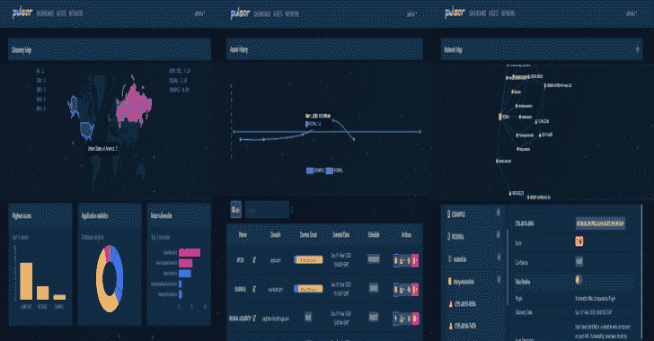
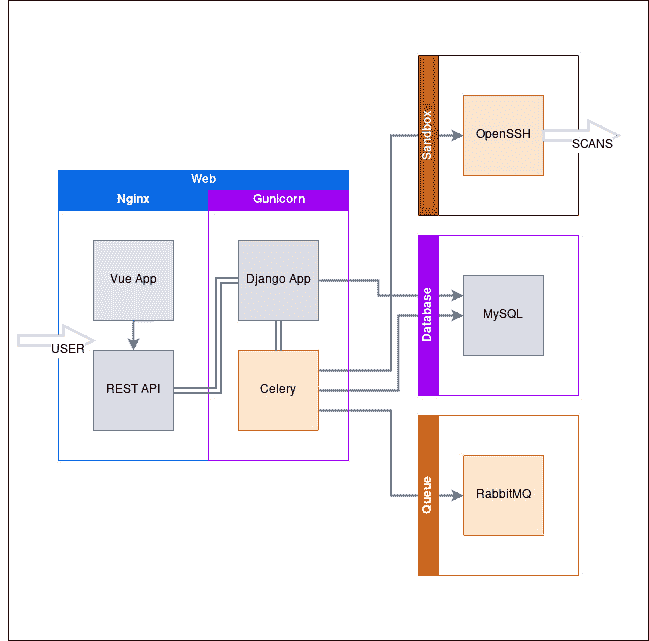

# Pulsar:网络足迹扫描仪平台

> 原文：<https://kalilinuxtutorials.com/pulsar/>

Pulsar 是一款为红队、圣灵降临者和赏金猎人设计的自动化网络足迹扫描仪。它专注于发现组织面向公众的资产，而对其基础架构知之甚少。

随着网络数据的可视化，它试图给出一个基本的脆弱性评分，以找到基础设施的弱点及其与其他资源的关系。

它还可以作为一个自定义的漏洞扫描器，用于大范围和未知范围。这个软件是在可用性和开放性的基础上开发的，所以它是 100%免费的，并且不需要任何 API 密匙来使用它的特性。

**它不是什么？**

*   漏洞管理平台 n
*   全框架扫描仪
*   以速度为导向的工具，立竿见影

**主要特征**

*   子域发现
*   TLD 发现
*   云资源发现
*   基本漏洞扫描
*   扫描策略和优化
*   数据可视化
*   协作和数据导出
*   计划和通知
*   REST API
*   外部 API 集成
*   OAUTH 集成
*   自定义扫描仪扩展

**安装说明**

**注意:**
如果您想要使用外部 API，请参见 USAGE.md
为了使用电子邮件通知，请在安装或 web 容器需要重新构建之前编辑 portal/portal/settings.py 中的 EMAIL_BACKEND 设置。

**窗户**

*   **先决条件**
    *   转到工具
    *   安装程序在处[可用。](https://gitforwindows.org/)
    *   坞站引擎和坞站-复合
    *   Docker 安装说明可在此处获得。
    *   docker-compose 安装说明可在此处获得。

**注意:**
安装过程中将验证先决条件。
对于 Windows 10 家庭版用户:由于 Docker 桌面无法安装在 Windows 10 家庭版上，请手动安装 Hyper-V，说明可在此处找到

**安装**

*   克隆或下载最新的 pulsar 库

**git 克隆 https://github.com/FooBallZ/pulsar**

*   运行 powershell 安装程序

**PS >。\install.ps1**

*   按照安装说明进行操作

**注意:**确保在进一步安装步骤之前存储生成的密码。管理员密码可以在/admin/的 Django 管理控制台中更改。

*   使用生成的默认凭证登录位于 [https://localhost:8443/](https://localhost:8443/) 的 pulsar 控制台

**Linux**

*   **先决条件**
    *   Git 工具从发行版的包管理器中安装 git，即

sudo 安装 git

**注意:**安装过程中将验证先决条件。

**安装**

*   克隆或下载最新的 pulsar 库

**git 克隆 https://github.com/FooBallZ/pulsar**

*   运行 bash 安装程序

**。/install.sh**

*   按照安装说明进行操作

**注意:**确保在进一步安装步骤之前存储生成的密码。管理员密码可以在/admin/的 Django 管理控制台中更改。

*   使用生成的默认凭证登录 https://localhost:8443/上的 pulsar 控制台

**贡献**

*   有一个想法，或者一个你想集成的工具？随意发出拉取请求。
*   当前的问题和特点可以在项目部分找到。随便挑吧。
*   目前大多数帮助是需要 Vue.js 前端和 Docker 优化的。

**文档**

*   **用户指南**
    *   基本使用指南可在[这里](https://fooballz.github.io/pulsar/USAGE.html)找到。
*   **REST API**
    *   自描述 API 在 **/pulsar/api/v1/** 端点可用。
*   **开发**
    *   目前唯一可用的文档位于 **/admin/doc/** 端点。

**注意:**完整的开发文档将在未来的版本中提供。

**架构**

Pulsar 是一个基于 docker-compose 文件的 PaaS，具有预装要求。所提供的体系结构可以轻松扩展、转换和部署到多个常见的云环境中。Web 应用服务器基于 Nginx、Gunicorn、Django Rest 框架等服务。

**码头集装箱结构**

[**Download**](https://github.com/FooBallZ/pulsar)