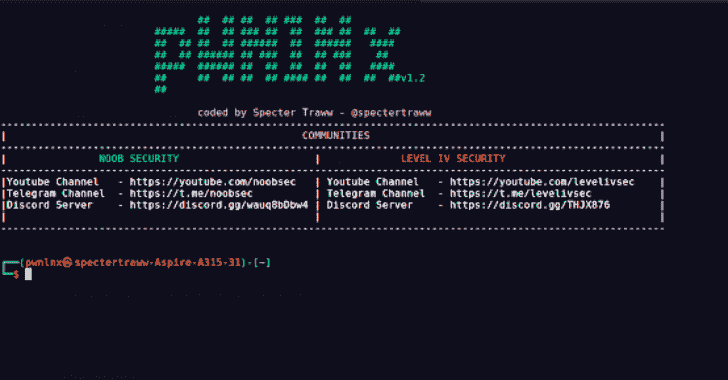
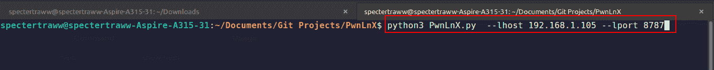
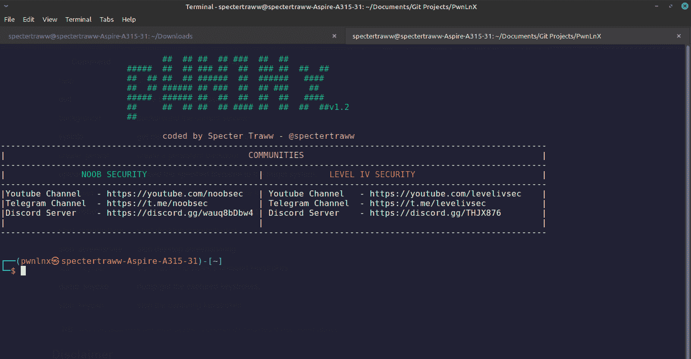
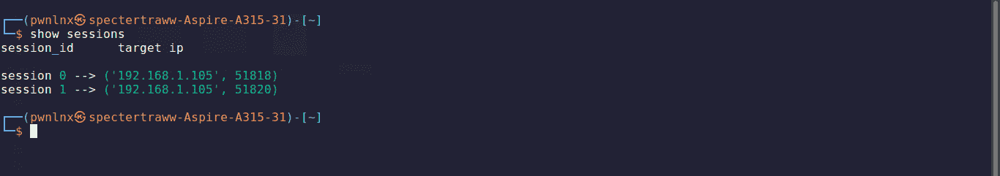
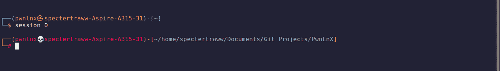
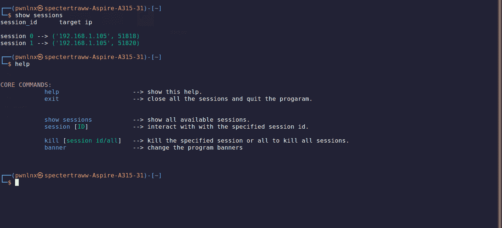
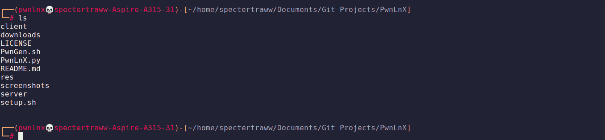
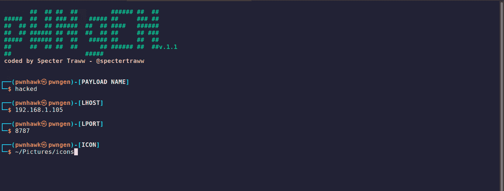

# PwnLnX:一个先进的多线程、多客户端 Python 反向 Shell，用于入侵 Linux 系统

> 原文：<https://kalilinuxtutorials.com/pwnlnx/>

**PwnLnX** 是一款高级的**多线程**、**多客户端** python 逆向 shell，用于黑客攻击 Linux 系统。仍然有更多的工作要做，所以请随时帮助开发。**免责声明**:这个反向 shell 只能用于合法的授权系统远程管理。未经授权或许可访问计算机网络是非法的。

**入门**

请按照这些说明获取 PwnLnX 的副本，在您的本地机器上运行，没有任何问题。

**先决条件**

*   **蟒蛇 3:**
    *   视频流
    *   皮菲莱
    *   tqdm
    *   多光谱扫描仪
    *   术语颜色
    *   pyautogui
    *   pyinstaller(安装程序)
    *   pip3
    *   pynput

**安装**

下载源代码

git 翻制 https://github . com/spectampered ww/pwnlnx . git
pwn lnx CD

##### 下载并安装依赖项

chmod +x setup.sh
。/setup.sh

**启动并运行 PwnLnx**

*   显示帮助

**python 3 pwnlnx . py–help**

*   侦听传入的连接

**python 3 pwnlnx . py–lhost[您的本地主机 ip 地址]–lport[监听传入连接的空闲端口]**

*   创建/生成有效载荷

**chmod+x pwn . sh
。/PwnGen.sh**

*   然后按照步骤成功创建你的有效载荷，有效载荷保存在 PwnLnx 目录下。将创建的有效载荷发送给受害者。

pwnlnx 用法

| 命令 | 使用 |
| --- | --- |
| 帮助 | 显示帮助 |
| 出口 | 关闭所有会话并退出程序。 |
| 显示会话 | 显示已连接的所有可用会话。 |
| 会话[ID] | 与指定的会话 ID 进行交互。 |
| kill [all/ID] | 取消指定的会话或全部取消所有会话。 |
| 旗帜 | 通过更改计划横幅来获得乐趣 |

**与会话互动**

| 命令 | 使用 |
| --- | --- |
| 帮助 | 显示帮助。 |
| 放弃 | 关闭当前会话。 |
| 背景 | 当前会话的背景。 |
| sysinfo | 获取最少的目标系统信息。 |
| 创建 _ 持久化 | 创建一个持久的后门。 |
| 上传 | 将指定的文件名上传到目标系统。 |
| 下载 | 从目标系统下载指定的文件名。 |
| 屏幕上显示程序运行的图片 | 拍摄目标系统的桌面截图。 |
| 开始 _ 屏幕共享 | 开始桌面屏幕共享。 |
| 停止 _ 屏幕共享 | 停止桌面屏幕共享。 |
| 开始 _ 键帽 | 开始捕捉受害者按下的按键。 |
| 转储 _ 键帽 | 转储/获取捕获的击键。 |
| 停止 _ 键帽 | 停止捕获击键。 |

**NB。**除了上面列出的命令之外，您还可以执行 linux 系统命令。

**快照**

[**Download**](https://github.com/spectertraww/PwnLnX)