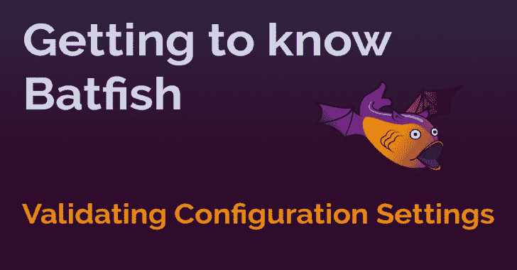

# Pybatfish:用于 batfish 的 Python 客户端(网络配置分析工具)

> 原文：<https://kalilinuxtutorials.com/pybatfish/>

**Pybatfish** 是 batfish 的 Python 客户端。

## 蝙蝠鱼是什么？

Batfish 是一种网络验证工具，通过分析网络设备的配置，为安全性、可靠性和合规性提供正确性保证。它根据设备配置构建完整的网络行为模型，并发现违反网络策略的行为(内置、用户定义和最佳实践)。

Batfish 的一个主要用例是在部署之前验证配置变更*(尽管它也可以用来验证部署的配置)。部署前验证是现有网络自动化工作流中的一个关键缺口。通过自动化工作流中的 Batfish，网络工程师可以缩小这一差距，并确保只部署正确的更改。*

Batfish 不需要直接访问网络设备。核心分析只需要配置网络设备。可以使用来自网络的附加信息来增强这种分析，例如:

*   从外部对等方接收的 BGP 路由
*   由 LLDP/CDP 表示的拓扑信息

## Batfish 支持哪种正确性检查？

Batfish YouTube 频道(可以订阅新内容)展示了许多类型的检查。这些检查涵盖一系列网络行为和设备配置属性。

#### 配置符合性

*   标记未定义但被引用或已定义但未被引用的结构(如 ACL、路由映射)
*   MTU、AAA、NTP、日志记录等的配置设置。匹配模板
*   只能使用 SSHv2 访问设备，并且密码不为空

#### 可靠性

*   在任何单链路或单设备故障之后，任何流的端到端可达性都不会受到影响
*   某些服务(例如 DNS)是全球可达的

#### 安全

*   敏感服务只能从特定的子网或设备访问
*   端点之间的路径符合预期(例如，穿越防火墙、至少具有双向 ECMP 等)

#### 变化分析

*   当前配置和规划配置的端到端可达性完全相同
*   可证明计划的 ACL 或防火墙更改是正确的，不会对其他流量造成附带损害
*   可能来自不同供应商的两种配置在功能上是等效的

## 我如何开始？

如果您尚未安装 Batfish，请按照 batfish github 资源库中列出的说明进行安装。

### 安装比目鱼

我们强烈建议您在 Python 3 虚拟环境中安装 Pybatfish。关于如何设置的细节可以在这里找到。一旦您的虚拟环境被设置和激活，升级 pip，然后安装 pybatfish。

python3 -m pip 安装–升级 pip
python3 -m pip 安装–升级 pybatfish

现在，你已经准备好用 Batfish 评估你自己的网络了。我们鼓励您使用 Jupyter 笔记本作为起点，但是您也可以使用您熟悉的其他方法，例如 PyCharm 之类的 IDE 或交互式 Python shell。如果您选择使用 Jupyter 笔记本作为起点，您需要在您的虚拟环境中安装 Jupyter。Jupyter 文档可以在这里找到——但是下面的命令可以帮助你。

**python3 -m pip 安装 jupyter
jupyter 笔记本**

我们的笔记本电脑为不同的使用案例提供了快速入门指南。

[**Download**](https://github.com/batfish/pybatfish)