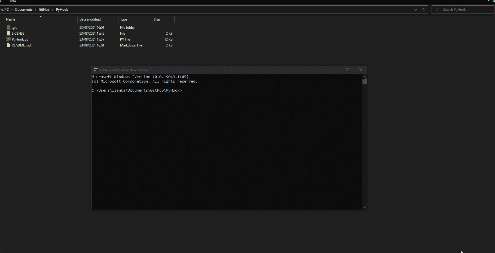

# PyHook:用 Python 编写的攻击性 API 挂钩工具，用于捕获 API 调用中的各种凭证

> 原文：<https://kalilinuxtutorials.com/pyhook/>

PyHook 是我的 SharpHook 项目的 python 实现，它使用各种 API 钩子来给我们想要的凭证。

PyHook 使用 frida 将它的依赖项注入到目标进程中

**支持的流程**

| 过程 | API 调用 | 描述 | 进步 |
| --- | --- | --- | --- |
| 远程桌面连接 | `**CredUnPackAuthenticationBufferW**` | 从 mstsc 挂接`**CredUnPackAuthenticationBufferW**`并输出用户名和密码 | 完成的 |
| runas | `**CreateProcessWithLogonW**` | 从 runas 挂接`**CreateProcessWithLogonW**`并输出用户名、密码和域名。 | 完成的 |
| PowerShell | `**CreateProcessWithLogonW**` | 从 PowerShell 挂接`**CreateProcessWithLogonW**`并输出用户名、密码和域名(例如–`**Start-Process cmd** **-Credential X**`)。 | 完成的 |
| 煤矿管理局 | `**RtlInitUnicodeStringEx**` | 从 cmd 挂钩`**RtlInitUnicodeStringEx**`并从特定过滤器输出数据(例如-"-p "、"密码"等)。 | 完成的 |
| mobaxterm(mobaxterm) | `**CharUpperBuffA**` | 从 MobaXterm 挂接`**CharUpperBuffA**`并输出 RDP 和 SSH 登录的凭证。 | 完成的 |
| 浏览器(UAC 提示) | `**CredUnPackAuthenticationBufferW**` | 从资源管理器中挂接`**CredUnPackAuthenticationBufferW**`并输出用户名、密码和域名。 | 完成的 |

**演示**

[**Download**](https://github.com/IlanKalendarov/PyHook)