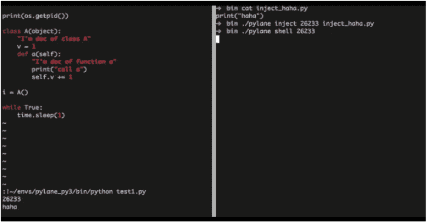
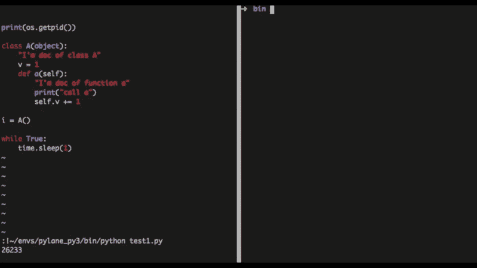

# Pylane:基于 GDB 的带有调试工具的 Python VM 注入器

> 原文：<https://kalilinuxtutorials.com/pylane-python-vm-injector-with-debug-tools/>

Pylane 是一个带有调试工具的 python vm 注入器，基于 gdb 和 ptrace。Pylane 使用 gdb 来跟踪 python 进程，在其 python vm 中注入和运行一些代码。

**用途**

使用注入命令在进程中注入 python 脚本:

**皮兰注入<PID><YOUR _ PYTHON _ FILE>**+

**也可阅读-[lazy recon:以一种有组织的方式自动化你的侦察过程](https://kalilinuxtutorials.com/lazyrecon-automate-your-reconnaissance-process/)**

使用 shell 命令注入交互式 shell:

**皮壳< PID >**

皮拉内壳特征:

*   使用 IPython 作为其交互界面，支持神奇的功能，如？和%
*   支持远程自动完成
*   提供调试工具包功能，例如:
    *   按名称查找类或实例
    *   获取对象的源代码
    *   打印所有线程的堆栈和局部变量

**安装**

**pip 安装皮线**

它应该安装在目标进程使用的 virtualenv 或 os python lib 中。

[**Download**](https://github.com/NtesEyes/pylane)