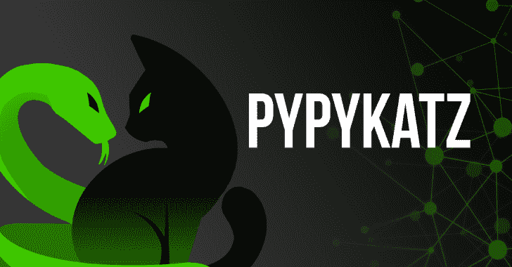

# Pypykatz:用纯 Python 实现 Mimikatz

> 原文：<https://kalilinuxtutorials.com/pypykatz/>

Pypykatz 是一个纯 Python 的 mimikatz 实现，可以在所有支持 python > =3.6 的操作系统上运行。

**安装**

通过 pip 或从 github 克隆来安装它。安装程序将在 python 的脚本目录中创建一个 pypykatz 可执行文件。你可以从那里运行它，应该在你的路径。

**通过 PIP**

**pip3 安装 pypykatz**

**通过 Github**

**安装前置要求**

**pip3 安装 minidump minikerberos aiowinreg ms LDAP wins SPI**

**克隆此回购**

git 克隆 https://github . com/skelsec/pykatz . git
pykatz CD

**安装它**

**python3 setup.py 安装**

**也可理解为-[shuffled ns:用 Go 编写的包装 Massdns，使用主动暴力枚举有效子域](https://kalilinuxtutorials.com/shuffledns/)**

**特性**

*   **将军**

独立于平台–所有命令都有一个“实时”版本和一个正常版本(如果适用)。“live”版本将使用当前的系统，并且只在 Windows 上运行。普通命令是独立于平台的。
可用作您项目的库。

*   **LSASS 处理**

可以解析隐藏在 LSASS 进程中的秘密。这就像米米卡兹的`**sekurlsa**` **`::`** 但是命令不同。
这里的主要区别是所有的解析逻辑都是从数据源中分离出来的，所以如果你定义了一个新的 reader 对象，你基本上可以从任何地方执行 LSASS 的解析。

**当前支持的数据源:**

1.  **live—**直接读取 LSASS 进程的内存
2.  **小型转储–**处理通过转储 LSASS 进程创建的小型转储文件
3.  **recall(volatility fork)–**基本上处理 recall 可以解析的任何 windows 内存转储
4.  **PCI leech–**可以通过活动计算机的 DMA 直接转储机密
5.  **远程**

*   **注册表处理**

解析注册表配置单元以获取存储的凭据，如 NT 和 LM 哈希、域缓存凭据(DCC/DCC2)和 LSA 机密。

**当前支持的数据源:**

1.  live–有两种技术来解析实时注册表。首先，它在内存中不接触磁盘，其次是转储配置单元并用离线解析器解析它们
2.  脱机(配置单元文件)

*   **DPAPI 函数–万能钥匙/BLOB/保险库/凭证**

DPAPI 是多种本地机密的保护者。目前，该项目支持解密万能钥匙，dpapi blobs，凭证文件，保险库文件。

这些结果并不是 100%正确的，因为关于这些事情的文档并不多。公关永远受欢迎！

**当前支持的数据源:**

1.  **live–**直接从 LSASS 获得主密钥，或者从 live registry 获得用户/机器密钥，并解密主密钥文件。
2.  **hive 文件(离线)-** 从实时注册表中获取用户/机器密钥，并解密主密钥文件
3.  **有效凭证(离线)–**可以通过让您键入正确的 SID 和密码来解密主密钥文件。

*   **冒充用户**

可以像在机器上运行进程的任何用户一样生成新的进程。

可以为您的线程分配任何可用的令牌

*   **recall 命令选项**

**时间戳覆盖**

此参数存在的原因:为了选择正确的解析结构，我们需要 msv dll 文件的时间戳信息。

遗憾的是，由于某些原因，Rekall 并不总是拥有这些信息，因此解析可能会失败。如果解析失败，这可以解决问题。

**参数:`-t`
值:`0`或`1`**

**举例:**

**pypykatz . py rekall<momeory_dump_file>-T0</momeory_dump_file>**

召回用途

有两种方法可以使用基于 rekall 的内存解析。

*   通过`**pypykatz rekall**`命令

您需要指定要解析的内存文件。

*   通过**recall**命令行

**注**:

*   如果你刚刚决定安装 **`rekall`** ，它必须在一个 virtualenv 中运行，你将需要在同一个 virtualenv 中安装 pypykatz！
*   rekall 命令行不适合显示从内存中获取的所有信息，应使用`**out_file**`和 **`kerberos_dir`** 命令开关！
*   你可以在 pypykatz 的`plugins`文件夹中找到一个名为`**pypykatz_rekall.py**`的 rekall 插件文件。
*   你需要将它复制到 rekall 的`**plugins/windows**`文件夹中，并将其重命名为 **`pypykatz.py`。**
*   在此之后，修改位于同一文件夹的`**__init__.py**`文件，并在末尾添加以下行:`**from rekall.plugins.windows import pypykatz**`
*   如果一切正常，你可以直接从 **`rekall`** 命令行使用`pypykatz`命令。

[**Download**](https://github.com/skelsec/pypykatz)