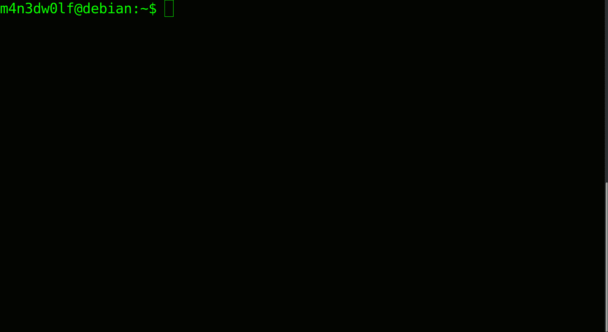

# py them–渗透测试框架

> 原文：<https://kalilinuxtutorials.com/pythem/>

[](https://1.bp.blogspot.com/-bVrw9bGFcAQ/XwdD6ShHX1I/AAAAAAAAG1o/aiWQNdhVHakq6O7xBtruLQZKWyTfrqNjQCLcBGAsYHQ/s1600/pythem%25281%2529.png)

**Pythem** 是一个用 Python 编写的多用途 pentest 框架。它是为安全研究人员和安全专业人员开发的。

该工具旨在仅用于法律范围内的行为。我对该工具实施的任何不当和非法行为不负任何责任，有关更多信息，请阅读许可证。

**Linux**T2【安装

*   **依赖关系**
    *   构建-基本
    *   python 开发
    *   python-capstone
    *   libnetfilter-queue-dev
    *   libffi-dev
    *   libssl-dev
    *   tcpdump

**依赖项安装**

**注意:**只在基于 Debian 的发行版上测试过，如果你使用 Redhat-like 或 SUSE-like，请随意使用 **yum** 或 **zypper** 安装依赖项。

$ sudo apt-get update
$ sudo apt-get install build-essential python-dev tcpdump python-capstone
$ sudo apt-get install libnetfilter-queue-dev libffi-dev libssl-dev

**安装**

*   用 **pip** :

$ **pip 安装 python**

*   带**源**:

$ git 克隆 https://github.com/m4n3dw0lf/pythem
$ CD python
$ sudo python setup . py install

*   带**源**和 **pip** :

$ git 克隆 https://github.com/m4n3dw0lf/pythem
$ CD python
$ sudo python setup . py sdist
$ pip install dist/*

**运行中**

*   在终端上呼叫(需要 **root** 权限):

$ sudo pythem

**也可理解为:[表单钓鱼——基于自动钓鱼表单的网站](https://kalilinuxtutorials.com/formphish/)**

**作为 Docker 容器运行**

*   需要码头工人

$**docker run-it-net = host-name pythem M4 n3 dw 0 lf/pythem**

**创建桌面快捷方式**


**nside python 目录执行以下命令:**

```
#!/bin/bash
cat <<EOT > ~/.local/share/applications/pythem.desktop
[Desktop Entry]
Name=pythem
Exec=pythem
StartupNotify=true
Terminal=true
Type=Application
Icon=$PWD/img/pythemico.png
EOT 
```

**用途**



**例题**

*   [ARP 欺骗——中间人](https://github.com/m4n3dw0lf/pythem/wiki/Examples#arp-spoofing---man-in-the-middle)。
*   [ARP+DNS 欺骗–虚假页面重定向到凭证采集器](https://github.com/m4n3dw0lf/pythem/wiki/Examples#arpdns-spoof---fake-page-redirect-to-credential-harvester)
*   [DHCP ACK 注入欺骗——中间人](https://github.com/m4n3dw0lf/pythem/wiki/Examples#man-in-the-middle-dhcp-spoofing---dhcp-ack-injection)
*   [中间人注射牛肉钩](https://github.com/m4n3dw0lf/pythem/wiki/Examples#inject-beef-hook)
*   [宋承宪暴力攻击](https://github.com/m4n3dw0lf/pythem/wiki/Examples#ssh-brute-force-attack)。
*   [网页公式化蛮干](https://github.com/m4n3dw0lf/pythem/wiki/Examples#web-page-formulary-brute-force)
*   [网址内容克星](https://github.com/m4n3dw0lf/pythem/wiki/Examples#url-content-buster)
*   [推翻局域网范围/IP 地址的 DNS](https://github.com/m4n3dw0lf/pythem/wiki/Examples#overthrow-the-dns-of-lan-rangeip-address)
*   [将所有可能的 DNS 查询重定向到主机](https://github.com/m4n3dw0lf/pythem/wiki/Examples#redirect-all-possible-dns-queries-to-host)
*   [从二进制文件中获取外壳代码](https://github.com/m4n3dw0lf/pythem/wiki/Examples#get-shellcode-from-binary)
*   [过滤 pcap 文件上的字符串](https://github.com/m4n3dw0lf/pythem/wiki/Examples#filter-strings-on-pcap-files)
*   [漏洞开发 1:重写指令指针](https://github.com/m4n3dw0lf/pythem/wiki/Exploit-development#exploit-development-1-overwriting-instruction-pointer)
*   [漏洞开发 2: Ret2libc](https://github.com/m4n3dw0lf/pythem/wiki/Exploit-development#exploit-development-2-ret2libc)

**显影**

*   [运行测试](https://github.com/m4n3dw0lf/pythem/wiki/Developing#running-tests)。

**命令参考**

*   **索引**
    *   **核心**
        *   [帮助](https://github.com/m4n3dw0lf/pythem/wiki/Commands-Reference#help)
        *   [退出/退出](https://github.com/m4n3dw0lf/pythem/wiki/Commands-Reference#exitquit)
        *   [设置](https://github.com/m4n3dw0lf/pythem/wiki/Commands-Reference#set)
        *   [打印](https://github.com/m4n3dw0lf/pythem/wiki/Commands-Reference#print)
    *   **网络、中间人和拒绝服务(DOS)**
        *   [扫描](https://github.com/m4n3dw0lf/pythem/wiki/Commands-Reference#scan)
        *   [网页抓取](https://github.com/m4n3dw0lf/pythem/wiki/Commands-Reference#webcrawl)
        *   [arpspoof](https://github.com/m4n3dw0lf/pythem/wiki/Commands-Reference#arpspoof)
        *   [dhcpspoof](https://github.com/m4n3dw0lf/pythem/wiki/Commands-Reference#dhcpspoof)
        *   [dnsspoof](https://github.com/m4n3dw0lf/pythem/wiki/Commands-Reference#dnsspoof)
        *   [重定向](https://github.com/m4n3dw0lf/pythem/wiki/Commands-Reference#redirect)
        *   [嗅嗅](https://github.com/m4n3dw0lf/pythem/wiki/Commands-Reference#sniff)
        *   [dos](https://github.com/m4n3dw0lf/pythem/wiki/Commands-Reference#dos)
        *   [pforensic](https://github.com/m4n3dw0lf/pythem/wiki/Commands-Reference#pforensic)
    *   **pforensic:命令参考**
        *   [帮助](https://github.com/m4n3dw0lf/pythem/wiki/Commands-Reference#help-1)
        *   [清除](https://github.com/m4n3dw0lf/pythem/wiki/Commands-Reference#clear)
        *   [退出/退出](https://github.com/m4n3dw0lf/pythem/wiki/Commands-Reference#exitquit-1)
        *   [显示](https://github.com/m4n3dw0lf/pythem/wiki/Commands-Reference#show)
        *   [对话](https://github.com/m4n3dw0lf/pythem/wiki/Commands-Reference#conversations)
        *   [数据包显示](https://github.com/m4n3dw0lf/pythem/wiki/Commands-Reference#packetdisplay-num)
        *   [过滤器](https://github.com/m4n3dw0lf/pythem/wiki/Commands-Reference#filter-stringlayer)
    *   **利用开发和逆向工程**
        *   [xploit](https://github.com/m4n3dw0lf/pythem/wiki/Commands-Reference#xploit)
    *   **xploit:命令参考**
        *   [帮助](https://github.com/m4n3dw0lf/pythem/wiki/Commands-Reference#help-2)
        *   [清除](https://github.com/m4n3dw0lf/pythem/wiki/Commands-Reference#clear-1)
        *   [退出/退出](https://github.com/m4n3dw0lf/pythem/wiki/Commands-Reference#exitquit-2)
        *   [设置](https://github.com/m4n3dw0lf/pythem/wiki/Commands-Reference#set-1)
        *   [shellcode](https://github.com/m4n3dw0lf/pythem/wiki/Commands-Reference#shellcode)
        *   [编码器](https://github.com/m4n3dw0lf/pythem/wiki/Commands-Reference#encoder)
        *   [解码器](https://github.com/m4n3dw0lf/pythem/wiki/Commands-Reference#decoder)
        *   [搜索](https://github.com/m4n3dw0lf/pythem/wiki/Commands-Reference#search)
        *   [xploit](https://github.com/m4n3dw0lf/pythem/wiki/Commands-Reference#xploit-1)
        *   [cheatsheet](https://github.com/m4n3dw0lf/pythem/wiki/Commands-Reference#cheatsheet)
        *   [模糊](https://github.com/m4n3dw0lf/pythem/wiki/Commands-Reference#fuzz)
        *   [解码/编码](https://github.com/m4n3dw0lf/pythem/wiki/Commands-Reference#decodeencode)
    *   **蛮力**
        *   [蛮力](https://github.com/m4n3dw0lf/pythem/wiki/Commands-Reference#brute)
    *   **Utils**
        *   [解码/编码](https://github.com/m4n3dw0lf/pythem/wiki/Commands-Reference#decodeencode-1)
        *   [烹饪解码](https://github.com/m4n3dw0lf/pythem/wiki/Commands-Reference#cookiedecode)

[**Download**](https://github.com/m4n3dw0lf/pythem)