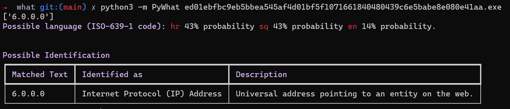

# pyWhat:识别任何东西。让您轻松识别电子邮件、IP 地址等…

> 原文：<https://kalilinuxtutorials.com/pywhat/>

鉴定任何东西最简单的方法是什么？

**pip3 安装 py what&py what–help**

**`What`这是？**

想象一下:你遇到一些神秘的文本🧙‍♂️ `**5f4dcc3b5aa765d61d8327deb882cf99**`你想知道它是什么。你是做什么的？

嗯，有了`**what**`你要做的就是问**`what "5f4dcc3b5aa765d61d8327deb882cf99"`****`what`**就会告诉你！

**`what`**的工作就是**识别*什么东西是*什么东西。无论是文件还是文本！或者甚至是文件的十六进制！如何处理文件中的文本*？我们也有！`**what**`是递归的，它将识别**文本中的一切**和更多！***

**用例**

**Wannacry**

你遇到了一个新的恶意软件叫做 WantToCry。你回想一下 Wannacry，记得它被停止是因为一名研究人员在代码中发现了一个 kill-switch。

当一个硬编码到 Wannacry 中的域名被注册时，病毒就会停止。

您使用`**What**`来识别恶意软件中的所有域，并使用域注册 API 来注册所有域。如果 Wannacry 再次发生，你可以在几分钟内停止它，而不是几周。

**更快地分析 Pcap 文件**

假设你有一个来自网络攻击的 **`.pcap`** 文件。`**What**`可以识别这个并快速找到你:

*   所有哈希
*   信用卡号码
*   加密货币地址
*   社会安全号码
*   还有更多。

有了 **`what`** ，你可以在几秒钟内识别出 pcap 中重要的东西，而不是几分钟。

任何事情

任何时候你有一个文件，你想在其中找到有用的结构化数据， **`What`** 就是为你准备的。

或者，如果你遇到一段你不知道是什么的文字， **`What`** 会告诉你。

**文件打开**你可以通过`**what 'this/is/a/file/path'**`传入一个文件路径。`What`聪明到能看出来是文件！

那么整个**目录**呢？ **`What`** 也能搞定！它将**递归**搜索文件并输出你需要的一切！

**过滤**使用`**what --rarity 0.2:0.8 --include_tags tag1,tag2 TEXT**`可以过滤输出。使用`**what --help**`获取更多信息。

**排序**可以使用 **`what -k rarity --reverse TEXT`对输出进行排序。**使用 **`what --help`** 获取更多信息。

[**Download**](https://github.com/bee-san/pyWhat)