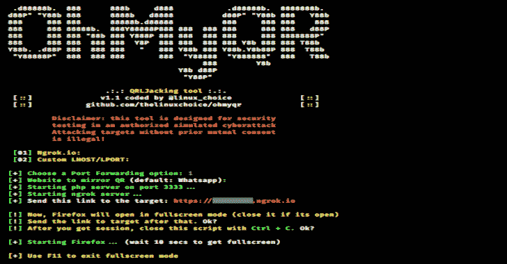

# QRLJacking:劫持依赖二维码认证的服务

> 原文：<https://kalilinuxtutorials.com/qrljacking/>

**QRLJacking 或快速响应**代码登录劫持是一种简单的社交工程攻击载体，能够进行会话劫持，影响所有依赖**二维码登录**功能作为安全登录帐户方式的应用程序。简而言之，受害者扫描攻击者的二维码，从而导致会话劫持。

**特性**

*   **使用 Ngrok 的端口转发**

**免责声明**

未经双方事先同意，使用 OhMyQR 攻击目标是非法的。最终用户有责任遵守所有适用的地方、州和联邦法律。开发人员不承担任何责任，也不对本程序造成的任何误用或损坏负责

**又念——[霓裳:红队进攻 PowerShell，渗透测试&进攻安全](https://kalilinuxtutorials.com/nishang/)**

**用途**

**git 克隆 https://github.com/thelinuxchoice/ohmyqr
CD ohmyqr
bash ohmyqr . sh**

[**Download**](https://github.com/thelinuxchoice/ohmyqr)