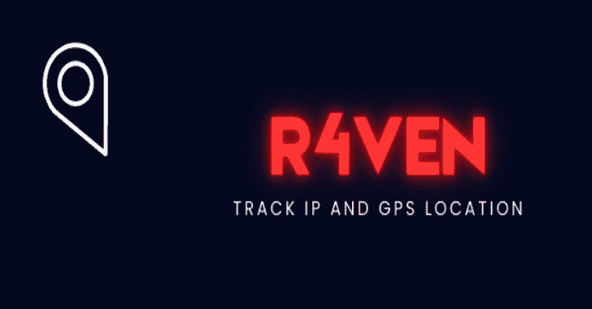
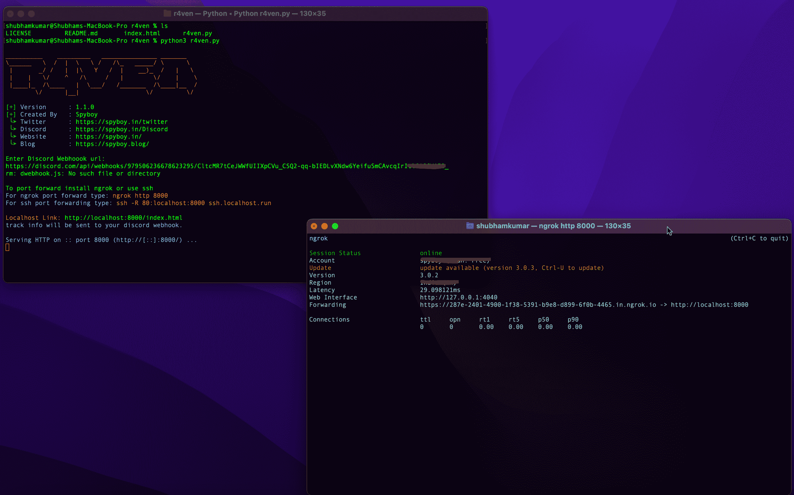
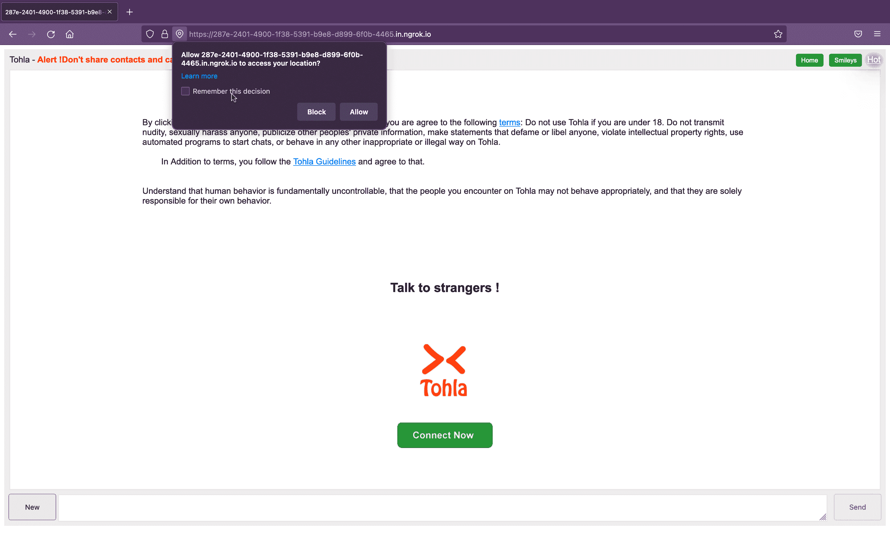
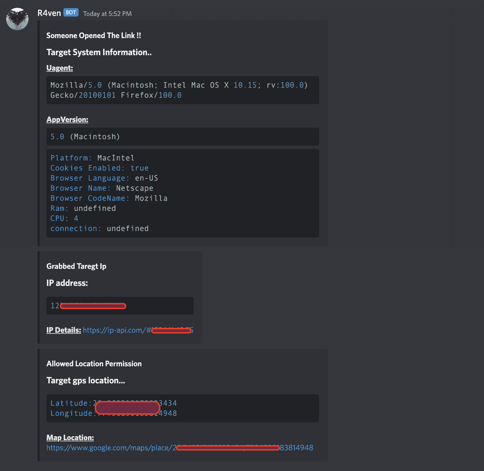
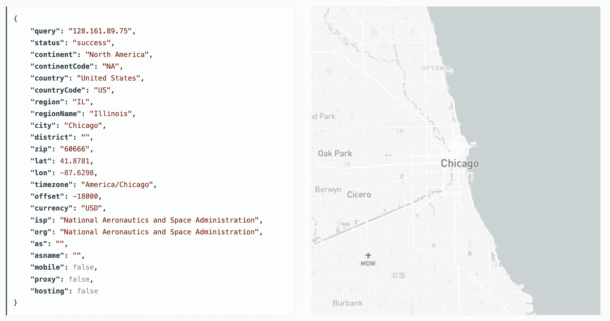

# R4Ven:追踪 IP 和 GPS 位置

> 原文：<https://kalilinuxtutorials.com/r4ven/>

[](https://blogger.googleusercontent.com/img/b/R29vZ2xl/AVvXsEiTta4C8oyRBREIiDgmZ8mr6IZcV_SVZLF-pr-pecpxcce45GtUTR35SMgijiN1nX_LR5cYleRsqgXsHOSB0P-GoLfjlkiSzDVVVU5LxGZ4DiFYcmnLb13YjbDpDJlYy0CcCw3wa4PC1gGj0A-GS8HI3x2Dxw7sgwpLaXfeTo2moiONL51qWytdJoiF/s728/R4Ven(1).png)

#### 跟踪用户的智能手机/Pc Ip 和 Gps 位置。

该工具托管一个使用 iframe 显示合法网站的虚假网站，如果目标允许，它将获取目标的 Gps 位置`(latitude and longitude)`以及`IP Address`和`Device Information`。

#### 该工具是一个概念证明，仅用于教育目的。

使用此工具，您可以了解恶意网站可以收集哪些关于您和您的设备的信息，以及为什么您不应该点击随机链接或向它们授予位置等权限。

### 单击链接时

```
+ it wil automatically fetch ip address and device information
! if location permission allowed, it will fetch exact location of target.
```

### 限制

```
- It will not work on laptops or phones that have broken GPS, 
# browsers that block javascript,
# or if the user is mocking the GPS location. 

- Safari - auto block location permission
- Brave - auto block location permission
- Firefox - after a recent update this browser became very weird it allows location permission but it's not accurate at all.

+ Best work with Chrome browser and location accuracy will be more accurate if you use this on a smartphone.
```

### IP 位置与 GPS 位置

```
- Geographic location based on IP address is NOT accurate,
# Does not provide the location of the target. 
# Instead, it provides the approximate location of the ISP (Internet service provider)
```

```
+ GPS fetch almost exact location because it uses longitude and latitude coordinates.
@@ Once location permission is granted @@
# accurate location information is recieved to within 20 to 30 meters of the user's location.
# (it's almost exact location)
```

## **安装**

**git 克隆 https://github.com/spyboy-productions/r4ven.git
CD R4 ven
pip 3 install-r requirements . txt
python 3 R4 ven . py**

输入您的 discord webhook url(在您的 discord 服务器中设置一个与 webhook 集成的频道)

[https://support . discord . com/HC/en-us/articles/228383668-Intro-to-web hooks](https://support.discord.com/hc/en-us/articles/228383668-Intro-to-Webhooks)

如果没有不和谐的帐户，并断绝了一个，这是免费的。

[https://discord.com/](https://discord.com/)

## **快照**

[Click Here To Download](https://github.com/spyboy-productions/r4ven)