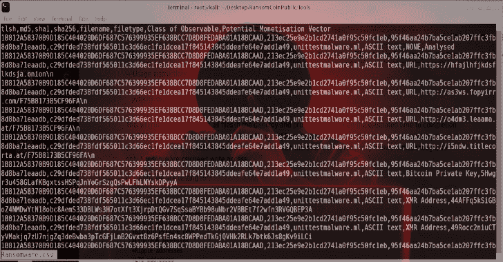
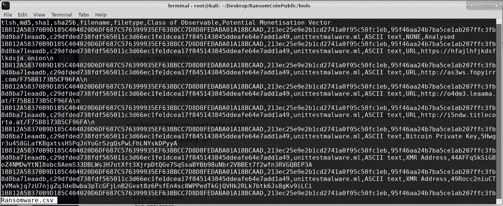
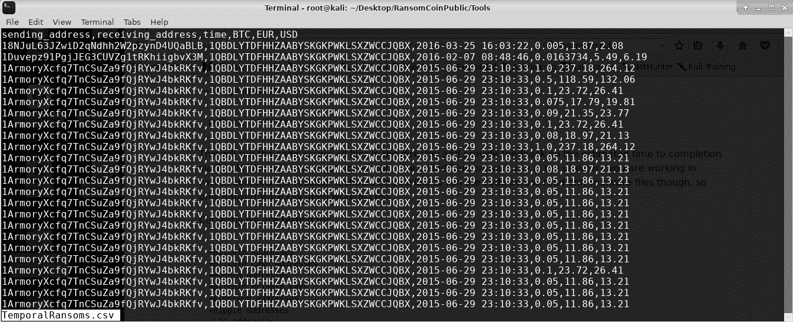

# RansomCoinPublic:提取加密货币地址的 DFIR 工具

> 原文：<https://kalilinuxtutorials.com/ransomcoinpublic/>

**RansomCoinPublic** 是一个 DFIR 工具，用于从二进制文件中提取加密硬币地址和其他危害指标。通过 cuckoo 集成，以可扩展、高效的方式从勒索软件中提取元数据和硬编码的危害指示器。

理想情况下，它在 cuckoo 动态分析期间运行，但也可以用于对大量勒索软件进行静态分析。旨在提高速度，降低加密货币地址的误报率。有限的电子邮件、网址、洋葱和域名误报(这很难做到完美)。

简而言之，如果你只想要赚钱的载体，这是快速而简单的初步分类。

**安装**

请确保您安装了 Python3。

**在 Linux 虚拟机中**

建议下载并安装一个虚拟化器，比如 [VirtualBox](https://www.virtualbox.org/wiki/Downloads) 。安装你想要的 [Linux 虚拟机](https://www.osboxes.org/virtualbox-images/)(即 Lubuntu、Kali Linux 等)，然后按照下面的说明操作。

从工具文件夹中:

**sudo apt-get install build-essential libpoppler-CPP-dev pkg-config python-dev python 3-tlsh**

**python3 -m pip 安装要求. txt**

注意:如果您得到一个错误消息，说没有名为 pip 的模块，请尝试运行

**sudo apt-get 安装 python3-pip**

**另请阅读-[HuskyCI:在您的配置项内执行安全测试](https://kalilinuxtutorials.com/huskyci-performing-security-tests-inside-ci/)**

**用途**

教程视频可用:

[https://www.youtube.com/embed/3pUDh5HvqVI?feature=oembed&enablejsapi=1](https://www.youtube.com/embed/3pUDh5HvqVI?feature=oembed&enablejsapi=1)

可以从“Tools”文件夹运行以下命令来分析位于此目录中的恶意软件样本。这将跨目录中的所有文件运行代码，并通过 TQDM 提供关于预计完成时间的反馈。您需要对工作目录中名为 Ransomware.csv 的文件(包含结果)具有写权限。应该可以跨只读恶意软件文件运行代码，因此只有 Ransomware.csv 需要写权限。

**共选者. py**

运行 co select or . py 后，结果输出到同一个目录下名为 Ransomware.csv 的文件中

**python3 共选者. py**

通过运行以下命令查看结果

**less Ransomware.csv**

**目前我们正在测试:**

*   比特币地址(BTC)
*   比特币现金地址(BCH)
*   Monero 地址(XMR)
*   比特币私钥
*   以太坊地址(ETH)
*   波纹地址(XRP)
*   LTC 地址(LTC)
*   海关地址(doge)
*   NEO 地址(NEO)
*   破折号地址
*   域(地址)
*   电子邮件地址(电子邮件)
*   洋葱地址(地址)

通过运行以下 grep 命令查看 URL、电子邮件地址和加密货币地址。

**less ransomware . CSV | grep URL**

**less ransomware . CSV | grep Email**

**less Ransomware.csv | grep 地址**

通过运行以下命令为 Monero 地址执行 Grep

**less ransomware . CSV | grep XMR**

使用上面列表中的缩写，可以使用相同的命令来搜索其他加密货币。

**tempurugio . py**

tempuscoin.py 输出带有时间戳的赎金交易列表。创建 TemporalRansoms.csv 文件，显示发送和接收比特币的地址、交易时的 BTC 金额及其欧元、美元等值。

**python 3 tempurugio . py**

通过运行查看结果。

**less TemporalRansoms.csv**

**Eventcoin.py**

这段代码可能需要修改，以便可用于您自己的 MISP 实例。它使用 PyMISP 从 Ransomware.csv 文件创建事件，事件组共享相同的名称。默认情况下，创建未发布的事件，然后在发布前手动添加详细信息。YMMV。

[**Download**](https://github.com/Concinnity-Risks/RansomCoinPublic)