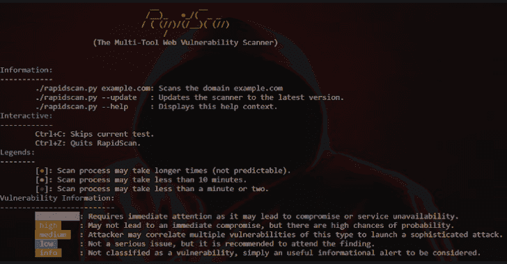
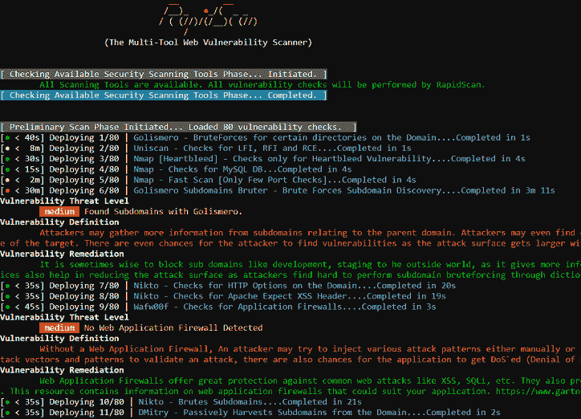

# RapidScan:多工具 Web 漏洞扫描器

> 原文：<https://kalilinuxtutorials.com/rapidscan-web-vulnerability-scanner/>

RapidScan 是一款多工具网络漏洞扫描器。对于 pentester 来说，在没有自动化的情况下执行大量的工具扫描(一个接一个地运行安全扫描工具)是一件非常麻烦的事情。

除非你是自动化方面的专家，否则对每一个约定都进行狂扫是一项艰巨的任务。

这个计划的最终目标是通过自动化解决这个问题；即运行多种扫描工具来发现漏洞，有效判断误报，集中关联结果并节省宝贵的时间；所有这些都在一个屋檐下。

**特性**

*   **一步安装**。
*   **执行多种安全扫描工具**，进行其他**自定义编码检查**，**自动打印结果**。
*   一些工具包括`nmap, dnsrecon, wafw00f, uniscan, sslyze, fierce, lbd, theharvester, dnswalk, golismero`等在一个实体下执行。
*   节省了很多时间，**确实节省了很多时间！**。
*   **使用多种工具**检查相同的漏洞，以帮助您**有效地消除误报**。
*   **图例**帮助您了解哪些测试可能需要更长的时间，因此如果需要，您可以`Ctrl+C`跳过。
*   **与 OWASP 2017 年 Top 10**发现的漏洞列表关联。(*正在开发*
*   **关键、高、中、低和信息性**漏洞分类。
*   **漏洞定义**指导您漏洞实际上是什么以及它可能造成的威胁。( *~~**正在开发**~~* )
*   **补救**告诉您如何堵塞/修复发现的漏洞。( *~~**正在开发**~~* )
*   **执行摘要**为您提供所执行扫描的总体环境，包括发现的严重、高、低和信息问题。(*正在开发*
*   **人工智能**根据发现的问题自动部署工具。对于 eg；当找到 wordpress 安装时，自动启动`wpscan`和`plecost`工具。(*开发中*)
*   **详细的综合报告**以可移植文档格式(*。pdf)以及扫描和所用工具的完整细节。(*正在开发*

**也可理解为-[ghost delivery:。持续交付有效负载的 VBS 脚本](https://kalilinuxtutorials.com/ghostdelivery/)**

**漏洞检查**

*   DNS/HTTP 负载平衡器和 Web 应用防火墙。
*   检查 Joomla，WordPress 和 Drupal
*   SSL 相关漏洞( *HEARTBLEED、FREAK、POODLE、CCS 注入、LOGJAM、OCSP Stapling* )。
*   通常打开的端口。
*   使用多种工具进行 DNS 区域迁移(*激烈、DNSWalk、DNSRecon、DNSEnum* )。
*   子域暴力破解。
*   打开目录/文件暴力。
*   浅 XSS，SQLi 和 BSQLi 横幅。
*   慢-洛里斯 DoS 攻击，LFI ( *本地文件内含*)，RFI ( *远程文件内含* ) & RCE ( *远程代码执行*)。
*   &更多即将推出…

**要求**

*   Python 2.7
*   Kali OS ( ***)首选**，因为它附带了几乎所有的工具* )
    用于其他风格的 OS，在 docker 支持上工作。坚持住。

**用途**

**下载脚本并授予可执行权限**

**wget-o rapid scan . py https://raw . githubusercontent . com/skvngr/rapid scan/master/rapid scan . py&【chmod+x rapid scan . py】**

**输出**

[**Download**](https://github.com/skavngr/rapidscan)