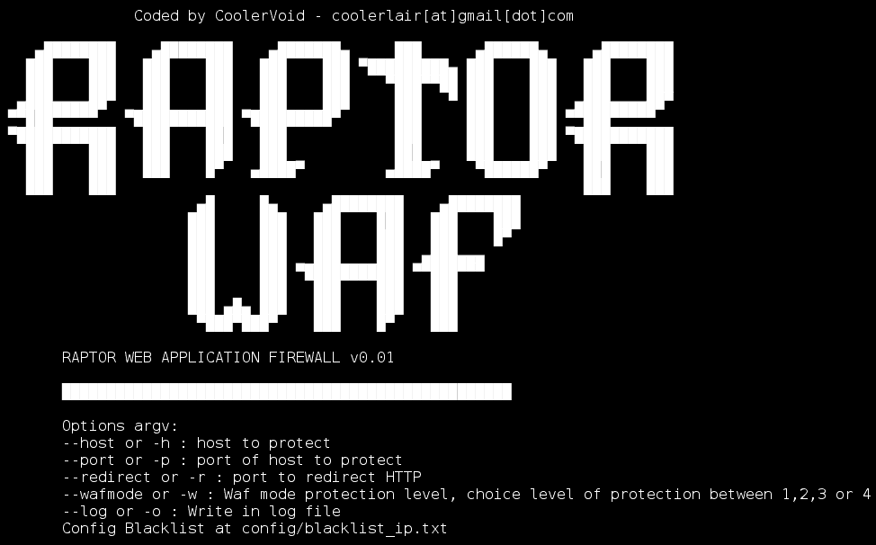

# raptor WAF–使用 DFA 的 Web 应用防火墙

> 原文：<https://kalilinuxtutorials.com/raptor-waf-web-application-firewall/>

Raptor WAF 是一个用 C 语言开发的开源 Web 应用防火墙工具，利用 DFA 来阻止 SQL 注入、跨网站脚本和路径遍历。现在它被广泛地用于以下方面:

*   用猛禽阻挡 XSS，SQL 注入的攻击和路径遍历。
*   在 config/blacjlist_ip.txt 中使用黑名单 ip 阻止一些用户
*   在通信中使用 IPv6 和 IPv4。
*   在未来的 Dos 保护器，请求限制，规则解释器和恶意软件检测器在上传。
*   在未来的 SSL/TLS。

**也可理解为[RouterSploit——嵌入式设备开发框架](https://kalilinuxtutorials.com/routersploit-exploitation-framework/)**



## **编译 Raptor WAF**

```
$ git clone [https://github.com/CoolerVoid/raptor_waf](https://github.com/CoolerVoid/raptor_waf)****$ cd raptor_waf; make; bin/raptor
```

**注意:**不要用“cd bin。/raptor "使用完整路径" bin/raptor "。需要 lib pcre 来编译。

## **例子**

在端口 80 启动一些 HTTPd 服务器，用 raptor 重定向到端口 8883

```
$ bin/Raptor -h localhost -p 80 -r 8883 -w 4 -o loglog.txt
```

将易受攻击的 PHP 代码复制到您的 web 服务器目录

```
$ cp doc/test_dfa/test.php /var/www/html
```

现在您可以在[http://localhost:8883/test . PHP](http://localhost:8883/test.php)测试 xss 攻击

要运行的其他选项(现在使用 regex，查看文件 config/regex_rules.txt 以编辑规则):

```
$ bin/Raptor -h 127.0.0.1 -p 80 -r 8883 -w 0 -o resultwaf -m pcre
```

[](https://github.com/CoolerVoid/raptor_waf)