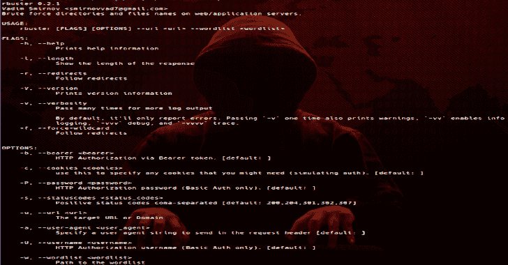

# RBuster:又一部恐怖片

> 原文：<https://kalilinuxtutorials.com/rbuster-dirbuster/>

Rbuster 是最新版本的 v0.2.1 的又一大亮点。

*   `**-a <user agent string>**`–指定要在请求中发送的用户代理字符串
*   `**-c <http cookies>**`–使用它来指定您可能需要的任何 cookies(模拟验证)。标题。
*   `**-f**`–强制处理带有通配符结果的域。
*   `**-l**`–显示响应的长度。
*   `**-r**`–跟随重定向。
*   `**-s <status codes>**`–逗号分隔的状态代码列表集，被视为“正”(默认:`200,204,301,302,307`)。
*   `**-u <url/domain>**`–完整的 URL(包括方案)，或基本域名。
*   `**-v**`–详细输出(显示所有结果)。
*   `**-w <wordlist>**`–用于暴力破解的单词列表的路径。
*   `**-b <token>**`–通过不记名令牌进行 HTTP 授权。
*   `**-P <password>**`–HTTP 授权密码(仅限基本授权，如有缺失则提示)。
*   `**-U <username>**`–HTTP 授权用户名(仅限基本授权)。

**又读-[GoBuster:目录/文件，DNS & VHost 用 Go](https://kalilinuxtutorials.com/gobuster/)T3 写的破坏工具**

**安装**

**货物安装滑轮**

**安装在卡利**

安装 libssl-dev pkg-config
货物安装程序

**例子**

**$ r buster-w common . txt-u http://horriblesubs.info/

r buster 0 . 1 . 0 Vadim Smirnov
= = = = = = = = = = = = = = = = = = = = = = = = = = = = = = = = = = = = = = = = = = = =
网址/域名:http://horriblesubs.info/
word list:common . txt
Words:4593
= = = = = = = = = = = = = = = = = = = = = = = = = = = = = = = = = = = =
/感谢(状态:感谢**

[**Download**](https://github.com/smirnovvad/rbuster)