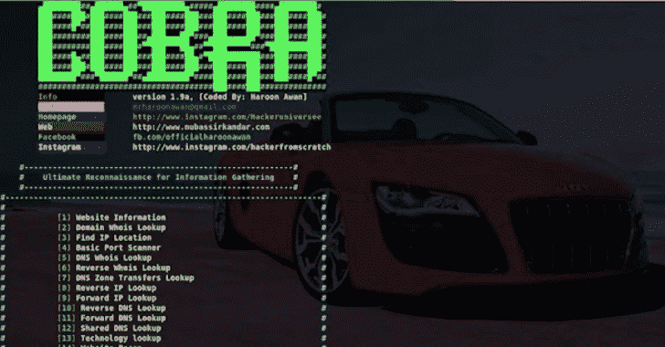

# ReconCobra:用于信息收集的完整自动化 Pentest 框架

> 原文：<https://kalilinuxtutorials.com/reconcobra-automated-pentest-framework/>

ReconCobra 是一个用于信息收集的完整自动化 pentest 框架，将在 Kali、Parrot OS、Black Arch、Termux 和 Android Led 电视上进行测试。

**简介**

*   它在银行、私人组织和道德黑客人员中用于法律审计。
*   它作为一种防御方法，尽可能多地查找信息，以获得未经授权的访问和入侵。
*   随着更先进技术的出现，网络罪犯也找到了更多进入许多组织系统的方法。
*   It 软件可以审计防火墙行为，如果它泄漏后端机器/服务器并回复 pings，它可以找到安装了许多软件(如 erp、邮件防火墙)的内部和外部网络，暴露服务器，因此它尽可能多地对目标进行足迹、扫描和枚举，以发现和收集最可能的信息，如用户名、web 技术、文件、端点、API 等。
*   这是阻止网络犯罪的第一步，通过保护您的基础设施信息收集泄漏。它是无假阳性的，当有什么东西时它会显示出来，如果没有，它会给出空白结果而不是错误。

**也可阅读-[PBTK:逆向工程工具集&模糊化基于 Protobuf 的应用](https://kalilinuxtutorials.com/pbtk-toolset-reverse-engineering-fuzzing-protobuf-based/)**

**集成**

*   Tigerman Root 软件包

**卡利安装**

*   https://github.com/haroonawanofficial/ReconCobra.git
*   cd 录制
*   sudo chmod u+x *.sh
*   。/Kali_Installer.sh
*   它将作为系统软件集成
*   依赖关系将被自动处理
*   将自动处理第三方软件/依赖关系/模块

**Parrot OS 安装**

*   https://github.com/haroonawanofficial/ReconCobra.git
*   cd 录制
*   chmod u+x *.sh
*   Bash ParrotOS_Installer.sh
*   它将作为系统软件集成
*   依赖关系将被自动处理
*   将自动处理第三方软件/依赖关系/模块

**热安装**

*   https://github.com/haroonawanofficial/ReconCobra.git
*   cd 录制
*   chmod u+x *.sh
*   pkg 安装程序
*   类型:term-ch root
*   。/term _ installer . sh
*   。/term _ fix me . sh
*   重启你的 Termux
*   perl ReconCobraTermux.pl
*   Termux 将自动处理依赖关系
*   Termux 将自动处理第三方软件/依赖项/模块

**安卓 Led 电视安装**

*   安装条款
*   输入 usb 键盘
*   https://github.com/haroonawanofficial/ReconCobra.git
*   cd 录制
*   chmod u+x *.sh
*   pkg 安装程序
*   类型:term-ch root
*   。/term _ installer . sh
*   。/term _ fix me . sh
*   重启你的 Termux
*   perl ReconCobraTermux.pl
*   Termux 将自动处理依赖关系
*   Termux 将自动处理第三方软件/依赖项/模块

**黑拱安装**

*   出现错误时的未决问题
*   https://github.com/haroonawanofficial/ReconCobra.git
*   cd 录制
*   chmod u+x *.sh
*   。/BlackArch_Installer.sh
*   它将作为系统软件集成
*   依赖关系将被自动处理
*   将自动处理第三方软件/依赖关系/模块

[**Download**](https://github.com/haroonawanofficial/ReconCobra)