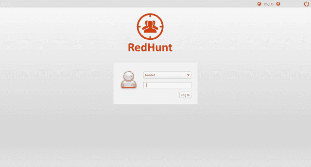
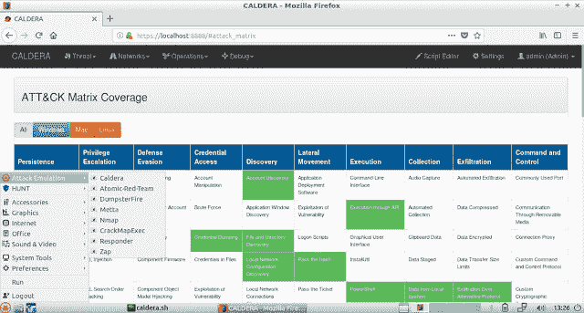
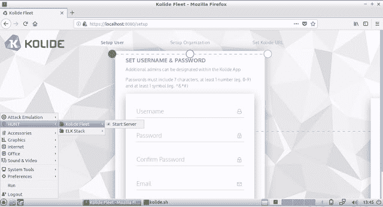
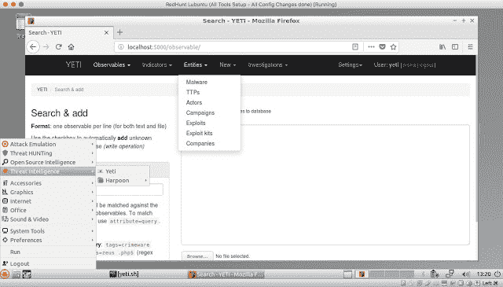

# RedHunt 操作系统:用于对手模拟和威胁追踪的虚拟机

> 原文：<https://kalilinuxtutorials.com/redhunt-os-virtual-machine/>

由 [RedHunt Labs](https://redhuntlabs.com/) 开发的用于对手模拟和威胁追踪的虚拟机。RedHunt OS 旨在通过集成攻击者的武器库和防御者的工具包来主动识别您环境中的威胁，从而成为满足您所有威胁模拟和威胁搜索需求的一站式商店。

**刀具设置**

**攻击仿真:**

*   [火山口](https://github.com/mitre/caldera)
*   [原子红队](https://github.com/redcanaryco/atomic-red-team)
*   [Nmap](https://nmap.org/download.html)
*   [破解密码](https://github.com/byt3bl33d3r/CrackMapExec)
*   [Metasploit](https://github.com/rapid7/metasploit-framework)
*   [应答者](https://github.com/lgandx/Responder)
*   Zap
*   [ADRecon](https://github.com/adrecon/ADRecon)

**威胁狩猎:**

*   [柯立德舰队](https://github.com/kolide/fleet)
*   [ELK (Elasticsearch、Logstash 和 Kibana)堆栈](https://www.elastic.co/elk-stack)

**开源情报(OSINT):**

*   [马尔特戈](https://www.paterva.com/web7/buy/maltego-clients/maltego-ce.php)
*   [侦察](https://bitbucket.org/LaNMaSteR53/recon-ng)
*   [Datasploit](https://github.com/DataSploit/datasploit)
*   [存储器](https://github.com/laramies/theHarvester)

**威胁情报**

 ***   雪人
*   [鱼叉](https://github.com/Te-k/harpoon)

**报道:**

*   [Asciinema](https://asciinema.org/)
*   [火焰射击](https://github.com/lupoDharkael/flameshot)
*   [CherryTree](https://www.giuspen.com/cherrytree/)

**也可阅读-[EVA bs:一个开源的 Android 应用程序，被故意攻击](https://kalilinuxtutorials.com/evabs-open-source-android-application-vulnerable/)**

**VM 下载链接:**

*   发布 v2:[http://bit.ly/RedHunt-OS-v2](http://bit.ly/RedHunt-OS-v2)。欢迎所有反馈。

**变更日志**

*   系统更新
*   工具更新
*   新增类别:报告
*   移除过时的工具
*   基本操作系统更新至 18.04

**设置:**

*   从[https://github.com/redhuntlabs/RedHunt-OS](https://github.com/redhuntlabs/RedHunt-OS)下载最新的 OVA 文件。
*   在 VirtualBox 中导入 OVA。
*   使用凭证 hunter:hunter 登录。
*   更新分发版“sudo apt-get update & & sudo apt-get upgrade”。
*   配置/使用工具。

**虚拟机凭证:**用户名:猎人密码:猎人

**火山口凭证:**用户名:管理员密码:火山口

**校验和:**

**版本 1**

*   MD5:f8d 433140 f 7 e2b 370 b 81 c8 b 6 ed 3c 951 f
*   SHA1:66b 6 a9 BD BD 2c 6 f 029 de 9d 17 a2 e 086166 a1 ab 7 FD 3

**先睹为快**

[**Download**](https://github.com/redhuntlabs/RedHunt-OS)**