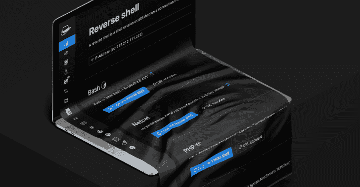
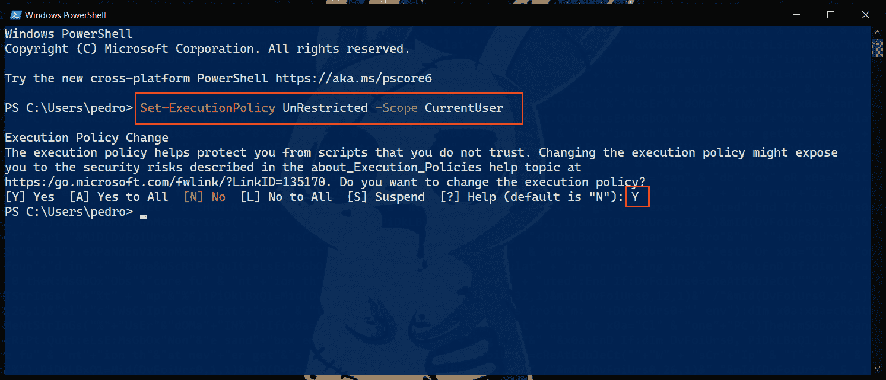
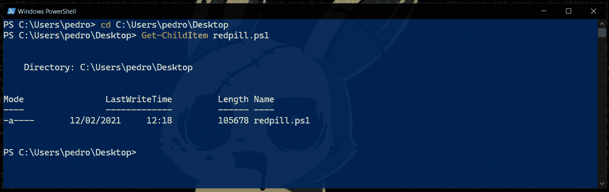
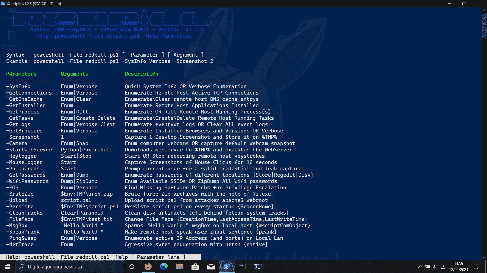
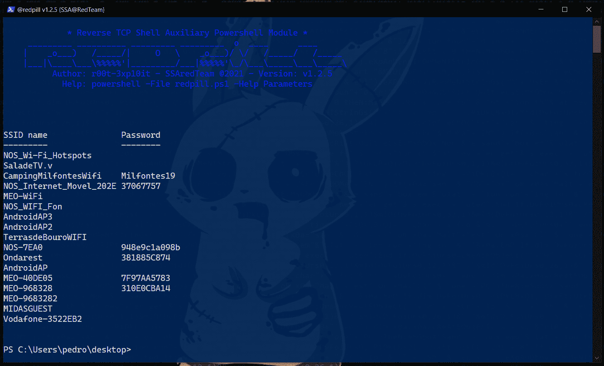
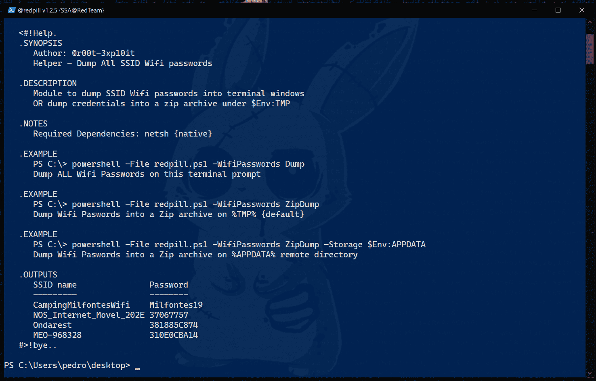
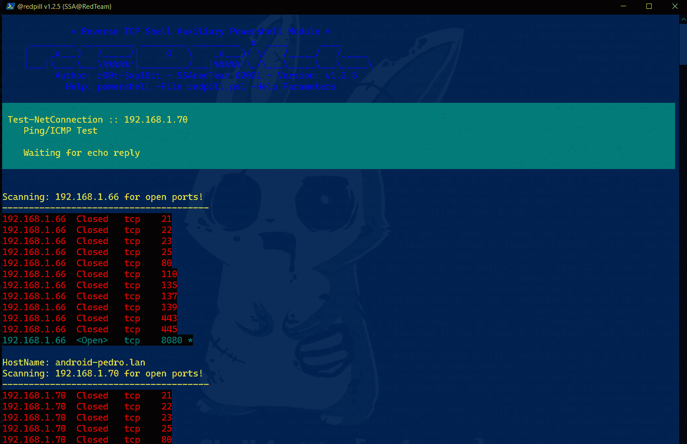
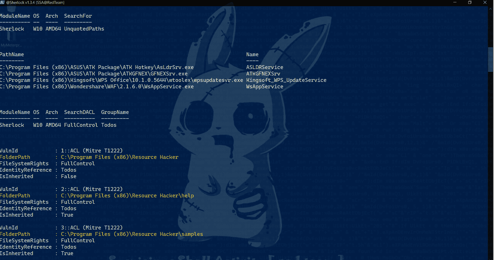
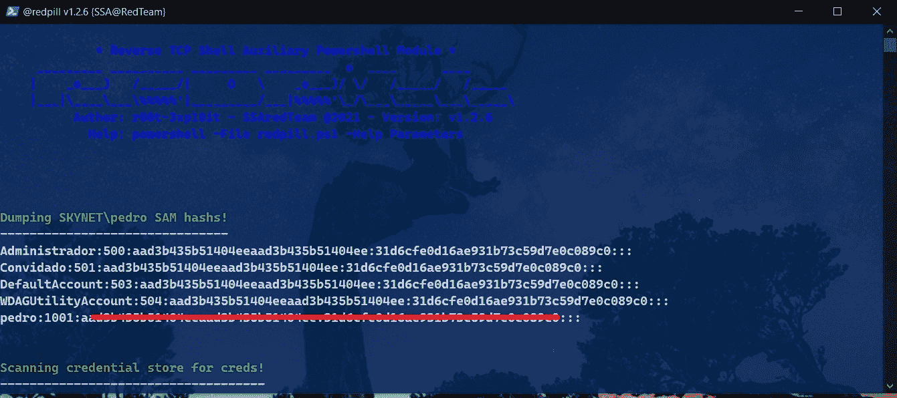
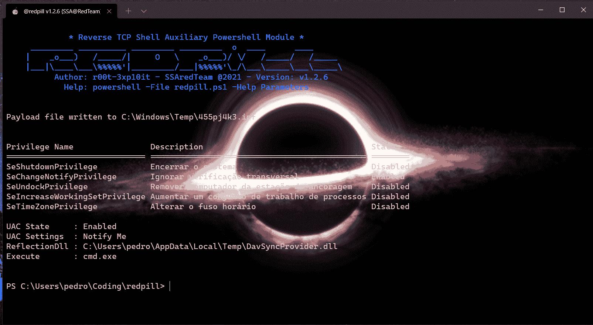

# Redpill:在后期探索任务中辅助反向 Tcp 外壳

> 原文：<https://kalilinuxtutorials.com/redpill/>

Redpill 项目旨在帮助反向 tcp shells 完成勘探后任务。通常在 redteam 项目中，我们
需要使用非常规的方法来访问目标系统，例如反向 TCP shell(***而不是 metasploit*** )以便
绕过系统管理员实施的防御。第一阶段成功完成后
我们面临另一类问题: ***“我有(shell)访问目标系统的权限，现在我可以用它做什么？”***

该项目由几个 PowerShell 脚本组成，这些脚本执行不同的*后期开发功能和
主脚本 ***redpill.ps1*** 主要工作是下载/配置/执行该存储库中包含的脚本。*

 *目标是在我们的反向 tcp shell 提示符下有类似的计量员经验(计量员类似选项)

| 文件夹名称 | 描述 | 笔记 |
| --- | --- | --- |
| 箱子 | 包含 redpill 主模块 | sysinfo &#124; getconnects &#124; persistent &#124; key logger &#124; etc . |
| 旁路，旁道 | 包含 redpill 旁路脚本 | 需要手动下载/执行 |
| 模块 | 包含 redpill 模块 | 夏洛克&#124; CredsPhish &#124; web server &#124; start web server &#124;等。 |
| Utils | 包含蝙蝠&#124; PS1 脚本 | 需要手动执行 |

**CmdLet 参数语法\示例**

**这个 cmdlet 属于 venom v1.0.17.8 的结构，作为一个后开发模块。
毒液 amsi 规避代理自动上传此 CmdLet 到%TMP%目录，以便在我们的反向 tcp 外壳(外壳提示符)中轻松访问
。**

*要列出所有可用的参数，请在 powershell 提示符下执行:*

**。\ red pill . PS1-帮助参数**

| CmdLet 参数名称 | 参数自变量 | 描述 |
| --- | --- | --- |
| -系统信息 | 枚举&#124;详细 | 快速系统信息或详细枚举 |
| -获取连接 | 枚举&#124;详细 | 枚举远程主机活动 TCP 连接 |
| -GetDnsCache | 枚举&#124;清除 | 枚举\清除远程主机 DNS 缓存条目 |
| -GetInstalled | 列举型别 | 枚举安装的远程主机应用程序 |
| -GetProcess | 枚举&#124;删除&#124;令牌 | 枚举或终止运行进程的远程主机 |
| -GetTasks | 枚举&#124;创建&#124;删除 | 枚举\创建\删除远程主机运行任务 |
| -GetLogs | 枚举&#124;详细&#124;清除 | 枚举 eventvwr 日志或清除所有事件日志 |
| -直播 | 绑定&#124;反转&#124;停止 | 使用 MJPEG 流式传输目标桌面的 Nishang 脚本 |
| -获取浏览器 | 枚举&#124;详细&#124;信用 | 枚举安装的浏览器和版本或详细 |
| -GetSkype | 联系人&#124;域用户 | 列举和攻击联合 Skype |
| -截图 | one | 捕获 1 个桌面屏幕截图并将其存储在%TMP%上 |
| -相机 | 枚举&#124;捕捉 | 枚举计算机网络摄像头或捕获默认网络摄像头快照 |
| -StartWebServer | Python &#124; Powershell | 将 web 服务器下载到%TMP%并执行 web 服务器 |
| -键盘记录器 | 开始&#124;停止 | 开始或停止记录远程主机击键 |
| -鼠标记录器 | 开始 | 捕捉 10 秒钟的鼠标点击截图 |
| -PhishCreds | 开始&#124;蛮 | 提示当前用户提供有效凭据和泄漏捕获 |
| -获取密码 | 枚举&#124;转储 | 枚举不同位置的密码{Store&#124;Regedit&#124;Disk} |
| -wifi 密码 | 转储&#124; ZipDump | 枚举可用的 SSIDs 或 ZipDump 所有 Wifi 密码 |
| EOP | 枚举&#124;详细 | 查找缺失的软件补丁以进行权限提升 |
| -广告 | 枚举&#124;创建&#124;执行&#124;清除 | 在$DATA 记录(ADS)上隐藏脚本{ bat &#124; ps1 &#124; exe } |
| -布鲁提兹普 | $Env:TMP\archive.zip | 蛮力选择压缩档案的帮助下，7z.exe |
| -上传 | script.ps1 | 从攻击者 apache2 webroot 上传 script.ps1 |
| -坚持 | $Env:TMP\Script.ps1 | 每次启动时持续运行 script . PS1 { beacon home } |
| 干净的轨道 | 清晰&#124;偏执 | 清理留下的磁盘项目{清理系统磁道} |
| -AppLocker | 枚举&#124; WhoAmi &#124;测试 | 枚举具有弱权限的 AppLocker 目录 |
| -菲利梅斯 | $Env:TMP\test.txt | 更改文件 Mace {CreationTime，LastAccessTime，LastWriteTime} |
| -元数据 | $Env:TMP\test.exe | 显示文件\应用程序描述(元数据) |
| -佩霍洛 | getssystem &#124; $ env:tmp \ test . exe | 处理挖空{将 explorer.exe 模拟为父级} |
| -MsgBox | “你好，世界。” | 产生了“你好，世界”本地主机{ wscriptComObject }上的 msgBox |
| 说话恶作剧 | “你好，世界。” | 让远程主机说出用户输入的句子{恶作剧} |
| -NetTrace | 列举型别 | netsh {native}帮助下的主动枚举 |
| 平斯威 | 枚举&#124;详细 | 枚举本地局域网上的活动 IP 地址和开放端口 |
| -DnsSpoof | 枚举&#124;重定向&#124;清除 | 将域名重定向到我们的网络钓鱼 IP 地址 |
| -残疾 | 查询&#124;开始&#124;停止 | 禁用 Windows Defender 服务(WinDefend) |
| -隐藏用户 | 查询&#124;创建&#124;删除 | 查询\创建\删除隐藏的用户帐户 |
| -CsOnTheFly | 编译&#124;执行 | 下载\编译(到 exe)并执行 CS 脚本 |
| -厨艺劫持 | 转储&#124;历史记录 | Edge&#124;Chrome Cookie 劫持工具 |
| -UacMe | 旁路&#124;提升&#124;清洁 | UAC 绕过&#124;EOP 通过 dll 反射！(cmstp.exe) |

*要显示每个参数的详细信息，请执行:*

**语法:。\ red pill . PS1-Help[-参数名称]
示例:。\ red pill . PS1-帮助妻子密码**

**指令如何使用 Cmdlet { *本地测试* }**

**这个 cmdlet 属于 venom v1.0.17.8 的结构，作为一个后开发模块。
毒液 amsi 规避代理自动上传此 CmdLet 到%TMP%目录，以便在我们的反向 tcp 外壳(shell)中轻松访问
。**

**'本节描述如何在不利用目标主机的情况下在本地测试此 Cmdlet】**

1–从 GitHub 库下载 CmdLet 到 ***【本地磁盘】***

**iwr-Uri https://raw . githubusercontent . com/r00t-3xp 10 it/red pill/main/red pill . PS1-OutFile red pill . PS1**

2–将 Powershell 执行策略设置为 ***【无限制】***

**Set-ExecutionPolicy 无限制作用域 CurrentUser**

3–浏览至 *'redpill.ps1'* 存储目录

**cd C:\Users\pedro\Desktop**

4–访问 CmdLet 帮助菜单{所有参数}

**。\ red pill . PS1-帮助参数**

5–进入***[-wifi 密码】*** 详细参数帮助

**语法:。\ red pill . PS1-Help[-参数名称]
示例:。\ red pill . PS1-帮助妻子密码**

6–运行***[-wifi 密码】【转储】*** 模块

**语法:。\ red pill . PS1[-参数名] [ @argument ]
例:。\ red pill . PS1-WifiPasswords Dump**

7–运行 ***[ -sysinfo ] [ Enum ]*** 模块

**语法:。\ red pill . PS1[-参数名] [ @argument ]
例:。\redpill.ps1 -sysinfo Enum**

**说明如何使用*Venon v 1 . 0 . 17 . 8*T3 下的 CmdLet**

这个 cmdlet 属于 venom v1.0.17.8 的结构，作为一个后开发模块。
venom amsi 规避代理自动将此 CmdLet 上传到%TMP%目录，以便在我们的反向 tcp shell 中
轻松访问(shell 提示符)。

1–在反向 tcp shell 提示符下执行

**【天网】C:\ Users \ Pedro \ AppData \ Local \ Temp>powershell-File red pill . PS1-帮助参数**

2–进入***[-wifi 密码】*** 详细参数帮助

**【天网】C:\ Users \ Pedro \ AppData \ Local \ Temp>powershell-File red pill . PS1-Help wifi passwords**

3–运行***[-wifi 密码】【转储】*** 模块

**【天网】C:\ Users \ Pedro \ AppData \ Local \ Temp>powershell-File red pill . PS1-wifi passwords Dump**

**要手动下载 CmdLet 进行本地测试，请执行**

**iwr-Uri https://raw . githubusercontent . com/r00t-3xp 10 it/red pill/main/red pill . PS1-OutFile red pill . PS1**

**视频教程**

演示—[本教程使用:sysinfo、GetPasswords、UacMe 模块](https://drive.google.com/file/d/1iryAhz-ryJWMz8-MNqKm1WffLYS6nhT0/view?usp=sharing)
mouse logger—[借助 psr.exe](https://drive.google.com/file/d/1k3DrsDEc6nOd7RHm-25nw0q6oD_aGxjg/view?usp=sharing)
PhishCreds—[费西合唱团获取登录凭证或强力用户帐户密码](https://drive.google.com/file/d/1m1M4rp24QGYftv9JPnp5Kj_zs8YFhz3_/view?usp=sharing)
FileMace—[更改文件时间戳{CreationTime，LastAccessTime，lastwrite time }](https://drive.google.com/file/d/10tR3hu_pS9tJiTImJTkraXozEEgAezwx/view?usp=sharing)
cson thefly—[下载(从 url)，自动编译并即时执行 CS 脚本](https://drive.google.com/file/d/1L4Qj0eK4QMbC6yBFlUVJQyi0NEoe25Ug/view?usp=sharing)
EOP—[为权限提升查找缺失的软件补丁](https://drive.google.com/file/d/1s6hPm63i4m2CHXEZU4ByRJRA41EOwUGf/view?usp=sharing)

**致谢**

| hax0r | 功能 | OS 风味 |
| --- | --- | --- |
| ***@youhacker55*** | 对于所有帮助调试此 cmdlet(测试测试版) | windows 7 x64 位 |
| ***@0xyg3n*** | 对于所有帮助调试此 cmdlet(测试测试版) | windows 10 x64 位 |
| ***@ Shanty _ dama yanti*** | 调试此 cmdlet(绕过 amsi 字符串检测) | windows 10 x64 位 |
| ***@米尔蒂霍克*** | 调试此 cmdlet 和录制视频教程 | windows 10 x64 位 |

**[欢迎任何合作或错误报告](https://github.com/r00t-3xp10it/redpill/issues)**

[**Download**](https://github.com/r00t-3xp10it/redpill)*