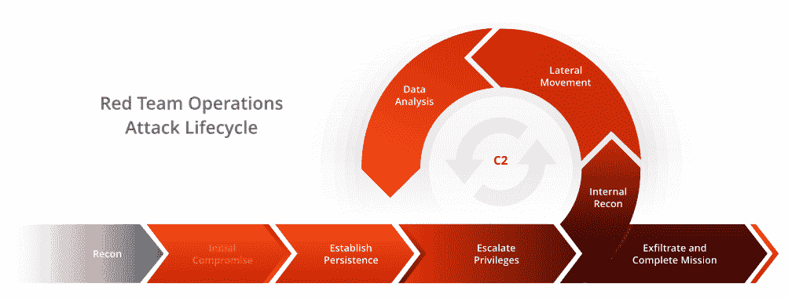

# 红队-硬件-工具包:红队硬件工具包

> 原文：<https://kalilinuxtutorials.com/redteam/>

**组建 Redteam** 的目的应该是识别和评估漏洞、测试假设、查看备选攻击方案并揭示该组织的局限性和安全风险。

红队有很多好处。首先，您有一个指定的小组，该小组具有随时挑战您组织的安全性的战术经验。这对于了解您的组织如何应对对手希望在您的环境中部署的相同策略非常重要。高效的红队:

*   质疑您组织的假设，并识别错误的逻辑或有缺陷的分析。
*   评估证据基础的强度或信息的质量，确定备选方案或结果，和/或探索行动或攻击计划的后果。
*   从对手的角度测试您的系统、网络、应用程序等。
*   了解对手侵入您的系统并在其中移动的选项。

**红队的角色**

这是一个指定的小组，在实时攻击真正发生之前，测试您的组织的安全状况，以了解它如何抵御实时攻击。雇用具有不同背景和专业知识的人有助于充实您的安全红队，以确保您从攻击者的不同角度测试和观察您的公司。

你的红队应该全年定期挑战你的安全措施。他们的工作主要是测试你的基础设施，看看它如何在不通知同事的情况下抵御不同的攻击方法。但是，在实施新的安全软件或程序后，让您的红队测试您的组织也是值得的。

**红队对渗透测试仪**

渗透测试人员是任何组织都必须具备的。这是一个指定的人，他将从道德上对你的环境进行黑客攻击和评估。在这个角色中，他们将是联络点，并作为您的安全范围背后的大脑进行操作。

虽然有人在适当的位置处理这一点是好的，但是保持所需的测试数量增长对于一个人来说太多了。攻击的数量在不断增加，提前应对这些攻击所需的大量研究和经验也在不断增加攻击时间和发现时间之间的差距。这就是红队出现的原因。雇佣一组人员来测试和监控您的日常安全状况，确保您有适当的措施来保护您的组织。

**硬件工具包列表**

*   锁镐(袖珍)-常用镐
*   门下工具
*   罐装空气、暖手宝(请求出口旁路等。)
*   推刀/刷子工具
*   -防撞杆工具
*   酒窝锁枪
*   管状开锁工具
*   消防/紧急电梯钥匙组
*   USB 键盘记录器和 Hak5 橡胶鸭子
*   客家兰龟
*   菠萝纳米
*   局域网分接头
*   晶片和防护拾取装置
*   笔记本电脑或移动设备
*   外置硬盘
*   假授权书(作为 B 计划和测试事故响应)
*   真实授权书
*   如果利用社会工程，伪装的道具
*   RFID 窃贼/克隆者(很容易隐藏的东西——我经常使用如上图所示的剪贴板)
*   相机(或者用你的智能手机)
*   撬锁工具(口袋)-常见
*   开锁工具(背包)-扩展套件
*   门下工具
*   推刀/刷子工具
*   防撞杆工具
*   带有可互换针头的弹簧枪
*   酒窝锁枪
*   管状开锁工具
*   暖手宝/罐装空气
*   皮手套/好鞋
*   消防/紧急电梯钥匙组
*   USB 键盘记录器和 Hak5 橡胶鸭子
*   客家兰龟
*   局域网分接头
*   晶片和带防护的拾取装置
*   如果需要，笔记本电脑
*   外置硬盘
*   恶意掉线 x4 (USB 等。)
*   流氓接入点(PwnPlug、Pi，无论您选择什么风格)
*   Hak5 菠萝
*   15dbi 无线天线(用于室外，不是你想放在包里的东西)。
*   Nexus 7，带 nethunter、TP-link 适配器等。
*   如果利用社会工程，伪装的道具
*   假授权书(作为 B 计划和测试事故响应)
*   真实授权书
*   RFID 窃贼/克隆者
*   相机(或者用你的智能手机)
*   蛇形摄像机(俯视吊顶或地板的奖励)
*   多工具

上面一些工具的一些示例资源链接

*   www.sparrowslockpicks.com
*   http://shop.riftrecon.com
*   www.wallofsheep.com
*   www.hackerwarehouse.com
*   www.hak5.org

**杂记注意事项**

*   各种 USB 线(A，B，迷你，微型，OTG 等。)
*   SD 卡、microSD 卡
*   智能手机(如果有团队，耳机)
*   人体摄像机(GoPro/ACE 摄像机有时在客户同意的情况下很方便)
*   额外的电源组/电池
*   小手电筒(低流明)
*   RTFM:红队野外手册

[**Download**](https://github.com/sectool/redteam-hardware-toolkit#hardware-toolkit-list-)