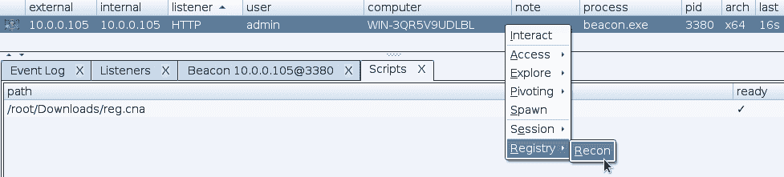
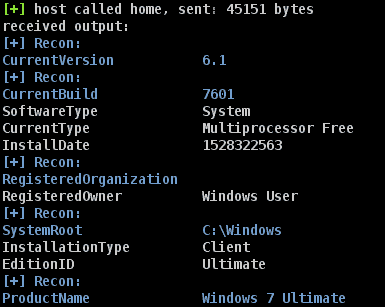

# 注册表-侦察:钴打击侵略者脚本，执行系统/AV/EDR 侦察

> 原文：<https://kalilinuxtutorials.com/registry-recon/>

是一个钴打击侵略者脚本，执行系统/AV/EDR 侦察。

**描述**

作为一名红队的实践者，我们经常使用一些工具，试图找到一个被入侵系统的细节，最好是以最隐秘的方式。由于使用了 Windows CLI 命令，我们的一些常用工具开始被 EDR 产品标记出来。该攻击者脚本旨在通过仅使用本机注册表查询而非 CLI 命令来探测系统，从而解决该问题。

**设置**

只需使用脚本管理器将`**reg.cna**`加载到 Cobalt Strike 中。然后右键单击要运行注册表侦察的信标，选择`**Registry**`然后选择`**Recon**`，或者在信标控制台中键入`**regenum**`。

这是如何工作的？

主要是使用 Cobalt Strike 的`**breg_query**`和`**breg_queryv**`功能。然后，用`**beacon_output**`劫持所有信标输出，寻找特定值。当匹配成功时，输出将在信标输出中突出显示。由于没有 **`beacon_output_reg`** 或类似的东西，像`**beacon_output_ls**`和`**beacon_output_ps**`，所有的输出都必须被捕获用于解析。

**如果我的反病毒/EDR 产品没有被检测到怎么办？/我能帮什么忙？**

这是意料之中的。我们无法测试每一个 AV/EDR 解决方案，我们知道会遗漏许多解决方案。您可以通过提交包含以下信息的 GitHub 问题来帮助我们:

*   如果这是系统/AV/EDR 条目
*   产品的名称
*   可用于确定产品身份的相关注册表项

[**Download**](https://github.com/optiv/Registry-Recon)