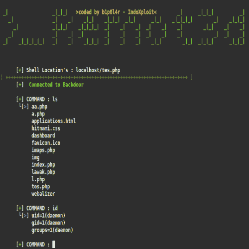
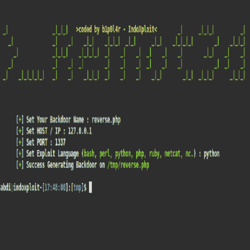

# remot 3d——一个为大型 Pentesters 创建的简单工具

> 原文：<https://kalilinuxtutorials.com/remot-3d-tool-large-pentesters/>

Remot 3d 是一个简单的工具，它是为大型测试者创建的，同时也是为了让破坏者能够利用运行 PHP 编程语言的系统或服务器。

很容易在瞬间创建一个后门，这个后门可以通过运行 PHP 语言程序的服务器上的 Linux 终端在远程进程中使用。

绕过服务器上禁用的系统，尤其是读取敏感文件`**/etc/passwd.**`

**也可阅读:**[Stardox–Github 观星者信息收集工具](https://kalilinuxtutorials.com/stardox-github-gathering-tool/)

#### **远程 3d 功能列表**

*   为 windows 或 Linux 服务器创建后门(可以运行 php 文件)
*   利用 imap_open 漏洞绕过禁用功能
*   使用 cURL 或独特的逻辑脚本绕过读取文件`/etc/passwd`
*   生成后门，可以在工具上远程控制
*   一些其他有趣的东西🙂

#### **安装**

**git clone https://github.com/KeepWannabe/Remot3d
cd Remot3d
chmod +x Remot3d.sh & & ./Remot3d.sh**

#### **我们推荐的操作系统:**

*   Linux mint(基于 Ubuntu 和 Mate DE)
*   鹦鹉
*   追踪
*   后箱
*   德拉科斯
*   IbisLinux

#### **截图**

鸣谢:Abdi Prawira N，Bayu Fedra，Novran Fathir，Ardhana Resky，Agus Setya R，Edo -maland，indo xploit–zero byte . id。

[**Download**](https://github.com/KeepWannabe/Remot3d)