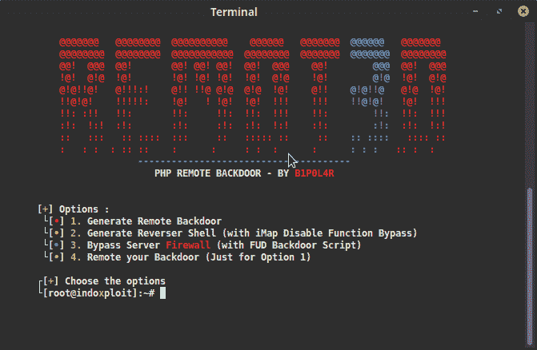
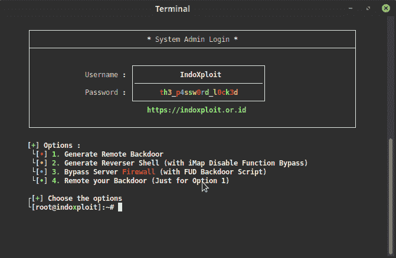
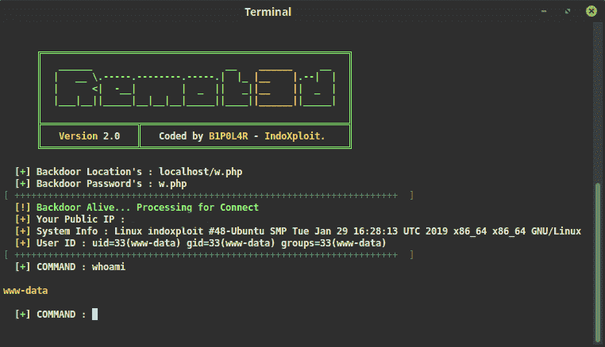
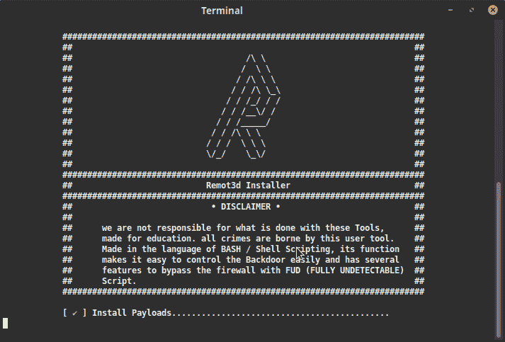

# Remot3d:为大型测试者创建的简单工具

> 原文：<https://kalilinuxtutorials.com/remot3d-pentesters/>

Remot3d 是一个简单的工具，为大型 pentesters 创建，也只是为了让破坏者通过后门控制服务器。

一个用来生成后门程序的工具，用来控制和利用服务器运行 PHP(超文本预处理器)程序。

配备了一个已经被混淆的后门，这意味着 100%的 FUD(完全无法检测)可以穿透服务器的防火墙，因为它不知道这是一个恶意软件，用 Shell 脚本语言编写，或通常被称为 16 岁青少年的 BASH。

**也可以理解为-[军械库:一个用来接收大量外部&发现数据](https://kalilinuxtutorials.com/armory-external-discovery-data/)的工具**

**截图**

*   
*   
*   
*   

**remot 3d 功能列表**

*   为 windows 或 linux 服务器创建后门(可以运行 php 文件)
*   利用 imap_open 漏洞绕过禁用功能
*   使用 cURL 或独特的逻辑脚本绕过读取文件/etc/passwd
*   生成后门程序，并可以在工具上远程操作
*   一些其他有趣的东西🙂

**入门**

**git clone https://github.com/KeepWannabe/Remot3d
cd Remot3d
sudo setup.sh & & Remot3d**

**我们推荐的 Linux 操作系统:**

*   Linux mint(基于 Ubuntu 和 Mate DE)
*   鹦鹉
*   追踪
*   后箱
*   德拉科斯
*   IbisLinux

**Update Remot3d**

要更新 remot3d，请转到 Remot3d 文件夹并执行:git pull && sudo setup.sh && Remot3d。

[**Download**](https://github.com/KeepWannabe/Remot3d)