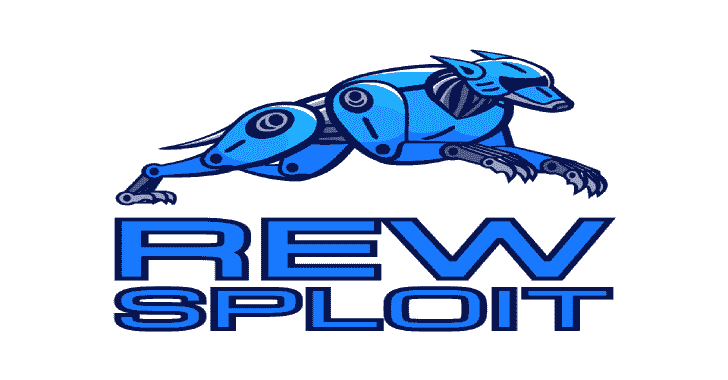

# REW-sploit:模拟和剖析 MSF 和*其他*攻击

> 原文：<https://kalilinuxtutorials.com/rew-sploit/>

**REW-sploit** 是模拟和剖析 MSF 和*其他*攻击的工具。需要帮助分析来自 **Metasploit 框架**或 **Cobalt Strike** 的 Windows 外壳代码或攻击(也可能是其他恶意或混淆代码)？您需要使用简单的脚本来自动化任务吗？您希望通过从有效负载中提取密钥来解密 MSF 生成的流量吗？

REW-sploit 是来帮助蓝队的！

**安装**

安装非常容易。我强烈建议为它创建一个特定的 Python Env:

**# python-m venv/REW-sploit
# source/bin/activate
# git 克隆 https://github.com/REW-sploit/REW-sploit.git
# CD REW-sploit
# pip install-r requirements . txt
#。/apply_patch.py -f
#。/rew-sploit**

如果您愿意，可以使用 docker 文件。要创建图像:

**码头工建造-t 奖励-sp lolit/rew-sp lolit。**

然后启动它(共享`**/tmp/**`文件夹):

**docker run–RM-it–name rew-sploit-v/tmp:/tmp rew-sploit/rew-sploit**

您会在安装序列中看到一个`**apply_patch.py**`脚本。这需要对`**speakeasy-emulator**`(https://github.com/fireeye/speakeasy/)应用一个小补丁，使其与`**REW-sploit**`兼容。如果需要，您可以使用`**./apply_patch.py -r**`轻松恢复补丁。

或者，您也可以安装 Cobalt-Strike 解析器:

**# CD REW-sploit/extras
# git 克隆 https://github.com/Sentinel-One/CobaltStrikeParser.git**

**站在巨人的肩膀上**

`**REW-sploit**`是基于几个伟大的框架，即`**Unicorn**`和 **`speakeasy-emulator`** (但也包括其他库)。感谢所有人，也感谢开放源码软件运动！

**工作原理**

总的来说，我们可以说，虽然红队有很多工具帮助他们“自动化”攻击，但蓝队有点“无工具”。所以，我想的是建立一些东西来帮助蓝队分析。

`**REW-sploit**`可以得到一个 shellcode/DLL/EXE，模拟执行，并给你一组信息来帮助你理解是怎么回事。提取信息的例子有:

*   API 调用
*   由 **MSF** 有效负载使用的加密密钥
*   来自 **MSF** 的解密的第二阶段
*   Cobalt-Strike 配置(如果安装了 CobaltStrike 解析器)

您可以在下面找到几个关于当前功能的示例:

*   RC4 键提取
*   RC4 密钥提取+ PCAP 第二阶段解密
*   ChaCha 键提取
*   电表首选会话解密 _ 无 rsa)
*   钴击信标模拟
*   钴击配置提取
*   调试选项
*   转储线程

**甜甜圈支持**

你肯定知道甜甜圈包，能够从 EXE，DLL，VBScript 和 JScript 创建 PIC。

`**Donut**`为了逃避检测，使用了一个 API exports 枚举，该枚举基于对每个 API 名称计算的散列，正如许多 PIC 所做的那样。这是非常 CPU 密集型的(尤其是在像`**REW-sploit**`这样的模拟环境中)。所以，知道了哪些是`Donut`存根需要的 API(你可以在 donut.c 中得到它们)，我实现了一个快捷方式来避免哈希计算，如果这个 API 不在使用列表中的话。这使得仿真速度大大加快(即使需要几分钟)。

此外，为了能够正确地完成仿真，您需要给`**Speakeasy**`DLL 以获得完整的导出。为此，请复制以下 dll

**kernel32.dll
mscoree.dll
ole32.dll
oleaut32.dll
wininet.dll**

在`**Speakeasy**`文件夹`**winenv/decoys/amd64**`和/或`**winenv/decoys/x86**`中(详见 Speakeasy 自述文件)。如果你不需要它们，不要把 dll 留在那里，因为它们会降低仿真的速度。

**固定架**

在某些情况下，出于不同的原因，仿真只是中断了。在某些情况下，混淆使用了一些技术来混淆仿真引擎。所以我实现了一些特别的修复(您可以通过使用`**emulate_payload**`命令的`**-F**`选项来启用它们)。修正在`**modules/emulate_fixups.py**`实现。目前我们有

独角兽问题#1092:

**Fixup # 1
Unicorn Issue # 1092(XOR 指令执行两次)【https://github.com/unicorn-engine/unicorn/issues/1092】T2
# 820(运行自修改代码后内存视图不正确)
https://github.com/unicorn-engine/unicorn/issues/820
Issue:自修改代码在同一个翻译块(16 字节？)
是的，我知道…这是一个巨大的组合… :-/**

FPU 仿真问题:

**Fixup #2
用于恢复 EIP 的“fpu”相关指令(FPU/FNSTENV)，有时
会返回错误的地址。
在这种情况下，当 FNSTENV 被调用**时，我需要跟踪第一条 FPU 指令，然后将它的地址
放入堆栈

陷阱标志规避:

**#Fixup #3
#Trap Flag 规避技术
# https://unit 42 . Palo alto networks . com/single-bit-Trap-Flag-Intel-CPU/
# Trap Flag 使能的 RDTSC 调用，导致未处理的
#中断。示例代码:
# pushf
#或 dword [esp]，0x 100
# popf
# rdtsc
#任何设置了 Trap 标志的对 rdtsc 的调用都将被拦截，TF 将
#被清除**

**定制 YARA 规则**

文件`**modules/emulate_rules.py**`包含了 **YARA** 规则，用来截取代码中有趣的部分，以便实现插桩。为了让您创建自己的规则，我尽可能多地对这些部分进行了注释(如果您认为它们可以帮助其他人，请通过拉式请求来共享它们)。例如:

**有效负载名称:[MSF]windows/meter preter/reverse _ TCP _ RC4
Search for:mov ESI，dword ptr [esi]
xor esi，0x
用于:此 xor 指令包含用于
加密有效负载长度的常数，该长度将作为第二个
阶段
架构发送:x32
yara _ reverse _ TCP _ RC4 _ xor _ 32 = ' rule reverse _ TCP _ RC4 _ xor { \【T8？？？？？？？} \
条件:\
$opcodes_1 }'**

[**Download**](https://github.com/REW-sploit/REW-sploit)