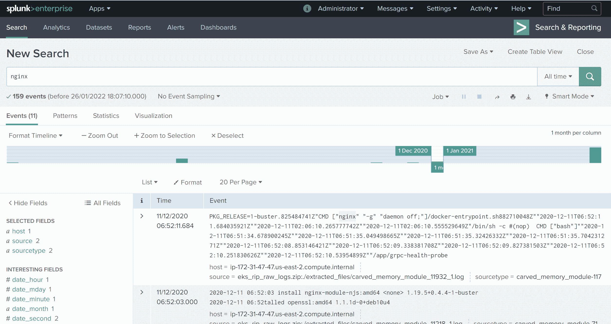

# Rip Raw:分析受损 Linux 系统内存的小工具

> 原文：<https://kalilinuxtutorials.com/rip-raw/>

Rip Raw 是一个分析被入侵的 Linux 系统内存的小工具。它的目的类似于 Bulk Extractor，但是特别侧重于从 Linux 系统的内存转储中提取系统日志。这使您无需生成配置文件即可分析系统。

这不能替代 Rekall 和 Volatility 等工具，它们使用概要文件来执行更结构化的内存分析。

Rip Raw 的工作原理是获取原始二进制文件(如内存转储),并使用以下方式来创建文件和日志:

*   文本/二进制边界
*   文件头和文件魔术
*   日志条目

然后将它们放在 zip 文件中，供 Cado Response 等其他工具或 Splunk 等 SIEM 进行二次处理(如下例所示)。

### 例子

例如，在捕获了亚马逊 EKS(弹性 Kubernetes 服务)系统的内存后，我们用 rip_raw 处理它:

**python 3 rip _ raw . py-f eks-node-ncat-capture . mem**

然后，可以在 Cado Response 之类的工具中查看抓取原始输出的大型日志压缩文件(如下)。大约有 **36500 个日志事件**被从这个内存映像中提取出来，还有一些二进制文件，比如映像和可执行文件。

或者 Splunk:

[**Download**](https://github.com/cado-security/rip_raw)