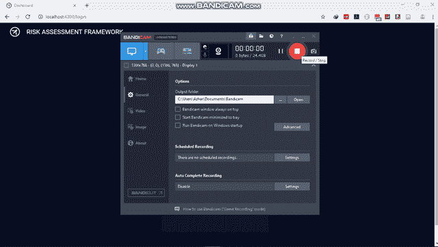
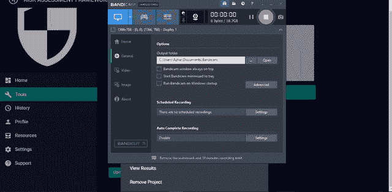

# 风险评估框架:静态应用程序安全测试

> 原文：<https://kalilinuxtutorials.com/risk-assessment-framework-static-application-security-testing/>

OWASP **风险评估框架**由静态应用安全测试和风险评估工具组成，尽管有许多 SAST 工具可供测试人员使用，但兼容性和环境设置过程很复杂。

通过使用 OWASP 风险评估框架的静态应用程序安全测试工具，测试人员将能够分析和检查他们的代码质量和漏洞，而无需任何额外的设置。

OWASP 风险评估框架可以集成到 DevSecOps 工具链中，以帮助开发人员编写和生成安全的代码。

**特性**

*   远程网页污损检测(可选)
*   静态应用程序安全性测试

**也可阅读-[Blinder:一个 Python 库，用于自动化基于时间的盲目 SQL 注入](https://kalilinuxtutorials.com/blinder/)**

**网页污损检测**

**网页污损检测装置**:

**CD web _ defage/
pip install-r requirements . txt
python web _ defage . py**

**Demo RAF SAST Tool**

演职员表:阿德·尤斯曼·普特拉，阿兹丁·拉姆拉米，雷杰赫·雷希姆

[**Download**](https://github.com/OWASP/RiskAssessmentFramework)