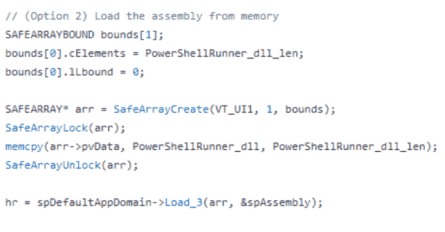

# RogueAssemblyHunter:Rogue Assembly Hunter 是一个发现‘有趣’的实用程序。NET CLR 模块

> 原文：<https://kalilinuxtutorials.com/rogueassemblyhunter/>

.png)

**Rogue Assembly Hunter** 是一个发现‘有趣’的实用程序。运行进程中的. NET CLR 模块。

## 背景

。NET 是一个非常强大的开发平台和运行时框架。NET 托管应用程序。在过去的几年里。NET 已经被红队(以及类似的队伍)采用，用于装备贸易技术以支持进攻行动。尤其是从进攻型 PowerShell 到。NET 是一个合乎逻辑的飞跃(对许多人来说),因为 PowerShell v5+中增加了光学和机会的可视性。就此而论。NET 攻击性工具和 tradecraft 已被成功用于规避基于主机的防御功能，绕过应用程序控制，以及构建/登台/交付/执行恶意代码(类似于 PowerShell)。

从预防的角度来看，微软正在做更多的工作来对抗。NET 检测威胁，并最大限度地减少总体威胁。净攻击面。例如，微软在中增加了 AMSI 检测功能。NET Framework 4.8 和 WDAC/WLDP 机制相当有效。从检测/响应的角度来看，对。NET 生态系统总是有利于发现新的打击方式。网络威胁。

2017 年，Joe Desimone (@dez_)写了一篇名为《寻找内存》的奇幻文章。网络攻击。今天仍然相关，文章概述了现代。NET 攻击媒介以及按需和基于事件的检测技术。伴随着这篇文章，Joe 发布了一个工具(Get-ClrReflection)来主动检测(和检索)内存。缺少正确磁盘引用的. NET CLR 模块。受 Joe 工作的启发，并利用 CLRMD 运行时诊断库的自省功能(加上 mscordacwks.dll 的后续数据访问功能)，Rogue Assembly Hunter 被创建来:

*   检查(所有)运转情况。感兴趣的 CLR 模块(例如，形成“程序集”的模块)的. NET(“托管”)进程
*   检查单个。有趣的 CLR 模块的 NET(“托管”)进程(通过 PID)
*   观察新生成的进程，并尝试检查感兴趣的 CLR 模块
*   支持多种“搜索”功能，以发现内存中加载的模块、模块的签名状态(如果从磁盘加载)、从感兴趣的目录加载的模块以及假冒模块(例如，伪造的文件引用)。
*   支持 CLR 模块导出功能(Get-ClrReflection 的快速端口)
*   激发更多有趣的工具和工艺

## 主要需求&依赖关系

*   在特权用户/进程上下文下运行
*   。NET Framework 4.6.1+版
*   。Microsoft。诊断。运行时自检库(NuGet 包)
*   il merge–静态链接器(NuGet 包)
*   …以及支持 Visual Studio 中的 NuGet 包。

## 注意事项，提示，&注意事项

*   以具有高/系统完整性的特权用户身份运行。
*   “搜索”是实验性的，不能保证提供完整/正确的结果。小心误报(例如签名模块)并相应地进行验证。
*   RogueAssemblyHunter 使用 CLRMD 连接到活动进程，这可能会引入有趣的结果。
*   由于 RogueAssemblyHunter 的扫描性质，可能会出现争用情况和遗漏结果。考虑使用–checks 和–sleep 开关进行调优以提供帮助(尤其是在“监视”模式下)。在某些情况下，由于执行速度的原因，可能很难“捕获”特定的程序集加载(例如执行程序集和牺牲进程)。
*   建筑(“比特”)和。NET 版本对于使用。NET CLRMD 库。
    *   为了最大限度地检查/覆盖，为 x86 和 x64 用例构建并运行这个程序。
    *   进程扫描模式将尝试连接到所有正在运行的进程，而不管“位”如何。否则，它将因架构不匹配而失败。
*   在 Windows 10 Pro 2H1H 和 Windows Server 2016 Standard 1607 上测试。它可以运行在其他版本的相关。NET 框架。
*   此项目包含带有 NuGet 包、PowerShell 脚本和发布二进制文件的 Visual Studio 项目源代码。
*   Notice.md 包括项目免责声明和许可信息。
*   风险自担(不要介意我可怕的代码😉 )!

## 用法

**[*]参数:
–模式= <。>:必选|选择分析模式。选项包括扫描、处理和观察。
–亨特= <。>:可选|选择搜索扫描类型，查找感兴趣的 CLR 模块。指定全部(默认)、仅存储、异常目录、
签名状态、冒名顶替文件或列表。
–出口= <。>:可选，实验性|指定一个文件路径，以导出加载的 CLR 模块进行内存搜索扫描和冒名顶替文件搜索扫描
(例如–hunt = memory-only/imposter-file/all)。
–PID =<。>:可选|通过 PID 指定目标进程。必须与–mode =过程参数/值一起使用。
–检查= <。>:可选|指定扫描周期值。这可能有助于减少扫描期间的竞争条件缺失，但也可能重复结果输出。
默认值为 1。
–睡眠= <。>:可选|指定睡眠秒数的值。这可以通过延迟检查周期来帮助减少扫描期间的竞争条件缺失。
默认值为 0 秒。
–调试:可选|显示异常信息(如过程连接错误)。
–no banner:可选|隐藏显示横幅。对于使用 PowerShell 脚本执行或利用自动化的用例非常有用。
–suppress:可选|在–mode = sweep 或–mode = watch 期间不扫描 RogueAssemblyHunter 进程。
–help:可选|显示此帮助。这将覆盖任何其他 cmdline 参数并退出应用程序。*这是不带参数的默认值。
[*]Modes(–mode =)–sweep:扫描/迭代所有进程(注意:只有类似架构/'bitness '的进程才会被成功扫描。为 x86/x64/etc 编译运行。).–进程:扫描单个进程。与–PID =一起使用。–观察:扫描创建的新流程。使用–checks 和–sleep 调整扫描属性。(注:这是实验性的。竞争条件是可能的。)[*]Hunts(–hunt =)
–all:默认值。使用所有寻线选项进行分析(除了“列表”)。
–仅记忆:记忆搜寻。分析没有磁盘支持的 CLR 模块。不寻常的目录:不寻常的目录搜寻。分析在“正常”目录之外加载的 CLR 模块。
编辑' _huntUnusualDirectoryFilter '进行定制。
–签名状态:文件签名搜索。分析具有异常签名状态(例如，未签名)的 CLR 模块。注意:这是实验性的。假阳性是可能的。
编辑' _ huntSigExclusionsFilter '进行定制。
imposter-file:意外的 CLR 模块搜索。分析带有可疑磁盘文件备份的 CLR 模块。实验性的。
–list:遍历所有 CLR 模块并相应列出。
[*]示例用法
–示例 1:扫描进程并运行所有可访问的 64 位进程的搜索(除“list”之外)–
RogueAssemblyHunter _ x64 . exe–mode = sweep
–示例 2:扫描进程，列出可访问的 32 位托管进程中的所有 CLR 模块，并显示错误信息—
RogueAssemblyHunter _ x86 . exe–mode = sweep–hunt = list–debug
–示例 3:监视新进程，扫描所有 CLR 在–
RogueAssemblyHunter _ x64 . exe–mode = watch–suppress–checks = 2–sleep = 3
–示例 4:通过 PID 扫描单个进程，列出仅内存中的 CLR 模块发现结果，并将 CLR 模块导出到指定路径–
RogueAssemblyHunter _ x86 . exe–mode = process–PID = 4650–hunt = memory-only–export = c:\ EVI assemblies \
–示例 5:扫描进程，列出内存中的 CLR 模块**

## 发布文件:Invoke-RogueAssemblyHunter &编译的二进制文件

为方便起见，PowerShell 脚本和两个编译的二进制文件(RogueAssemblyHunter_x64.exe 和 RogueAssemblyHunter_x86.exe)包含在\Release 文件夹中。随意修改以适应您的使用情况(例如，部署、嵌入、检查、睡眠等。).

**示例用法**

在扫描模式下运行 Invoke-RogueAssemblyHunter 并检查所有寻线选项

CD c:\ path \ to \ RogueAssemblyHunter
导入模块。\ Invoke-RogueAssemblyHunter . PS1
Invoke-RogueAssemblyHunter

在监视模式下运行 Invoke-RogueAssemblyHunter，并检查所有寻线选项

CD c:\ path \ to \ RogueAssemblyHunter
导入模块。\ Invoke-RogueAssemblyHunter . PS1
Invoke-RogueAssemblyHunter-ScanMode watch

**SHA256 哈希**

**e 804711 A8 b 6469 f1 b 13 b 388 de 47 DFA 6 DDE 1c 85279d 365 db 7 b 6 e 19 e 1644990 fa 6 Invoke-RogueAssemblyHunter . PS1
cc 985d 918 e 566671 aa 209142 ABC 55 BD 798 ca 6 C1 a 18730 b 785 AC 8 c 18d 489736 c 3 RogueAssemblyHunter _ x64 . exe
AE 3 EAD**

[**Download**](https://github.com/bohops/RogueAssemblyHunter)