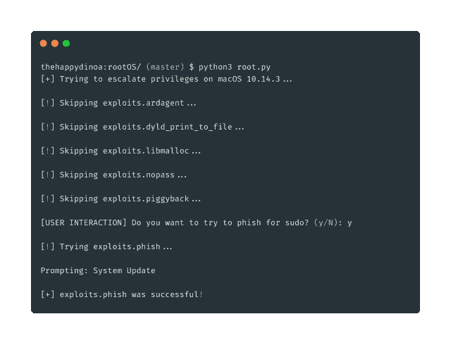
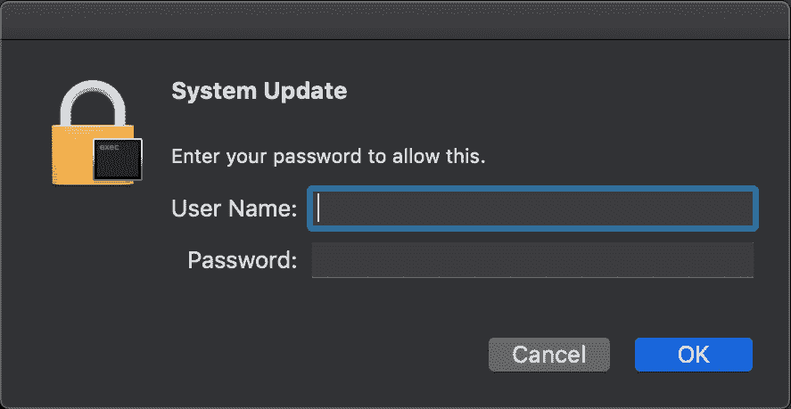
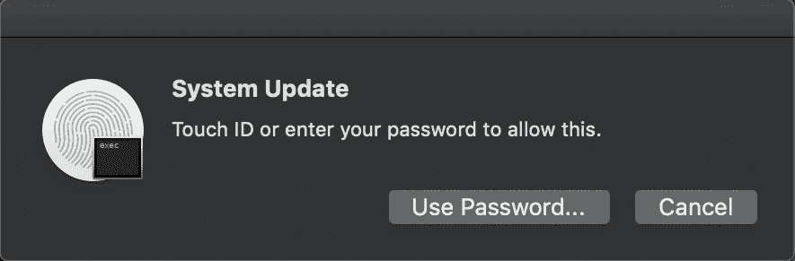

# Root OS–MAC OS Root 助手

> 原文：<https://kalilinuxtutorials.com/rootos-macos-root-helper/>

rootOS 试图使用各种 CVE 来获得 sudo 或 root 访问权限。所有的攻击都有一个最终目标，即在 `**/etc/sudoers**`中添加`**ALL ALL=(ALL) NOPASSWD: ALL**` **，允许任何用户运行`**sudo**`命令。**

**又读-[Goca:用于查找元数据的扫描仪&隐藏信息](https://kalilinuxtutorials.com/goca-scanner-metadata/)**

**战功**

*   CVE-2008-2830
*   CVE-2015-3760
*   CVE-2015-5889
*   CVE-2017-13872
*   AppleScript 动态网络钓鱼
*   须藤背负

**运行**

**python root.py**

**动态网络钓鱼**

[**Download**](https://github.com/thehappydinoa/rootOS)