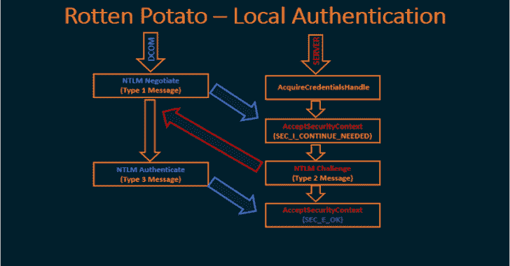

# RottenPotatoNG:一个 C++ DLL 和独立的 C++二进制文件——不需要 Meterpreter 或其他工具

> 原文：<https://kalilinuxtutorials.com/rottenpotatong/>

**RottenPotatoNG** 生成一个 DLL 和 EXE 文件。DLL 包含了执行 RottenPotato 攻击和获取特权令牌句柄所需的所有代码。MSF RottenPotato Test Harness 项目简单地展示了 DLL 的示例用法。有关更多示例，请参见 https://github . com/hatRiot/token-priv/tree/master/pop toke/pop toke，特别是 seassignprimarytokenprivilege . CPP 和 SeImpersonatePrivilege.cpp 文件。

**RottenPotato EXE**

这个项目与上面的相同，除了代码都被打包到一个项目/二进制文件中。这对于一些渗透测试场景可能更有用。

修改 MSFRottenPotato.cpp 中的“main”方法，以更改将要运行的命令。默认情况下，它只是运行 cmd.exe 弹出一个命令外壳。

[**Download**](https://github.com/breenmachine/RottenPotatoNG)