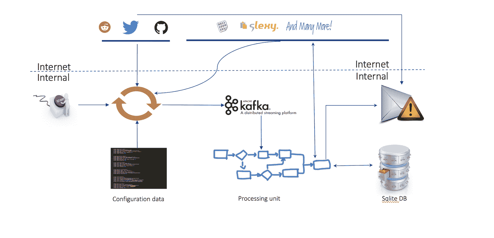

# RTTM:实时威胁监控工具

> 原文：<https://kalilinuxtutorials.com/rttm/>

监控你的公司在互联网上可能面临的威胁是一项不可能的任务。因此，该公司的许多威胁都被忽视了，直到它成为公开的病毒。从而造成金钱/名誉损失。这就是 RTTM 开始行动的地方。

RTTM(实时威胁监测工具)是一个工具，开发来报废所有 pasties，github，reddit..以识别所配置的搜索项的出现。一旦匹配，将触发一封电子邮件。从而允许公司在代码泄露、任何黑客发微博的情况下做出反应..等等..在病毒传播之前让自己坚强起来。

在过去的两年里，这个工具已经从简单的搜索发展而来。已经实现了人工智能来基于上下文执行更好的搜索。如果需要正则表达式，它也是受支持的。因此，行为更接近人类，减少了误报。

该工具最棒的地方在于，从威胁进入互联网开始，警报会在不到 60 秒的时间内发送到电子邮件。从而允许实时响应发生..

恶意用户手中的相同工具可以被恶意使用来获取任何最新的黑客攻击、代码泄漏等的更新..

将被监控的站点列表包括:

*   非馅饼网站
    *   推特
    *   Reddit
    *   开源代码库
*   Pastie 网站
    *   Pastebin.com
    *   Codepad.org
    *   Dumpz.org
    *   Snipplr.com
    *   Paste.org.ru
    *   Gist.github.com
    *   Pastebin.ca
    *   Kpaste.net
    *   Slexy.org
    *   Ideone.com
    *   Pastebin.fr

**也可阅读-[file Intel:一个模块化的 Python 应用程序，用于获取有关恶意文件的情报](http://Fileintel : A Modular Python Application To Pull Intelligence About Malicious Files)**

**架构**

它是如何工作的？

一旦工具被启动，引擎就会被启动并永远运行下去。这个引擎的主要输入是配置文件。基于配置文件数据，引擎继续在 twitter/github/reddit 中搜索配置文件中配置的匹配项。一旦找到匹配，twitter/github/reddit 的链接就会被推送到 sqlite DB，并触发一个电子邮件警报。

在 pastie 网站的情况下，逻辑是不同的。原因是它们既不支持搜索也不支持流式 api。因此，任何用户制作的任何新 pastie，链接都会被获取并推送到 kafka。从 kafka 中，任何添加的新链接都会被拾取并搜索配置文件中配置的匹配项。一旦发现匹配，pastie 站点的链接将被推送到 sqlite DB，并触发一个电子邮件警报。

在过去的两年里，这个工具已经从简单的搜索发展而来。已经实现了人工智能来基于上下文执行更好的搜索。如果需要正则表达式，它也是受支持的。因此，行为更接近人类，减少了误报。

**信用:纳文·鲁达帕**

[**Download**](https://github.com/NaveenRudra/RTTM)