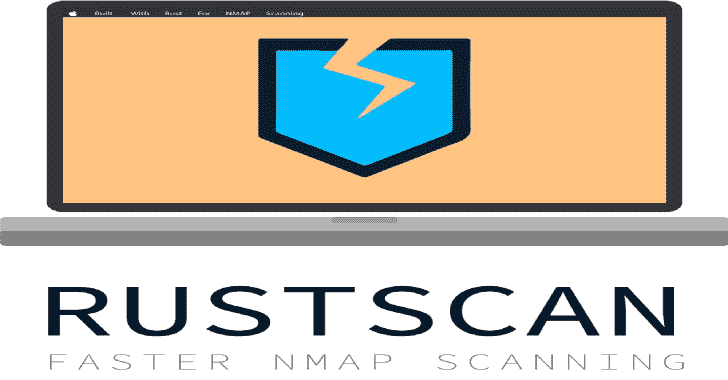

# Rustpad:多线程填充 Oracle 攻击任何服务

> 原文：<https://kalilinuxtutorials.com/rustpad/>

`**Rustpad**`是经典`**padbuster**`的多线程继承者，用 Rust 编写。它滥用填充 Oracle 漏洞来解密任何密码文本或加密任意纯文本**，而不知道加密密钥**！

**特性**

*   密码文本的解密
*   任意纯文本的加密
*   块级和字节级的多线程
*   现代、实时、互动的 TUI！
*   不支持 TTY，所以您可以通过管道输出到一个文件
*   支持 *Web* 服务器 oracles
*   …和*脚本基于*的 oracles。当你需要额外的控制时。
*   web oracle 正确填充响应的自动校准
*   进度条和自动重试
*   标签自动完成
*   块级缓存
*   智能检测密文编码，支持:**`hex``base64``base64url`**
*   没有静脉注射支持
*   写在纯粹的安全锈，确保你不会遇到讨厌的崩溃

**用途**

使用`**rustpad**`攻击一个填充预言很容易。开始时只需要 4 条信息:

*   甲骨文的类型( **`web` / `script`** ，见下文)
*   目标甲骨文(`**--oracle**`)
*   要解密的密码文本(`**--decrypt**`)
*   块大小(`**--block-size**`)

**网络模式**

Web 模式指定 oracle 位于 web 上。换句话说，oracle 是一个带有 URL 的 web 服务器。

如果提供了填充不正确的密码文本，填充 oracle 攻击要想成功，oracle 必须声明这一点。`**rustpad**`将分析先知的响应，并根据先知的行为自动调整自身。

**rustpad web–help
rustpad-web 1 . 8 . 0
提问一个基于 web 的 oracle
用法:
rustpad {web，–web，-W}【选项】–Oracle–Block-size–decrypt
选项:
-A，–User-agent
用户代理用
【默认:rustpad/1 . 8 . 0】
-B，–Block-size
密码器使用的块大小【T14 –Data
在 POST 请求中发送的数据
-D，–解密从目标服务接收的
原始密码文本，该文本将被解密
–Delay
线程内请求之间的延迟，以毫秒为单位
【默认值:0】
-E，–encoding
指定 oracle 用于编码密码文本的编码方式
[选项:auto、hex、base64、base64url]
【默认值:auto】
注意:加密模式需要一个密码文本来收集必要的数据
-h，–help
打印帮助信息
-H，–header
HTTP header 发送
[格式::]
-k，–不安全
禁用 TLS 证书验证
-K，–Keyword
关键字指示密码文本在 HTTP 请求中的位置。它在运行时被替换为密码文本的值
[默认值:CTEXT]
-n，–no-iv
密码文本不包含初始化向量
–no-cache
禁用对缓存文件的读写
–no-url-encode
禁用密码文本的 URL 编码和解码
-o，–输出
日志输出将被写入的文件路径
-O，–Oracle
Oracle 这可以是 URL 或 shell 脚本。
进一步帮助，分别参见子命令`web --help`和`script --help`。
–Proxy-Credentials
凭证使用
[格式::]
-r，–redirect
跟随 HTTP 重定向
-t，–threads
线程池中的线程数量
【默认值:64】
-T，–time out
Web 请求超时(秒)
【默认值:10】
-V，–verbose
增加日志记录的详细程度支持 HTTP(S)和 SOCKS5
指示密码文本的位置！请参见`--keyword`了解详情。**

**脚本模式**

脚本模式是为超级用户~~或 CTF 玩家🏴‍☠️设计的，他们得到一个运行~~的脚本。目标 oracle 是一个本地 shell 脚本。

脚本允许您运行针对本地 oracles 或更多外来服务的攻击。或者你可以使用脚本模式来定制和扩展**`rustpad`**的特性。然而，如果你错过了一个功能，请随时在 GitHub 上打开一个问题！

**rustpad script–help
rustpad-script 1 . 8 . 0
quest a script based Oracle
用法:
rustpad {script，–script，-S}【选项】–Oracle–Block-size–decrypt
选项:
-B，–Block-size
密码器使用的块大小
【选项:8，16】
-D，–解密从目标服务接收的
原始密码文本，该文本将被解密 –encoding
指定 oracle 用来对密码文本进行编码的编码
[选项:auto，hex，base64，base64 URL]
[默认:auto]
-E，–encrypt
要加密的纯文本。 注意:加密模式需要一个密码文本来收集必要的数据
-h，–help
打印帮助信息
-n，–no-iv
密码文本不包含初始化向量
–no-cache
禁用对缓存文件的读写
–no-url-encode
禁用密码文本的 URL 编码和解码
-o，–output
日志输出将被写入的文件路径
-o，–O 这可以是 URL 或 shell 脚本。
进一步帮助，分别参见子命令`web --help`和`script --help`。
-t，–threads
线程池中的线程数量
[默认值:64]
-v，–verbose
增加日志记录的详细程度
-V，–version
打印版本信息
脚本必须用退出代码 0 进行响应以进行正确填充，否则为任何其他代码。密码文本被
传递给了** s 的第一个参数。

[**Download**](https://github.com/Kibouo/rustpad)