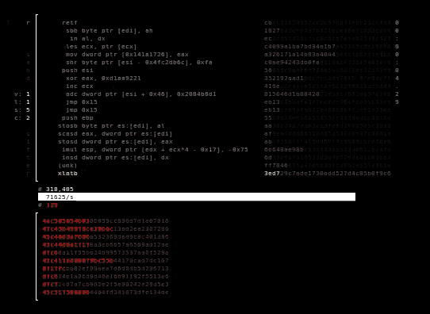
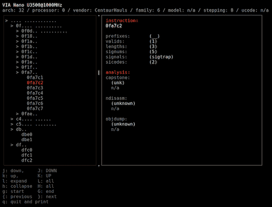

# sandsifter–x86 处理器模糊器，用于隐藏指令和硬件错误

> 原文：<https://kalilinuxtutorials.com/sandsifter-x86-processor/>

sandsifter 通过系统地生成机器代码来搜索处理器的指令集，并监控异常的执行，来审计 x86 处理器的隐藏指令和硬件错误。Sandsifter 已经从每个主要供应商那里发现了秘密的处理器指令；反汇编程序、汇编程序和仿真器中普遍存在的软件错误；企业虚拟机管理程序中的缺陷；以及 x86 芯片中良性和安全关键的硬件缺陷。

随着大量 x86 处理器的出现，该工具的目标是使用户能够检查他们自己的系统中隐藏的指令和错误。

**也读** [**接管:接管脚本一次性提取所有子域的 CNAME 记录**](https://kalilinuxtutorials.com/takeover-cname-record-subdomains/)

要对您的处理器运行基本审计:

```
sudo ./sifter.py --unk --dis --len --sync --tick -- -P1 -t
```



系统地扫描计算机，寻找异常指令。在上半部分，您可以查看 sandsifter 当前正在处理器上测试的指令。在下半部分，砂筛报告它发现的异常情况。

根据处理器的速度和复杂程度，搜索将需要几个小时到几天的时间。完成后，总结结果:

```
./summarize.py data/log
```



通常，在您的处理器上会发现几百万条未记录的指令，但这些指令通常属于少数几个不同的组。宁滨异常后，汇总工具会尝试将每个指令分配到一个问题类别:

*   软件错误(例如，管理程序或反汇编程序中的错误)，
*   硬件错误(CPU 中的错误)，或者
*   未记录的指令(存在于处理器中，但不被制造商认可的指令)

按“Q”退出并获取基于文本的系统扫描摘要:

扫描结果有时很难由工具自动分类，可能需要手动分析。如需帮助分析您的结果，请随时发送。/data/log 文件发送到 xoreaxeaxeax@gmail.com。除了处理器品牌、型号和版本(来自/proc/cpuinfo)之外，该日志中不包含任何个人信息。

## **大楼**

砂筛需要先安装顶石拆卸器:[http://www.capstone-engine.org/](http://www.capstone-engine.org/)。顶石通常可以安装:

```
sudo apt-get install libcapstone3 libcapstone-dev
sudo pip install capstone
```

砂筛可以用以下材料制造:

```
make
```

然后运行

```
sudo ./sifter.py --unk --dis --len --sync --tick -- -P1 -t
```

## **标志**

使用–flag 将标志传递给筛选程序，使用-f 将标志传递给进样器。

示例:

```
sudo ./sifter.py --unk --dis --len --sync --tick -- -P1 -t
```

筛选标志:

```
--len
	search for length differences in all instructions (instructions that
	executed differently than the disassembler expected, or did not
	exist when the disassembler expected them to

--dis
	search for length differences in valid instructions (instructions that
	executed differently than the disassembler expected)

--unk
	search for unknown instructions (instructions that the disassembler doesn't
	know about but successfully execute)

--ill
	the inverse of --unk, search for invalid disassemblies (instructions that do
	not successfully execute but that the disassembler acknowledges)

--tick
	periodically write the current instruction to disk

--save
	save search progress on exit

--resume
	resume search from last saved state

--sync
	write search results to disk as they are found

--low-mem
	do not store results in memory
```

**注射器标志:**

```
-b
	mode: brute force

-r
	mode: randomized fuzzing

-t
	mode: tunneled fuzzing

-d
	mode: externally directed fuzzing

-R
	raw output mode

-T
	text output mode

-x
	write periodic progress to stderr

-0
	allow null dereference (requires sudo)

-D
	allow duplicate prefixes

-N
	no nx bit support

-s seed
	in random search, seed value

-B brute_depth
	in brute search, maximum search depth

-P max_prefix
	maximum number of prefixes to search

-i instruction
	instruction at which to start search (inclusive)

-e instruction
	instruction at which to end search (exclusive)

-c core
	core on which to perform search

-X blacklist
	blacklist the specified instruction

-j jobs
	number of simultaneous jobs to run

-l range_bytes
	number of base instruction bytes in each sub range
```

## **键**

m:Mode–更改筛子的搜索模式(强力、随机或隧道)

问:退出——退出筛子

p:暂停–暂停或取消暂停搜索

## **算法**

扫描支持四种不同的搜索算法，可以在命令行设置，或通过热键循环。

*   随机搜索生成随机指令进行测试；它通常很快产生结果，但无法找到复杂的隐藏指令和错误。
*   强力搜索递增地尝试指令，直到用户指定的长度；几乎在所有情况下，它的表现都比随机搜索差。
*   驱动或突变驱动搜索旨在通过遗传算法创建新的、越来越复杂的指令；尽管前景看好，但这种方法从未被完全实现，并被作为未来研究的一个存根。
*   隧道是演示文稿和白皮书中描述的方法，在几乎所有情况下都提供了彻底性和速度之间的最佳平衡。

## **提示**

*   须藤

为了获得最佳结果，该工具应该以 root 用户身份运行。这是必要的，以便进程可以将地址为 0 的页面映射到内存中，这需要 root 权限。该页面防止许多指令在存储器访问时发生 seg-faulting，这允许更准确的故障分析。

*   前缀

指令搜索深度的主要限制是要搜索的前缀字节数，每增加一个前缀字节，搜索空间就会增加大约 10 倍。用-P 标志限制前缀字节。

*   颜色；色彩；色调

筛分机的接口是为 256 色终端设计的。虽然具体细节因终端而异，但大致可以通过以下方式实现:

```
 **export TERM='xterm-256color'
```

*   图像使用者界面

界面假设终端至少具有一定的大小；如果界面呈现不正常，请尝试增加终端大小；这通常可以通过减小终端字体大小来实现。

在某些情况下，可能需要或有必要在没有图形前端的情况下运行该工具。这可以通过直接运行进样器来完成:

```
 **`sudo ./injector -P1 -t -0
```

为了过滤直接注入器调用的结果，可以使用 grep。举个例子，

```
 **sudo ./injector -P1 -r -0 | grep '\.r' | grep -v sigill
```

搜索处理器与反汇编程序在指令长度(grep)上不一致的指令。r ')，但指令成功执行(grep -v sigill)。

*   目标模糊化

在许多情况下，将引信指向特定目标是很有价值的。例如，如果您怀疑仿真器在重复的“lock”前缀(0xf0)周围有缺陷，您可以使用-i 和-e 标志指示 fuzzer 搜索指令空间的这个区域:

```
 `sudo ./sifter.py --unk --dis --len --sync --tick -- -t -i f0f0 -e f0f1 -D -P15
```

*   遗留系统

对于扫描旧得多的系统(i586 类处理器、低内存系统)，将–low-mem 标志传递给筛选程序，将-N 标志传递给进样器:

```
 **sudo ./sifter.py --unk --dis --len --sync --tick --low-mem -- -P1 -t -N
```

如果您发现扫描完成得太快(例如，扫描在几秒钟内完成)，通常是因为这些标志是您正在扫描的处理器所必需的。

*   32 位与 64 位

默认情况下，sandsifter 是针对主机操作系统的位而构建的。然而，与在 64 位进程中运行时相比，在 32 位进程中运行时，一些指令具有不同的行为。为了探索这些场景，有时在 64 位系统上运行 32 位 sandsifter 是有价值的。

为了在 64 位系统上构建 32 位砂筛，顶石必须安装为 32 位；这方面的说明可以在 http://www.capstone-engine.org/.找到

那么必须为 32 位架构构建 sandsifter:

```
 `make CFLAGS=-m32
```

这样，32 位指令空间可以在 64 位系统上进行探索。

[](https://github.com/xoreaxeaxeax/sandsifter)