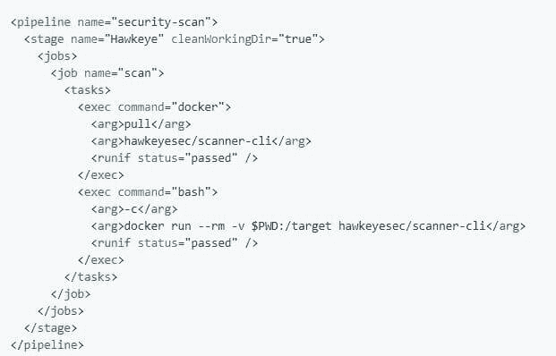

# Scanner CLI:一个项目安全/漏洞/风险扫描工具

> 原文：<https://kalilinuxtutorials.com/scanner-cli-security-vulnerability-scanning/>

Hawkeye **Scanner CLI** 是一个项目安全、漏洞和一般风险突出显示工具。它应该集成到你的预提交钩子和管道中。

**运行&配置扫描仪**

Hawkeye scanner-cli 假设您的目录结构能够将工具链的文件保存在顶层。大致说来，这可以归结为:

*   **Node.js** 项目在顶层有一个`**package.json**`
*   **Ruby** 项目将在顶层有一个`**Gemfile**`
*   Python 项目将在顶层有一个`**requirements.txt**`
*   PHP 项目将在顶层有一个`**composer.lock**`
*   **Java** 项目会有一个`**build**` **(gradle)或者** `**target**` (maven)文件夹，包含`.**java**`和`**.jar**`文件

这并不详尽，因为有时工具需要更多的文件存在。理解模块如何决定它们是否能处理一个项目。

**又念: [Twifo CLI:获取 Twitter 用户信息 2019](https://kalilinuxtutorials.com/twifo-cli/)**

**【Docker(推荐)**

docker 图像对于扫描仪来说是最简单的方式。请注意，您的项目根目录(例如$PWD)需要挂载到`/target`。

**docker run–RM-v $ PWD:/target hawkeysec/scanner-CLI**

docker 构建也是在 CI 管道中运行扫描器的推荐方式。这是一个对 GoCD 中的一个项目运行 Hawkeye 的例子:

**npm**

您可以通过以下方式在 Node.js 项目中安装和运行 hawkeye

**npm 安装–save-dev @ hawkeyesec/scanner-CLI
npx 鹰眼扫描**

建议在 Node.js 项目中使用这种方法，因为不需要其他工具链(例如 python、ruby)。

使用这种方法，如果发现问题，还建议调用 git 预提交钩子中的扫描器(例如，通过预提交包)来使提交失败。

**配置文件(推荐)**

您可以通过配置扫描仪。鹰眼和。忽略项目根目录中的文件。

的。hawkeyerc 文件是一个 JSON 文件，允许您配置…

*   要运行的模块，
*   要使用的编写器，以及
*   失败阈值

**{
"all ":真|假，
"staged ":真|假，
"modules": ["files-ccnumber "，" java-owasp "，" java-find-secbugs"]，
" sumo ":" http://your . sumologic . foobar/collector "，
" http ":" http://your . logger . foobar/collector "，
"json": "log/results.json "，
"failOn ":"**

`.hawkeyeignore`文件是从扫描中排除的*正则表达式*匹配**路径**和**模块错误代码**的集合，相当于使用`--exclude`标志。以`#`开头的行被视为注释。

请注意，正则表达式中保留的任何特殊字符(-[]{}()*+。,^$|#\s)作为字面量使用时需要转义！

还请注意，模块错误代码通常不会显示，因为它们主要与用户无关。

如果想排除某个误报，可以用标志`--show-code`或`.hawkeyerc`中的`showCode`属性显示模块错误代码。

**^test/
这是评论
^README.md**

**工作原理**

鹰眼被设计成可以通过添加模块和编写器来扩展。

*   在模块文件夹中添加模块。
*   在 writers 文件夹中添加 writer。

**模块**

模块基本上是一小段代码，要么实现自己的逻辑，要么包装第三方工具并标准化输出。它们仅在满足要求的标准时运行。例如:`npm outdated`模块只有在扫描目标中检测到`package.json`时才会运行——因此，您不需要告诉 Hawkeye 您正在扫描什么类型的项目。

**通用模块**

*   **files-ccnumber** :扫描可能包含信用卡号的可疑文件内容
*   **文件-内容**:扫描可能包含机密的可疑文件内容
*   **files-entropy** :扫描文件中可能包含密码的高熵字符串。默认情况下，熵扫描是禁用的，因为误报率很高。时不时地扫描代码库寻找密钥是很有用的，在这种情况下，请使用`-m files-entropy`开关运行它。
*   **文件-秘密**:扫描可能包含秘密的可疑文件名

**Java**

*   **java-find-secbugs** :用 findsecbugs 查找 java 代码中常见的安全问题
*   **java-owasp** :用 owasp 依赖检查器扫描 java 项目中具有已知漏洞的 gradle/maven 依赖

**Node.js**

*   **node-crossenv** :扫描节点项目中已知的恶意 [crossenv](http://blog.npmjs.org/post/163723642530/crossenv-malware-on-the-npm-registry) 依赖项
*   **node-npmaudit** :使用 [npm 审计](https://docs.npmjs.com/cli/audit)检查节点项目与已知漏洞的依赖关系
*   **node-npmoutdated** :用 [npm 过期](https://docs.npmjs.com/cli/outdated)检查节点项目的过期 npm 模块
*   **node-yarnaudit** :用 [yarn audit](https://yarnpkg.com/lang/en/docs/cli/audit/) 检查 yarn 项目对已知漏洞的依赖性
*   **节点纱线更新**:用[纱线过期](https://yarnpkg.com/en/docs/cli/outdated)检查节点项目的过期纱线模块

**PHP**

*   **php-security-checker** :使用 security-checker 检查 composer.lock 是否包含已知漏洞的依赖项

**Python**

*   **python-bandit** :用 bandit 扫描 python 代码中常见的安全问题。
*   **python-piprot** :用 [piprot](https://github.com/sesh/piprot) 扫描 python 依赖关系，寻找过期的包
*   **python-safety** :用安全工具检查 python 依赖关系中已知的安全漏洞。

红宝石

*   ruby-brakeman :用 brakeman 静态分析 Rails 代码的安全问题。
*   **ruby-bundler-scan** :使用 bundler 扫描具有已知漏洞的 Ruby gems

**添加模块**

如果你有一个模块的想法，请随时在问题部分打开一个功能请求。

如果您还有一点时间，请考虑向我们发送拉取请求。要查看模块的工作情况，请前往[模块](https://github.com/hawkeyesec/scanner-cli/blob/master/lib/modules)文件夹，了解事情是如何工作的。

[**Download**](https://github.com/hawkeyesec/scanner-cli)