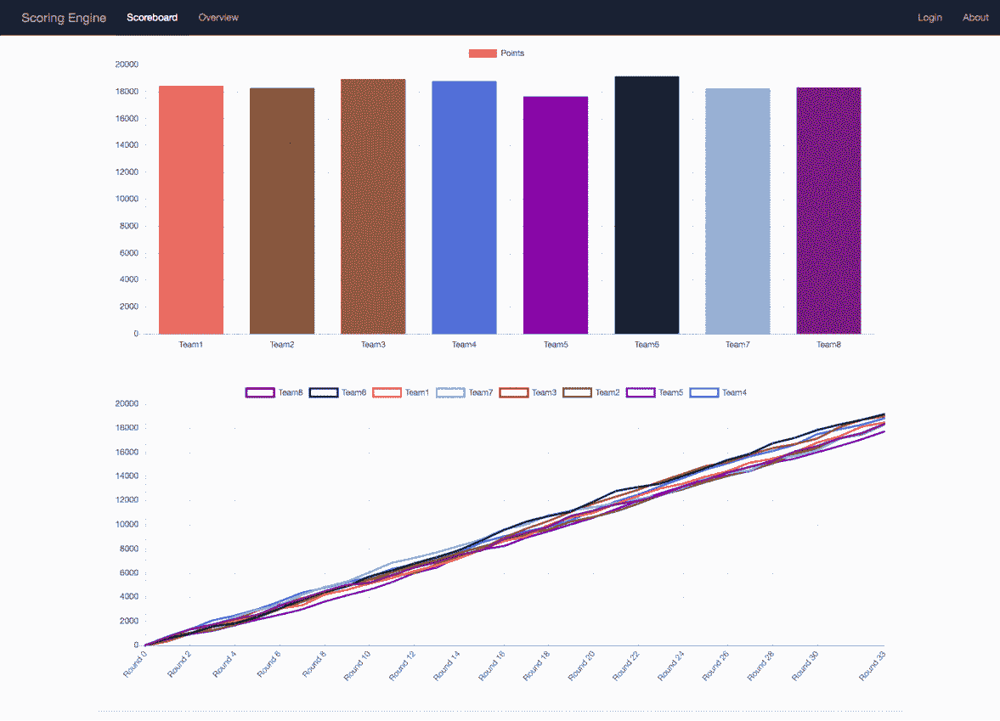

# scoringine:红/白/蓝团队比赛的评分引擎

> 原文：<https://kalilinuxtutorials.com/scoringengine/>

**红/白/蓝团队比赛的评分引擎**。下载 Docker。如果您在 Mac 或 Windows 上，Docker Compose 将自动安装。

在 Linux 上，确保您有最新版本的 Compose。如果你在 Windows 10 pro 或更高版本上使用 Docker for Windows，你也必须切换到 Linux 容器。

*   **在此目录下运行:**

**对接器-复合式建置
对接器-复合式 up**

如果要在启动前删除数据库，请设置 SCORINGENGINE _ OVERWRITE _ DB 环境变量:

**scoringine _ OVERWRITE _ DB = true docker-compose up**

我们还提供了在“示例”模式下运行它的能力。这意味着只有 web ui 运行，并且数据库中预先填充了示例数据。将 SCORINGENGINE _ EXAMPLE 环境变量设置为 true:

scoringine _ EXAMPLE = true docker-合成

该应用程序将在 http://localhost 上运行

使用 http://localhost 上的以下任何登录帐户登录:

**白队用户:测试组
队 1user1:测试组
队 2user1:测试组
队 2user2:测试组
红队用户:测试组**

**安装**

*   **码头工人**

**注意**:所有容器启动并运行需要一两分钟的时间！

**试验台环境**

**进行重建-试验台-新建**

此命令将构建、停止任何预先存在的评分引擎容器，并启动一个新环境。作为环境的一部分，多个容器将被用作测试床环境的一部分。

**环境变量**

我们使用某些环境变量来控制某些 docker 容器的功能。

*   **scoringine _ OVERWRITE _ DB:**
    *   如果设置为 true，数据库将被删除，然后在启动时重新创建。
*   **scoringine _ EXAMPLE:**
    *   如果设置为 true，数据库将填充 sample db，引擎容器将被暂停。这对于在 web 应用程序上进行开发非常有用。

您可以在执行每个命令之前设置每个环境变量，例如:

**scoringine _ EXAMPLE = true make rebuild-new**

**生产环境**

修改 bin/competition.yaml 文件，根据您的竞争环境配置引擎。然后，运行以下 make 命令进行构建，并运行评分引擎。

**警告:**这将删除以前的数据库，从命令中排除“新”部分，从而不重建数据库。

**进行重建-新建**

然后，“暂停”评分引擎(例如:在一天结束时):

**对接器-化合物-f 对接器-化合物. yml 停止引擎**

要“解除暂停”发动机:

**对接器-化合物-f 对接器-化合物. yml 启动引擎**

**也可阅读-[懒人码头工人:管理一切的懒惰方式码头工人](https://kalilinuxtutorials.com/lazydocker/)**

**手动设置**

**注意:**目前，我们唯一有文档的操作系统是 Ubuntu 16.04。

*   **通过 APT-Get 安装依赖项**

**apt-get 更新
apt-get install-y python 3.5 wget git python 3.5-dev build-essential libmysql client-dev**

*   **创建引擎用户**

**useradd -m 引擎**

*   **下载并安装 pip**

**wget-O/root/get-pip . py https://bootstrap.pypa.io/get-pip.py
python 35/root/get-pip . py
RM/root/get-pip . py**

*   **设置虚拟环境**

**pip 安装 virtualenv
su 引擎
CD ~/
mkdir/home/engine/scoring _ engine
virtualenv-p/usr/bin/python 3.5/home/engine/scoring _ engine/env**

*   **设置 src 目录**

**git 克隆 https://github.com/scoringengine/scoringengine/home/engine/scoring _ engine/src**

*   **安装 scoring_engine src python 依赖关系**

**source/home/engine/scoring _ engine/env/bin/activate pip install-e/home/engine/scoring _ engine/src/**

*   **复制/修改配置**

CP/home/engine/scoring _ engine/src/engine . conf . Inc/home/engine/scoring _ engine/src/engine . conf
VI/home/engine/scoring _ engine/src/engine . conf

*   **创建日志文件位置(以 root 用户身份运行)**

**mkdir/var/log/scoring _ engine
chown-R syslog:ADM/var/log/scoring _ engine**

*   **复制 rsyslog 配置**

**CP/home/engine/scoring _ engine/src/configs/RS yslog . conf/etc/RS yslog . d/10-scoring _ engine . conf**

*   **重启 rsyslog**

**systemctl 重启 rsyslog**

[**Download**](https://scoringengine.readthedocs.io/en/latest/installation/docker.html)