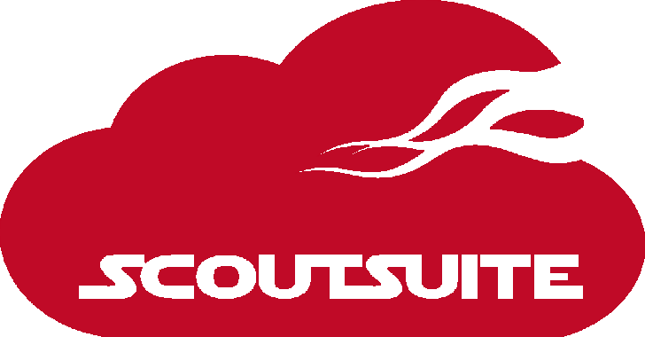

# Scout Suite:多云安全审计工具

> 原文：<https://kalilinuxtutorials.com/scout-suite-multi-cloud-security-auditing-tool/>

**Scout Suite** 是一款开源的多云安全审计工具，支持云环境的安全态势评估。Scout Suite 使用云提供商提供的 API 收集配置数据以进行人工检查，并突出显示风险区域。Scout Suite 不会在网络控制台上浏览几十个页面，而是自动呈现攻击面的清晰视图。

Scout Suite 是稳定的，并得到了积极的维护，但许多功能和内部可能会发生变化。因此，请耐心等待我们找到时间来改进这个工具。请随意报告一个错误的详细信息(请使用`**--debug**`参数提供控制台输出)，请求一个新特性，或者发送一个 pull 请求。

**也可以阅读-[fudgec 2:一个用 Python3 编写的紫色团队合作 C2 框架，Powershell &。](https://kalilinuxtutorials.com/fudgec2-a-collaborative-c2-framework-for-purple-teaming-written-in-python3-powershell-net/)网**

**支持**

目前支持/计划支持以下云提供商:

*   亚马逊网络服务
*   微软 Azure(测试版)
*   谷歌云平台
*   阿里云(早期 alpha)
*   Oracle 云基础设施(早期版本)

**也可阅读-[Aura 僵尸网络:一个超级便携的僵尸网络框架，带有基于 Django 的 C2 服务器](https://kalilinuxtutorials.com/aura-botnet-django-based-c2-server/)**

**要求**

Scout Suite 是用 Python 编写的，支持以下版本:

*   Three point five
*   Three point six
*   Three point seven

所需的库可以在 [requirements.txt](https://github.com/nccgroup/ScoutSuite/blob/master/requirements.txt) 文件中找到。我们建议使用虚拟环境。

**安装**

**通过 PIP**

**$ virtualenv-p python 3 venv
$ source venv/bin/activate
$ pip 安装 scout suite
$ scout–help**

**通过转到**

**$ git 克隆 https://github.com/nccgroup/ScoutSuite
$ CD scout suite $ virtualenv-p python 3 venv
$ source venv/bin/activate
$ pip install-r requirements . txt
$ python scout . py–help**

**计算资源**

Scout Suite 是一个多线程工具，在运行时获取并在内存中存储您的云帐户的配置设置。预计该工具将在任何现代笔记本电脑或同等虚拟机上顺利运行。

**注意**在一个计算资源有限的虚拟机中运行 Scout Suite，比如 AWS `t2.micro`实例，并不是有意的，可能会导致进程被终止。

**符合性**

**AWS**

使用 Scout Suite 不需要 AWS 用户填写并提交 AWS 漏洞/渗透测试申请表。Scout Suite 仅执行 API 调用来获取配置数据和识别安全漏洞，这不被视为安全扫描，因为它不会影响 AWS 的网络和应用程序。

**蔚蓝色**

使用 Scout Suite 不需要 Azure 用户联系微软就可以开始测试。唯一的要求是用户遵守微软云统一渗透测试参与规则。

参考资料:

*   [https://docs . Microsoft . com/en-us/azure/security/azure-security-pen-testing](https://docs.microsoft.com/en-us/azure/security/azure-security-pen-testing)
*   [https://www . Microsoft . com/en-us/msrc/pentest-rules-of-engagement](https://www.microsoft.com/en-us/msrc/pentest-rules-of-engagement)

**谷歌云平台**

使用 Scout Suite 不需要 GCP 用户联系 Google 就可以开始测试。唯一的要求就是用户遵守云平台可接受使用政策和服务条款，确保测试只影响你自己的项目(而不是其他客户的应用)。

参考资料:

*   [https://cloud.google.com/terms/aup](https://cloud.google.com/terms/aup)
*   [https://cloud.google.com/terms/](https://cloud.google.com/terms/)

**用法**

以下命令将提供可用命令行选项的列表:

**$ python scout . py–help**

您还可以使用它来获取特定提供商的帮助:

**$ python scout . py PROVIDER–帮助**

欲知详情，请查看我们在 https://github.com/nccgroup/ScoutSuite/wiki 的维基页面。

在执行一些 API 调用之后，Scout 将创建一个本地 HTML 报告，并在默认浏览器中打开它。

另请注意，当接收部分开关时，如果可能，命令行将尝试推断参数名称。例如，这将工作并使用选定的配置文件:

**$ python scout . py AWS–配置文件配置文件**

**国书**

假设您已经启动并运行了提供商的 CLI，那么您应该已经设置了您的凭据，并且能够使用以下命令之一运行 Scout Suite。如果不是这样，请查阅 wiki 页面以获得所需的提供商。

[**亚马逊网络服务**](https://github.com/nccgroup/ScoutSuite/wiki/Amazon-Web-Services)

**$ python scout.py aws**

[**蔚蓝**](https://github.com/nccgroup/ScoutSuite/wiki/Azure)

**$ python scout . py azure–CLI**

[**谷歌云平台**](https://github.com/nccgroup/ScoutSuite/wiki/Google-Cloud-Platform)

**$ python scout . py GCP–用户帐户**

[**Download**](https://github.com/nccgroup/ScoutSuite)