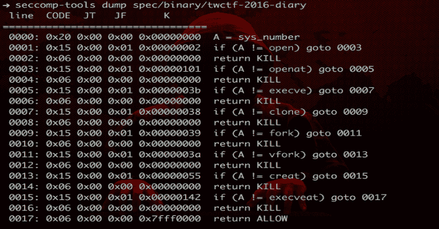
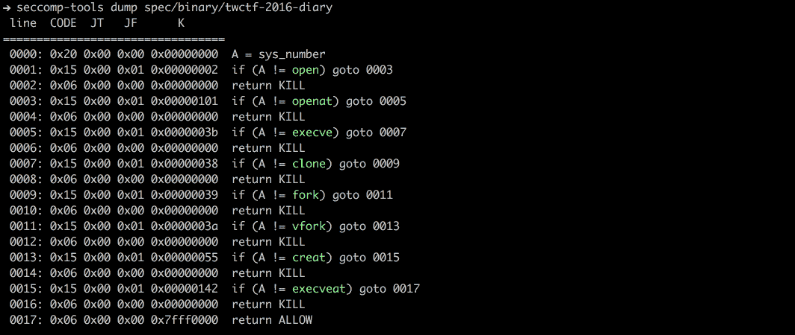
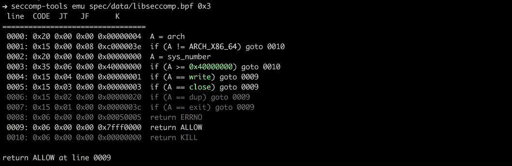
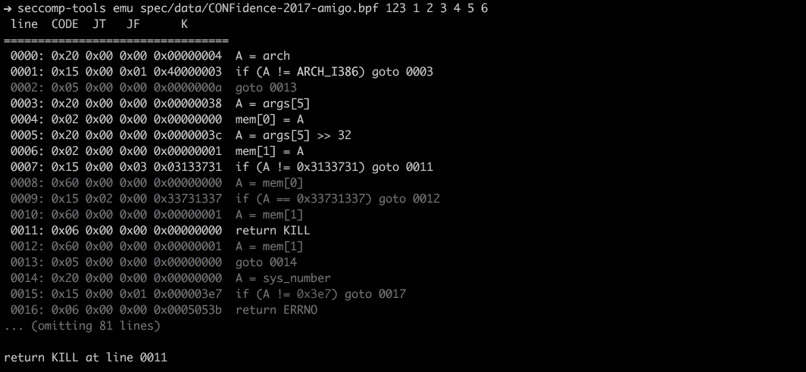

# Seccomp 工具:为 Seccomp 分析提供强大的工具

> 原文：<https://kalilinuxtutorials.com/seccomp-tools/>

**Seccomp** 为 Seccomp 分析提供了强大的工具。该项目旨在(但不限于)分析 CTF pwn 挑战赛中的 seccomp 沙盒。有些特征可能是 CTF 特有的，但对分析真实案例中的 seccomp 仍然有用。

**特性**

*   dump-自动从执行文件中转储 seccomp-bpf。
*   disasm–将 bpf 转换为人类可读的格式。
    *   简单反编译。
    *   尽可能显示系统调用名和参数。
    *   丰富多彩！
*   ASM–编写 seccomp 规则非常简单！
*   emu–模拟 seccomp 规则。
*   支持多架构。

**安装**

在 RubyGems.org 有售！

**$ gem 安装 seccomp-tools**

如果编译失败，请尝试:

sudo 安装 gcc ruby-dev

并再次安装 seccomp-tools。

**也读作——[SQLMap:自动 SQL 注入&数据库接管工具](https://kalilinuxtutorials.com/sqlmap-sql-injection-database/)**

**命令行界面**

**$ sec comp-tools–help**
= =>**用法:sec comp-tools[–版本][–help][]**

**= =>命令列表:**
# asm Seccomp bpf 汇编器。
# disasm 拆卸 seccomp bpf。
# dump 自动从执行文件中转储 seccomp bpf。
# emu 仿真 seccomp 规则。
#参见“sec comp-tools-help”阅读特定子命令。

**= =>$ sec comp-tools dump–help**
# dump–自动从执行文件中转储 seccomp bpf。
== > **用法:sec comp-tools dump[exec][options]**
#-c，–sh-exec 执行给定的命令(通过 sh)。如果你想传递参数或者对执行文件做一些事情，使用这个选项。
#例如，使用`-c "./bin > /dev/null"`转储 seccomp 而不与 stdout 混合。
# -f，–FORMAT 格式输出格式。格式只能是默认值之一:disasm
# -l，–LIMIT LIMIT 限制调用“prctl(PR_SET_SECCOMP)”的次数。
#当目标进程的调用次数达到限制时，目标进程将被杀死。
# Default: 1
-o，–将文件输出结果输出到文件中，而不是 stdout。
#如果调用了多个 seccomp 系统调用(参见–limit)，
#结果将被写入文件，文件 _1，文件 _2..等等。
#例如，“–output out.bpf”，输出文件为 out . bpf，out_1.bpf，…

**转储**

从执行文件中转储 seccomp bpf。这项工作是由`**ptrace**` syscall 完成的。

**注意:**当心执行文件会被执行。

**$ file spec/binary/tw CTF-2016-diary**
spec/binary/tw CTF-2016-diary:ELF 64 位 LSB 可执行文件，x86-64，version 1 (SYSV)，动态链接，解释器/lib64/l，针对 GNU/Linux 2.6.24，BuildID[sha1]= 3648 e 29153 AC 0259 a0b 7c 3 e 25537 A 5334 f 50107 f，未剥离【T3= open)goto 0003
0002:0x 06 0x 00 0x 00 0x 00000000 return KILL
0003:0x 15 0x 00 0x 01 0x 00000101 if(A！= open at)goto 0005
0004:0x 06 0x 00 0x 00 0x 00000000 return KILL
0005:0x 15 0x 00 0x 01 0x 0000003 b if(A！= exec ve)goto 0007
0006:0x 06 0x 00 0x 00 0x 00000000 return KILL
0007:0x 15 0x 00 0x 01 0x 00000038 if(A！= clone)goto 0009
0008:0x 06 0x 00 0x 00 0x 00000000 return KILL
0009:0x 15 0x 00 0x 01 0x 00000039 if(A！= fork)goto 0011
0010:0x 06 0x 00 0x 00 0x 00000000 return KILL
0011:0x 15 0x 00 0x 01 0x 0000003 A if(A！= vfork)goto 0013
0012:0x 06 0x 00 0x 00 0x 00000000 return KILL
0013:0x 15 0x 00 0x 01 0x 00000055 if(A！= creat)goto 0015
0014:0x 06 0x 00 0x 00 0x 00000000 return KILL
0015:0x 15 0x 00 0x 01 0x 00000142 if(A！= exec veat)goto 0017
0016:0x 06 0x 00 0x 00000000 return KILL
0017:0x 06 0x 00 0x 00 0x 7 fff 0000 return ALLOW

**$ sec comp-tools dump spec/binary/twc TF-2016-diary-f inspect**
" \ x20 \ x00 \ x00 \ x00 \ x00 \ x00 \ x00 \ x15
00000020:0600 0000 0000 0000 1500 0001 3b 00 0000……………
00000030:0600 0000 0000 0000 1500 0001 3800 0000……8…
00000040:0600 0000 0000 1500 00001 3900 0000……9…
000000050:0600 000 0000

**开发**

我建议在您的 Ruby 环境中使用 [rbenv](https://github.com/rbenv/rbenv) 。

**设置**

*   安装捆扎机
    *   `**$ gem install bundler**`****
*   克隆源
    *   `**$ git clone https://github.com/david942j/seccomp-tools && cd seccomp-tools**`****
*   安装依赖项
    *   `**$ bundle install**`****

**运行测试**

**$捆绑销售执行瑞克**

**截图**

**转储**

**动车组**

[**Download**](https://github.com/david942j/seccomp-tools)