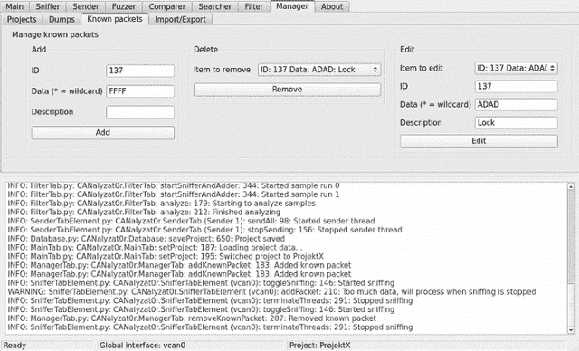

# 面向汽车协议的安全分析工具包——canalyzat 0 r

> 原文：<https://kalilinuxtutorials.com/security-analysis-toolkit-for-car-protocols-canalyzat0r/>

CANalyzat0r 是一个 Python 软件项目，从零开始构建，具有分析机制的新思想。

## **为什么是 CANalyzat0r？**

为智能汽车而奋斗的需要是在单个汽车单元内互连的快速增长数量的组件导致了专门的专有汽车协议。

然而，在当今的汽车系统中，经常找不到或找不到足够的认证和加密或其他安全机制。因此，需要开源、可扩展、易于使用且公开可用的软件来分析此类网络和协议的安全状态。

## **分析 0r 的特性**

**CANalyzat0r** 在一个地方捆绑了其他 CAN 工具的很多特性。此外，它基于 GUI，每个特定的分析任务都有一个选项卡

## **工具安装:**

*   跟着`sudo -E ./[CANalyzat0r](https://www.kitploit.com/2019/02/canalyzat0r-security-analysis-toolkit.html?m=1#).sh`一起跑`sudo ./install_requirements.sh`。这将创建一个名为`pipenv`的文件夹，其中包含一个`pipenv`环境。
*   或者只使用此时推荐的 docker 版本(查看子目录中的`README.md`文件)

有关更多信息，请阅读`./doc/build`文件夹中文档的 HTML 或 PDF 版本。

## **特性**

*   管理接口配置(自动加载内核模块，管理物理和虚拟 SocketCAN 设备)
*   多接口支持
*   管理您在项目中的工作。您还可以以人类可读/可编辑的 JSON 格式导入和导出它们
*   记录所有操作
*   图形嗅探
*   管理每个项目的发现、转储和已知数据包

*   在 GUI 上添加多个分析线程
*   嗅探时忽略数据包–根据 ID 或数据和 ID 自动过滤唯一的数据包
*   比较转储
*   允许仅使用一个窗口设置复杂的设置
*   为每个分析任务清除选项卡中的组织
*   随机化二进制分组过滤
*   使用背景噪声过滤搜索特定于动作的数据包
*   SQLite 支持
*   动态模糊和更改值

模糊测试是一种自动化的软件测试技术，它包括向计算机程序提供无效的、意想不到的或随机的数据作为输入。然后监控程序的异常，如崩溃、失败的内置代码断言或潜在的内存泄漏。