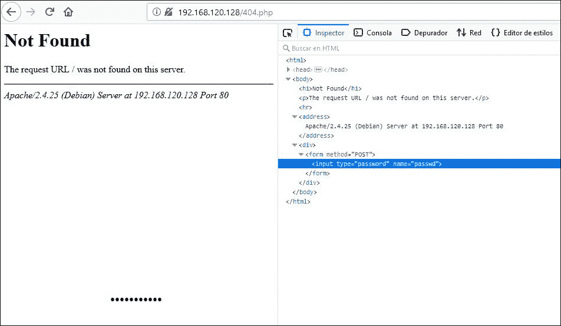
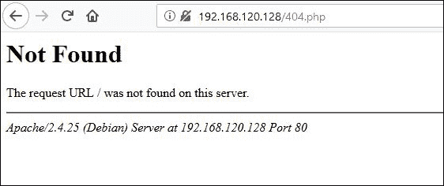
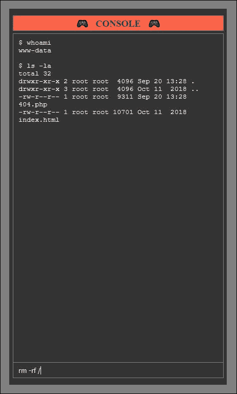

# SecurityNotFound : 404 找不到网页外壳

> 原文：<https://kalilinuxtutorials.com/securitynotfound-404-page-not-found-webshell/>

克隆或下载项目:

**git 克隆 https://github . com/cosasdepuma/security notfound . git security notfound
CD security notfound**

**安装**

*   **src/404.php** 文件应该位于目标服务器上。
*   该服务器必须能够执行。php 文件。
*   下面是一些服务器所在的最常见路线的示例:

**#🏁windows(Xampp)
C:\ Xampp \ htdocs \

🐧Linux
/var/www/html/**

**注**:显然，你我都知道你有合法的权限访问那个服务器。

**也可理解为-****[路由器漏洞挖掘铲:无线路由器上栈溢出类型的自动应用生成](https://kalilinuxtutorials.com/router-exploit-shovel-automated-application-generation-for-stack-overflow-types-on-wireless-routers/)**

**授权访问**

现在，你可以点击这里通过浏览器访问它。

**注意:**可以替换服务器 404 错误模板，从任何无效 URL 访问。

要访问控制面板，请按`**TAB**` 键或使用浏览器工具搜索密码字段。

默认密码为:`**cosasdepuma**`。

您可以将脚本中的`**$passphrase**`变量保留为空字符串，以直接访问控制面板。如果这是你的意图，你已经失去了我的尊重。

要设置自定义值，在连续三次应用`**MD5**`算法后，将您的密码插入到`**$passphrase**`变量中。

**控制面板**

**横幅**

| 功能 | 如图所示 |
| --- | --- |
| 当前用户 | 根 |
| 核心 | Linux 操作系统 |
| 释放；排放；发布 | 4.9.0-7-AMD64 |
| 退出按钮 | ⑨ |

您也可以使用`**GET**` 请求中的`**exit**` 参数注销。

**按钮及其功能:**

*   **PHPINFO :** 显示 PHPINFO()；页面。
*   **EXPLOIT-DB :** 在 exploit-db.com 搜索内核兼容的漏洞。
*   **GEOLOCATE :** 它在 Google Maps 中大致显示了服务器的物理位置。
*   **SELF-REMOVE:**shell 从服务器上删除自己。

**日志足迹**

| `access.log`中的行数 | 行动 |
| --- | --- |
| one | 无需登录即可访问 |
| one | 访问会话已经开始 |
| Two | 登录 |
| Two | 注销 |
| Two | 通过控制台执行命令 |
| one | 按钮:PHPINFO |
| Zero | 按钮:漏洞利用数据库 |
| Zero | 按钮:地理定位 |
| Two | 按钮:自行移除 |
| one | `Problem:` favicon.ico |

[Download](https://github.com/CosasDePuma/SecurityNotFound)