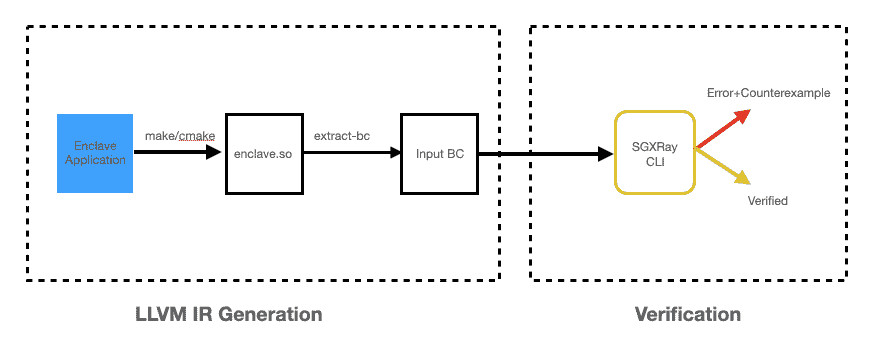

# SGXRay:自动检测 SGX 应用的漏洞

> 原文：<https://kalilinuxtutorials.com/sgxray/>

SGXRay 是一款自动检测 SGX 应用漏洞的工具

SGX 通过基于硬件的内存加密技术保护孤立应用逻辑和敏感数据。使用这种基于硬件的安全机制需要一个严格的内存使用编程模型，在 enclave 边界内外使用复杂的 API。Enclave 开发人员需要应用谨慎的编程实践来确保 enclave 的安全性，尤其是在处理流经 enclave 可信边界的数据时。可信边界违规会进一步导致内存损坏，并被攻击者利用来检索和操作受保护的数据。目前，没有公开可用的工具可以有效地检测现实世界飞地的此类问题。

SGXRay 是一个基于 SMACK 验证器的自动推理工具，它可以自动检测 SGX 飞地中源于违反可信边界的错误。它重新编译给定的 enclave 代码，并从用户指定的 enclave 函数条目开始分析。在分析之后，它或者在 SGX 软件栈中发现无效的指针处理，例如在 enclave 中传递未检查的指针、无效的内存释放和 TOCTOU 错误，或者证明在用户指定的循环和递归界限内不存在这样的错误。

目前，SGXRay SGX 应用构建于两个 SGX SDK 之上:英特尔 SGX SDK 和 openenclave SDK。用户可以选择 SDK 代码进行更彻底的分析。

**入门**

要快速开始，请通过这里的一个演示示例，按照一步一步的教程来使用 SGXRay。

下图演示了 SGXRay 的工作流程。

运行 SGXRay 是一个两步过程。第一步是为应用程序获取一个 LLVM IR 文件。第二步是调用 SGXRay CLI 进行验证。

第一步，我们分别为每个 SDK 提供两个 Docker 映像。

**坞站拉百度线/sgx 射线前端-英特尔
坞站拉百度线/sgx 射线前端-oe**

运行第一步的详细说明可以在这里找到。

**LLVM IR (BC)生产**

运行 SGXRay 的第一步是为 SGX enclave 应用程序获取一个*单个* LLVM IR 文件。我们分别为英特尔 SGX SDK 和 Open Enclave SDK 提供了两个 Docker 映像。

**英特尔 SGX SDK 前端图片**

该映像包含英特尔软件开发套件 SGX 版本 2.12 和 Clang 版本 11。

要为您的应用程序获取 LLVM IR，请以交互方式运行 Docker 容器，并挂载您的应用程序目录

**cd #去根你的 SGX 项目
docker run-it–RM-v $(pwd):/sgx-w/sgx–user $ UID:$(id-g)baiduxlab/sgx-ray-frontend-Intel:最新**

在容器内，请运行，

**source/opt/sgxsdk/environment
source/opt/smack-wl LVM/default . environment
make #你的编译命令
extract-bc -l llvm-link-11 #这个应该产生 enclave.so.bc**

**打开 Enclave 前端图像**

这个映像包含 openenclave 版本 0.16.1 和 Clang 版本 8。

要为您的应用程序获取 LLVM IR，请以交互方式运行 Docker 容器，

**cd #去根你的 SGX 项目
docker run-it–RM-v $(pwd):/sgx-w/sgx–user $ UID:$(id-g)baiduxlab/sgx-ray-frontend-Intel:最新**

在容器内，请运行，

**source/opt/open enclave/share/open enclave/open enclave RC
source/opt/smack-wll VM/OE . environment
make #你的编译命令
extract-bc -l llvm-link-8 #这应该产生 enclave.so.bc**

对于第二步，我们还提供了一个 Docker 图像。

**码头拉百度线 ab/sgx-ray-distro:latest**

运行第二步的详细说明可以在这里找到。

**验证**

目前，验证步骤只能在我们提供的 Docker 容器中完成。我们建议在我们的演示机器上使用以下命令交互运行它，

**cd #转到 enclave 目录，该目录包含上一步生成的 bc 文件
docker run–RM-it-v $(pwd):/sgx-w/sgx–user $ UID baiduxlab/sgx-ray-distro**

在容器内部，您应该能够调用 SGXRay CLI `sgx-ray`。

**验证 CLI 概述**

我们提供了一个二进制文件`**sgx-ray**`,作为验证 SGX 应用程序的包装器 SMACK。选项可以通过`**sgx-ray --help**`显示。目前，有两个后端验证器——Boogie 和 Corral。Boogie 往往更快，而 Corral 提供更好的错误跟踪。我们建议先试试 Boogie。如果发现反例，可以使用 Corral 来更好地理解它。

**验证 CLI 的基本用法**

SGXRay CLI 的基本用法非常简单。让我们假设用于构建您的应用的 SDK 是英特尔 SGX SDK。

**sgx-ray–英特尔–ecall-name**

Ecall 名称可以在您的应用程序的 EDL 文件中找到。

**咂选项**

重要的 SMACK 选项可以在演示视频的末尾找到。我们也在此重申重要的建议。

**循环展开绑定**

回想一下，在教程中，我们看到 SGXRay 可以成功检测到`**copytohost**`的`**ecall_error1**`函数中的一个无效指针用法。如果我们对`**ecall_error2**`应用相同的命令，我们将看不到要报告的错误，即使它存在。这是因为错误出现在循环的第二次迭代中，而 SGXRay 只检查循环的第一次迭代，之后它假设程序退出。为了发现这个错误，我们需要 SMACK 选项 **`--unroll=2`** ，它可以使用 SGXRay 的选项 **`--smack-options='--unroll=2'`来启用。**

**sgx-ray enclave . so . BC–英特尔–ecall-name ecall _ error 2–smack-options = "–unroll = 2"**

**空指针检查**

有两个与空支票相关的 SMACK 选项 **— `--enable-null-che`** `ck`和`**--enable-failing-malloc**`。前者在 enclave 中启用空检查，后者指定 malloc 可以失败并返回一个空指针。SGXRay 默认情况下不启用空检查，因为与其他漏洞(如写入 enclave 内的任意位置)相比，空指针取消引用的破坏性较小。

**Docker Build**

我们提供了一个 docker 文件，为验证步骤构建图像。

**git 克隆 https://github . com/Baidu xlab/sgxray . git&&CD sgxray
dock build。-t sgx-ray-distro-local–build-arg host uid = $ uid-f dock erfiles/dock erfile-CLI**

成功的构建应该会产生一个名为`**sgx-ray-distro-local**`的映像，其中有一个用户`**user**`，其用户 id 与主机帐户相同。

[**Download**](https://github.com/baiduxlab/sgxray)