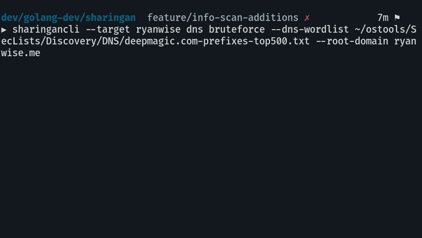
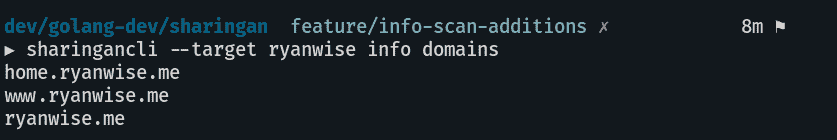
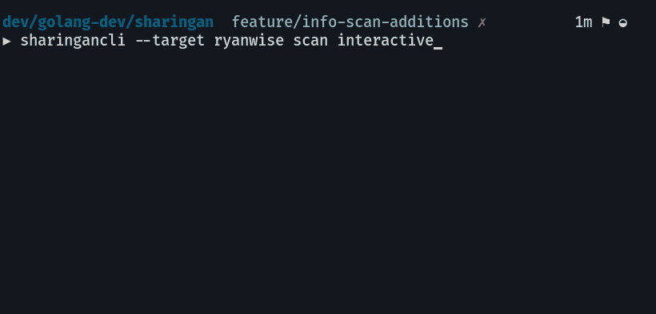
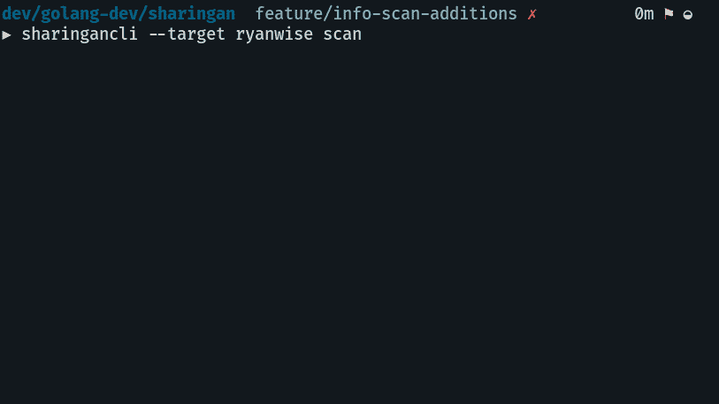

# Sharingan:攻击性安全侦察工具

> 原文：<https://kalilinuxtutorials.com/sharingan/>

Sharingan 是一个用于进攻安全/臭虫奖励的侦查多功能工具。这在很大程度上是一项正在进行的工作，我对一般的攻击性安全相对较新，所以如果你看到一些可以改进的地方，请打开一个问题或建议更改的 PR。

**为发展而克隆**

在您的 gopath 之外

**git 克隆 https://github.com/leobeosab/sharingan**

**安装**

去找 github.com/leobeosab/sharingan/cmd/sharingancli

**也可阅读-[Threadtear:多功能 Java Seobfuscation 工具套件](https://kalilinuxtutorials.com/threadtear/)**

**依赖关系**

*   NMap
*   去

**用途**

**注意:**当谈到旗帜时，顺序很重要，它必须是`**sharingancli [globalflags] command [commandflags]**`如果这不是我想要的功能，我可以改变它，但我喜欢它的整洁

**DNS**

*   野蛮人

DNS 用你提供的单词表来攻击目标

**sharingancli–目标 target name DNS–DNS-word list ~/path/to/word list–根域 target.com**

*   **添加接头**

使用管道将子域从 stdin 添加到程序的存储中

**cat subs | sharingancli–target target name DNS addsubs**

*   **扫描**

使用 nmap 扫描存储在目标中的所有可用主机

**分享目标目标扫描**

*   **互动**

从存储在目标中的子域列表中扫描单个主机

**分享目标目标扫描互动**

*   **信息**
    *   **域**

在 stdout 中以列表形式输出所有域

sharingancli–目标目标信息域+

**即将推出的功能**

*   Dir 暴力强制——目前正在研究中
*   JSON 和常规文件导出
*   通过守护程序自动扫描？
*   添加进行 SYN / -sS 扫描的方法[必须是 root，因此会带来挑战]
*   可能的 Web ui / html 导出

[**Download**](https://github.com/leobeosab/sharingan)