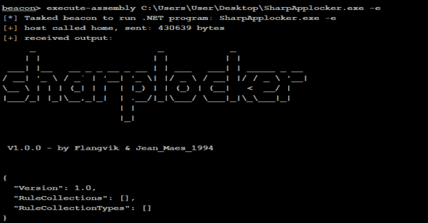

# sharpaplocker:Get-app locker policy PS Cmdlet 的 C#端口

> 原文：<https://kalilinuxtutorials.com/sharpapplocker-2/>

**sharapp locker**是 Get-AppLockerPolicy PS Cmdlet 的 C#端口使用的工具。

**用途**

**用法:**
-h，-？，–Help Show Help
-l，–local Queries local app locker config
-d，–domain Queries domain app locker config(需要一个 ldap
路径)
-e，–effective Queries the effective app locker config on this
computer
-x，–XML output app locker in XML format(默认为 JSON)
–LDAP = VALUE LDAP filter to query domain policy from

如需详细信息，请点击此处查看 MSDN 网址。

[**Download**](https://github.com/Flangvik/SharpAppLocker)