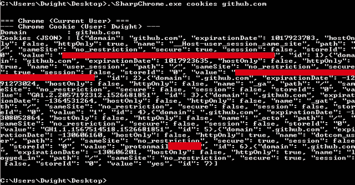
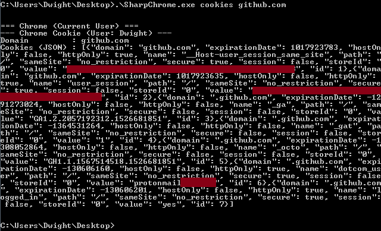
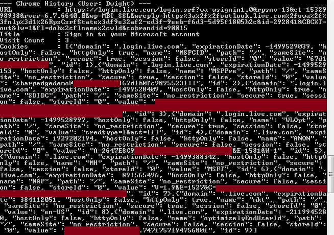
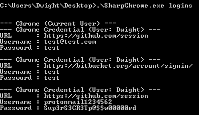

# SharpChromium:。NET 4.0 CLR 项目来检索 Chromium 数据，如 Cookies、历史记录和保存的登录信息

> 原文：<https://kalilinuxtutorials.com/sharpchromium/>

SharpChromium 是一个. NET 4.0+ CLR 项目，用于从 Google Chrome、Microsoft Edge 和 Microsoft Edge Beta 中检索数据。目前，它可以提取:

*   cookie(JSON 格式)
*   历史记录(每个历史记录项目都有相关的 cookies)
*   保存的登录

注意:所有返回的 cookies 都是 JSON 格式的。如果你安装了扩展 [Cookie 编辑器](https://chrome.google.com/webstore/detail/cookie-editor/hlkenndednhfkekhgcdicdfddnkalmdm)，你可以简单地复制并粘贴到这个浏览器插件的“导入”部分来运行提取的会话。

**优势**

与以前的实现相比，这次重写有几个优点，包括:

*   不需要类型编译或反射
*   Cookie 以 JSON 格式显示，便于导入到 [Cookie 编辑器](https://chrome.google.com/webstore/detail/cookie-editor/hlkenndednhfkekhgcdicdfddnkalmdm)中。
*   不从远程资源下载 SQLite 程序集。
*   支持主要的 Chromium 浏览器(但是可以扩展到其他浏览器)

**用途**

**用法:**
。\ sharp Chromium . exe arg 0[arg 1 arg 2…]

**参数:**
all–检索所有 Chromium Cookies、历史记录和登录信息。
完整–与“全部”相同
登录–检索所有保存的具有非空密码的凭证。
history——检索用户的历史记录，包括 URL 被
访问的次数，以及与这些条目匹配的 cookies。
cookies[domain1.com·domain2.com]–以 JSON 格式检索用户的 cookies。
如果域通过，则只返回与这些域匹配的
cookie。否则，
所有 cookies 被保存到一个格式为" " % TEMP % \ $ browser-cookies . JSON "
的临时文件中

**例题**

检索与 Google Docs 和 Github 相关的 cookies

**。\ sharp chromium . exe cookies docs.google.com github.com**

检索历史项目及其关联的 cookies。

**。\SharpChromium.exe 历史记录**

检索保存的登录信息(注意:仅显示密码非空的登录信息):

**。\SharpChromium.exe 登录**

**关于 SQLite 解析器的注释**

SQLite 数据库解析器有点问题。这是因为解析器正确地将数据 blobs 检测为 System 类型。Byte[]，但它不能正确检测 System 类型的列。字节[]。

因此，字节数组被转换为字符串“System”。Byte[]”，这是错误的。我还没有找到这个原因的根源，但是作为一个快速而肮脏的解决方法，我已经将所有 blob 值编码为 Base64 字符串。

因此，如果您希望从常规数据值是字节数组的列中检索一个值，您需要首先对它们进行 Base64 解码。

[**Download**](https://github.com/djhohnstein/SharpChromium)