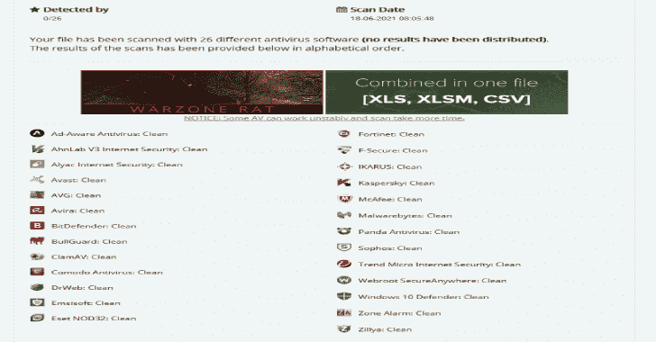

# Sharperner:带有加密外壳代码的简单可执行生成器

> 原文：<https://kalilinuxtutorials.com/sharperner/>

**Sharperner** 是一个用 CSharp 编写的工具，可以生成。NET 滴管与 AES 和 XOR 混淆外壳代码。生成的可执行文件可能会绕过签名检查，但我不能肯定它能绕过启发式扫描。

**特性**

**PE 二进制**

*   过程空洞化
*   PPID 欺骗
*   随机生成的 AES 密钥和 iv
*   最后的外壳代码，关键和四被翻译成莫尔斯电码

**。网络二进制**

*   AES + XOR 加密外壳代码
*   APC 工艺注射(explorer.exe)
*   随机函数名
*   随机生成的 AES 密钥和 iv
*   最后的外壳代码，关键和四被翻译成莫尔斯电码

**用途**

**/file B64，hex，raw shellcode
/type cs，cpp
/out 输出文件位置(可选)
示例:【Sharperner.exe】file:file . txt/type:CPP
Sharperner.exe/file:file . txt/out:payload . exe**

[**Download**](https://github.com/aniqfakhrul/Sharperner)