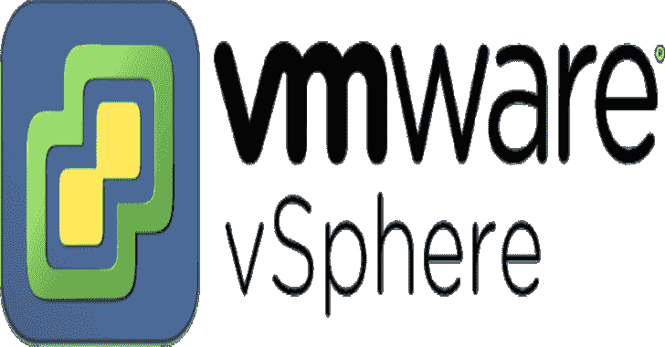

# 尖锐世界:。攻击 vCenter 的. NET 项目

> 原文：<https://kalilinuxtutorials.com/sharpsphere/>

**SharpSphere** 让 red teamers 能够轻松地与 vCenter 管理的虚拟机的客户操作系统进行交互。它使用 vSphere Web 服务 API，并提供以下功能:

*   **命令&控制**–结合 [F-Secure 的 C3](https://github.com/FSecureLABS/C3) ，SharpSphere 使用 VMware 工具向虚拟机提供 C & C，不需要与目标虚拟机的直接网络连接。
*   **代码执行**–允许在客户操作系统中执行任意命令，并返回结果
*   **文件上传**–允许将任意文件上传到客户操作系统
*   **文件下载**–允许从客户操作系统下载任意文件
*   **列出虚拟机**—列出由 vCenter 管理的运行 VMware Tools 的虚拟机
*   **转储内存**–转储并下载虚拟机的内存，然后使用 WinDbg 和 Mimikatz 从 LSASS 离线手动提取凭证([指南](https://jamescoote.co.uk/Dumping-LSASS-with-SharpShere/))

SharpSphere 通过钴击的 *execute-assembly* 支持执行。

**编译**

编译版本可以在这里找到[。](https://github.com/JamesCooteUK/SharpSphere/releases)

如果你自己编译，你需要使用`ILMerge`将 SharpSphere.exe 和 CommandLine.dll 合并到`Releases`文件夹中。

**用途**

*   **可用模块:**

**SharpSphere.exe 帮助**

列表列出此 vCenter 管理的所有虚拟机
在目标虚拟机中执行执行给定命令
c2 使用 C3 的 VMwareShareFile 模块运行 C2
将上传文件上传到目标虚拟机
从目标虚拟机下载下载文件
帮助显示特定命令的更多信息。
版本显示版本信息。

*   **列出虚拟机:**

**SharpSphere.exe 列表–帮助**

–需要网址。vCenter SDK URL，即 https://127 . 0 . 0 . 1/SDK
–需要用户名。vCenter 用户名，即 administrator @ VSP here . local
–需要密码。vCenter 密码

*   **代码执行:**

**SharpSphere.exe 执行–帮助**

–需要 url。vCenter SDK URL，即 https://127 . 0 . 0 . 1/SDK
–需要用户名。vCenter 用户名，即 administrator @ VSP here . local
–需要密码。vCenter 密码
–需要 ip。目标虚拟机 IP 地址
–需要 guestusername。用于对来宾操作系统进行身份验证的用户名
–需要 guestpassword。用于向客户操作系统
验证的密码–需要命令。执行
命令–输出(默认:假)标志以接收输出。将在
guest 上的 C:\Users\Public 中创建一个临时文件来保存输出。然后下载并打印到控制台，文件被删除。

*   **命令&控制:**

**SharpSphere.exe C2–帮助**

–需要网址。vCenter SDK URL，即 https://127 . 0 . 0 . 1/SDK
–需要用户名。vCenter 用户名，即 administrator @ VSP here . local
–需要密码。vCenter 密码
–需要 ip。目标虚拟机 IP 地址
–需要 guestusername。用于对来宾操作系统进行身份验证的用户名
–需要 guestpassword。用于对来宾操作系统进行身份验证的密码
–需要本地目录。这台机器上 C3 目录的完整路径
–需要 guestdir。来宾操作系统上 C3 目录的完整路径
–需要输入。为本机器上运行的 C3 继电器配置的输入 ID
–需要输出 ID。为此机器上运行的 C3 继电器配置的输出 ID

*   **文件上传:**

**SharpSphere.exe 上传–帮助**

–需要网址。vCenter SDK URL，即 https://127 . 0 . 0 . 1/SDK
–需要用户名。vCenter 用户名，即 administrator @ VSP here . local
–需要密码。vCenter 密码
–需要 ip。目标虚拟机 IP 地址
–需要 guestusername。用于对来宾操作系统进行身份验证的用户名
–需要 guestpassword。用于向客户操作系统
验证的密码–需要来源。要上传的本地文件的完整路径
–需要目的地。文件上传位置的完整路径

*   **文件下载:**

**SharpSphere.exe 下载–帮助**

–需要网址。vCenter SDK URL，即 https://127 . 0 . 0 . 1/SDK
–需要用户名。vCenter 用户名，即 administrator @ VSP here . local
–需要密码。vCenter 密码
–需要 ip。目标虚拟机 IP 地址
–需要 guestusername。用于对来宾操作系统进行身份验证的用户名
–需要 guestpassword。用于向客户操作系统
验证的密码–需要来源。来宾中要上传的文件的完整路径
–需要目的地。文件应下载到的本地目录的完整路径

*   **转储内存:**

**SharpSphere.exe 转储–帮助**

–需要 url。vCenter SDK URL，即 https://127 . 0 . 0 . 1/SDK
–需要用户名。vCenter 用户名，即 administrator @ VSP here . local
–需要密码。vCenter 密码
–需要 targetvm。虚拟机到快照
–快照(默认值:false)警告:创建然后删除快照。如果未设置，SharpSphere 将只从最后一个现有快照中提取内存，如果没有可用的快照，则不提取内存。
–目的地必填。文件应下载到的本地目录的完整路径

**未来特征**

1.  添加对 Linux 来宾操作系统的支持
2.  包括一个用于列出虚拟机的`**--verbose**`选项
3.  添加一个`**--quiet**`标志，以避免提及每个已传输的数据包
4.  添加一个`**--testauth**`标志来确认来宾凭证有效

[**Download**](https://github.com/JamesCooteUK/SharpSphere)