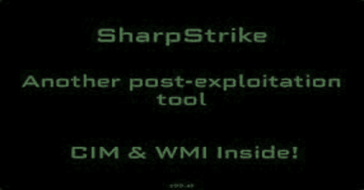

# SharpStrike:用 C#编写的后期开发工具使用 CIM 或 WMI 来查询远程系统

> 原文：<https://kalilinuxtutorials.com/sharpstrike/>

SharpStrike 是一个用 C#编写的后开发工具，它使用 CIM 或 WMI 来查询远程系统。它可以使用提供的凭据或当前用户的会话。

注意:有些命令将 PowerShell 与 WMI 结合使用，在`**--show-commands**`命令中用**表示。

**简介**

SharpStrike 是对@Matt_Grandy_ 的 CIMplant 和@christruncer 的 WMImplant 的 C#重写和扩展。

SharpStrike 允许您收集有关远程系统的数据、执行命令、导出数据等。该工具允许使用 Windows Management Instrumentation、WMI 或公共接口模型 CIM 进行连接。更准确地说是视窗管理基础设施。CIMplant 需要目标系统上的本地管理员权限。

**设置**

在 Releases 下使用构建版本可能是最简单的，只需注意它是在调试模式下编译的。如果您想自己构建解决方案，请遵循以下步骤。

1.  将 SharpStrike.sln 加载到 Visual Studio 中
2.  转到顶部的构建，然后构建解决方案(如果不需要修改)

构建将产生两个版本的 SharpStrike: GUI (WinForms)和控制台应用程序。每个版本都实现了相同的功能。

**用途**

**控制台版本:
SharpStrike.exe–帮助
SharpStrike.exe–显示-命令
SharpStrike.exe–显示-示例
SharpStrike.exe-c ls _ domain _ admins
SharpStrike.exe-c ls _ domain _ users _ list
SharpStrike.exe-c cat-f " c:\ users \ user \ desktop \ file . txt "-s[远程 IP 地址]
SharpStrike.exe-c cat-f " c:\ users \ user \ desktop \ file . txt "-s[远程 IP 地址]-u[用户名]-d[域]-p[密码] -c
GUI 版本:
show-commands
show-examples
ls _ domain _ admins
ls _ domain _ users _ list
cat-f " c:\ users \ user \ desktop \ file . txt "-s【远程 IP 地址】
cat-f " c:\ users \ user \ desktop \ file . txt "-s【远程 IP 地址】-u【用户名】-d【域】-p【密码】
command_exec -e "quser "【远程 IP 添加**

**功能**

**文件操作**

**cat–读取文件内容
copy–将文件从一个位置复制到另一个位置
Download * *–从目标机器下载文件
ls–特定目录的文件/目录列表
Search–搜索用户的文件
Upload * *–将文件上传到目标机器**

**横向运动促进**

**command _ exec * *–运行命令行命令并接收输出。使用 nops 标志运行以禁用 PowerShell
disable _ wdi gest–将 UseLogonCredential 的注册表值设置为零
enable _ wdi gest–添加注册表值 UseLogonCredential
disable _ WinRM * *–在目标系统上禁用 WinRM
enable _ WinRM * *–在目标系统上启用 WinRM
reg _ mod–修改目标计算机上的注册表
reg _ Create–在目标计算机上创建注册表值
reg _ Delete–删除目标计算机上的注册表
–在远程计算机上运行 PowerShell 脚本并接收输出
sched _ job–由于 Win32_ScheduledJobs 访问过时的 API 而未实现
service _ mod–创建、删除或修改系统服务
ls _ domain _ users *–列出域用户 ls _ domain _ users _ List *–列出域用户 Sam account name
ls _ domain _ users _ email *–列出域用户电子邮件地址 ls _ domain _ groups *–列出域用户组
ls _ domain _ admins *–List**

**流程操作**

**Process _ Kill–在目标机器上通过名称或进程 id 终止一个进程
Process _ Start–在目标机器上启动一个进程
PS–进程列表**

**系统操作**

**active _ users–列出目标系统上具有活动进程的域用户
basic _ info–用于枚举关于目标系统的基本元数据
drive _ List–列出本地和网络驱动器
share _ List–列出网络共享
ifconfig–从具有活动网络连接的 NIC 接收 IP 信息
installed _ programs–接收目标机器上已安装程序的列表
注销–注销目标机器上的用户
重新启动(或重新启动) –重新启动目标机器
power_off(或关机)–关闭目标机器
vacate _ system–确定用户是否离开系统
edr _ Query–查询本地或远程系统中的 edr 供应商**

**日志操作**

**logon _ events–标识已登录到系统的用户
可以使用–nops 标志禁用所有 PowerShell，尽管有些命令不会执行(上传/下载、启用/禁用 WinRM)
**表示 PowerShell 的使用(使用 PowerShell 运行空间或通过 Win32_Process::Create 方法)
***表示 LDAP 的使用—“root \ directory \ LDAP”命名空间**

**解决方案架构**

SharpStrike 由三个主要项目组成

*   ServiceLayer —提供核心功能，由 UI 层使用
*   模型—包含所有项目共享的类型
*   用户界面—GUI/控制台

**现役军人**

*   Connector.cs

这是进行初始 CIM/WMI 连接并传递给应用程序其余部分的地方

*   ExecuteWMI.cs

WMI 命令的所有功能代码

*   ExecuteCIM.cs(执行 CIM.cs)

CIM (MI)命令的所有功能代码

[**Download**](https://github.com/iomoath/SharpStrike)