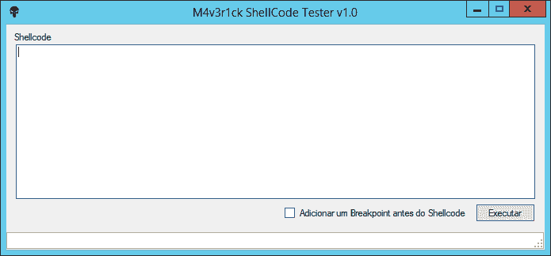
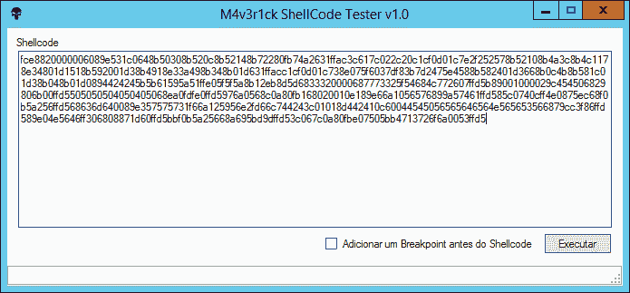

# Shellcodetester:一个测试 Windows 和 Linux 外壳代码的应用程序

> 原文：<https://kalilinuxtutorials.com/shellcodetester/>

[](https://blogger.googleusercontent.com/img/b/R29vZ2xl/AVvXsEjq_LZxj_s0zOSby5OQaIeseFzHp9CslGYwmF1_V_7B7Ku_nHKIbZP5TH9SorvDjYDqa8-u4YkEMe7dgNyTVVUozDYXyANecY1Ku_6vOP_lSkFxJqjfUWStJZgAsurT4EIGF7PmyojkdACae5Fc73hOrIEC1F4bKrYiHmD1JKCKLzYHlasgW51XY53p/s728/images.png)

**Shellcodetester** 是一个测试生成的外壳代码的工具。

## 使用



## 例子



## 外壳代码测试器 Linux

### 安装

```
git clone https://github.com/helviojunior/shellcodetester.git
cd shellcodetester/Linux
make

```

### 使用

无断点:

```
shellcodetester [file.asm]

```

带断点(INT3)。断点将被插入到我们生成的外壳代码之前:

```
shellcodetester [file.asm] --break-point
```

[**Download**](https://github.com/helviojunior/shellcodetester)