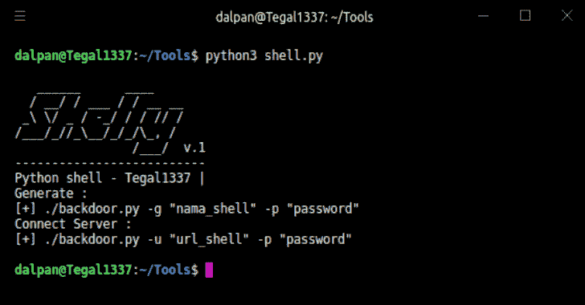
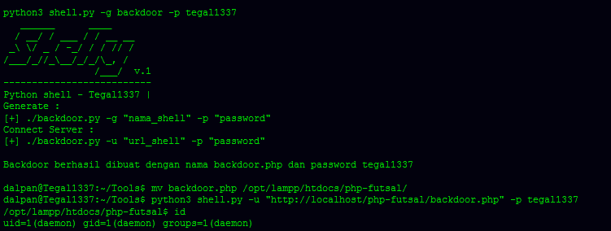

# Shelly:使用 Python 的简单后门管理器

> 原文：<https://kalilinuxtutorials.com/shelly-simple-backdoor-manager-python/>

**Shelly** adalah sebuah tool sederhana yang ditulis menggunakan Python, yang berfungsi untuk meremote sebuah website.

**安装**

**git 克隆[https://github . com/tegal 1337/Shelly](https://github.com/tegal1337/Shelly)
CD Shelly
python 3 shell . py**

**也可阅读-[Secretx:通过请求您的列表](https://kalilinuxtutorials.com/secretx-extracting-api-keys-secrets/)** 中的每个 URL 来提取 API 密钥&秘密

**要求**

**sudo pip 安装要求. txt**

**举例:**

[**Download**](https://github.com/tegal1337/Shelly)