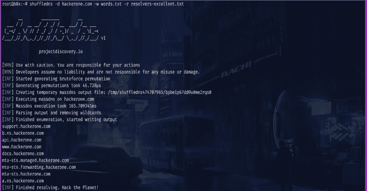
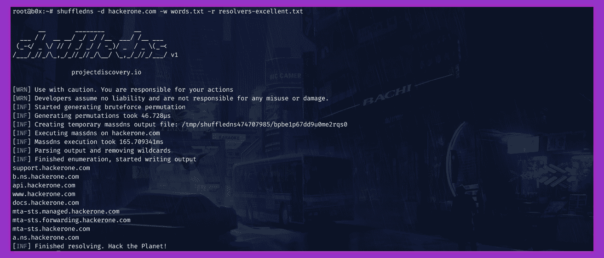

# ShuffleDNS:用 Go 编写的 Massdns 包装器，使用 Active Bruteforce 枚举有效的子域

> 原文：<https://kalilinuxtutorials.com/shuffledns/>

ShuffleDNS 是一个用 go 编写的 massdns 包装器，它允许你使用 active bruteforce 枚举有效的子域，以及使用通配符处理和简单的输入输出支持来解析子域。

**特性**

*   简单和模块化的代码基础使其易于贡献。
*   快速简单的主动子域扫描。
*   以智能的方式处理通配符子域。
*   针对**易用性进行了优化**
*   **标准输入**和**标准输出**支持集成到工作流中

**又读-[Dirble:快速目录扫描抓取工具](https://kalilinuxtutorials.com/dirble/)**

**用法**

**shuffledns -h**

这将显示该工具的帮助。这里是它支持的所有开关。

| 旗 | 描述 | 例子 |
| --- | --- | --- |
| -d | 要为其查找或解析子域的域 | 沙狐球 hackerone.com |
| -目录 | 枚举的临时目录 | 随机目录/硬盘 |
| -r | 包含枚举解析器的文件 | shuffledns -r resolvers.txt |
| -数控 | 不要在输出中使用颜色 | 洗牌 dns -nC |
| 表示“具有…性质的” | 保存输出结果的文件(可选) | shuffledns -o hackerone.txt |
| -列表 | 要处理的子域列表 | shuffledns -list bugcrowd.txt |
| -海量 dns | Massdns 二进制路径 | shuffle DNS-mass DNS/usr/bin/mass DNS |
| -重试次数 | dns 枚举的重试次数(默认为 5) | 洗牌次数-重试次数 1 |
| -沉默 | 在输出中只显示子域 | shuffled ns-静音 |
| 相当于-ED | 并发批量 dns 解析的数量(默认值为 10000) | shuffledns -t 100 |
| -v | 显示详细输出 | 洗牌者-v |
| -版本 | 显示洗牌的版本 | 洗牌 DNS-版本 |
| -w | 包含对域强制使用的单词的文件 | shuffledns -w words.txt |
| -重量 | 并发通配符检查的数量(默认为 25) | shuffledns -wg 100 |
| -原始输入 | 包含现有 massdns 输出的文件 | shuffle DNS-mass DNS-file output . txt |

**安装说明**

**先决条件**

它需要安装 massdns 才能执行其操作。你可以在 https://github.com/blechschmidt/massdns#compilation 看到安装说明。

如果您将二进制文件放在`**/usr/bin/massdns**`或`**/usr/local/bin/massdns**`中，工具将自动检测二进制文件的存在并使用它。在 windows 上，您需要提供二进制文件的路径，该工具才能工作。

该工具还需要一个有效解析器的列表。dnsvalidator 项目可用于生成这些列表。您可以使用自定义单词表，也可以在[commonspeak2-单词表](https://github.com/assetnote/commonspeak2-wordlists/tree/master/subdomains)使用 common speak 2 单词表。

**直接安装**

**来自双星**

安装很容易。您可以从 [Releases](https://github.com/projectdiscovery/shuffledns/releases/) 页面为您的平台下载预构建的二进制文件。使用 tar 提取它们，移动到您的$PATH，您就可以开始了。

**>tar-xzvf shuffledns-linux-amd64.tar
>mv shuffled ns-Linux-amd64/usr/bin/shuffled ns
shuffled ns-h**

**来源于**

需要 go1.13+才能成功安装。运行以下命令获取报告–

**github.com/projectdiscovery/shuffledns/cmd/shuffledns>go 111 module = on go get-u-v**

为了更新工具，你可以使用-u 标志和`**go get**`命令。

**运行** **工具**

它支持两种类型的操作。

**1。解析子域名**

要解析子域列表，您可以通过 **`list`** 选项传递子域列表。

**>shuffledns-d example.com-list example . com-subdomains . txt-r resolvers . txt**

这将针对`**example.com-subdomains.tx**t`中的子域运行该工具，并返回结果。该工具使用用-r 选项指定的解析器来进行解析。

您还可以在标准输入(STDIN)处传递子域列表。这使得自动化管道中的集成变得容易。

**【example.com sub finder-d | shuffled ns-d example.com-r resolvers . txt**

这使用由 **`subfinder`** 被动发现的子域，并解析它们，只返回唯一有效的子域。

**2。强制子域**

它还支持对给定单词表的目标使用暴力。您可以使用 **`w`** 标志来传递一个单词列表，该列表将用于生成将使用 massdns 解析的排列。

**>shuffled ns-d hackerone.com-w word list . txt-r resolvers . txt**

这将使用单词列表`**wordlist.txt**`对`**hackerone.com**`运行工具。域强制也可以用标准输入来完成，如在前面的例子中用于解析子域。

**>回声 hackerone.com | shuffle DNS-w word list . txt-r resolvers . txt**

o 命令可用于指定输出文件。

**>shuffled ns-d hackerone.com-w word list . txt-o output . txt**

发现的子域也可以通过管道传输给其他工具。例如，您可以通过@tomnomnom 将它发现的主机通过管道传输到 httprobe 工具，然后该工具将在主机上找到正在运行的 http 服务器。

**>echo hackerone.com | shuffle DNS-w word list . txt-r resolvers . txt-silent | http probe
【http://docs.hackerone.com】T2
http://www.hackerone.com
http://info.hackerone.com**

**或**

**>echo hackerone.com | sub finder | shuffled ns-d hackerone.com-r resolvers . txt-silent | http probe

http://docs.hackerone.com
http://www.hackerone.com
http://info.hackerone.com**

**关于通配符的说明**

该工具的一个特别之处在于它能够处理基于多级 DNS 的通配符，并且只需很少的 DNS 请求就能做到。

有时所有的子域都会被解析，这将导致结果中的大量垃圾。

它处理这种情况的方式是，它将跟踪有多少子域指向一个 IP，如果子域数量增加超过某个小阈值，它将反复检查该 IP 的所有主机级别上的通配符。

[**Download**](https://github.com/projectdiscovery/shuffledns)